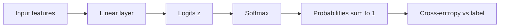

Neural nets for multi-class problems usually emit raw scores called logits—not probabilities. Softmax is the bridge: it turns an arbitrary vector of real numbers into a distribution that is non-negative and sums to one, so you can talk about “70% class A” and plug the result into cross-entropy. Language models, image classifiers, and many ranking heads all rely on this same transform. Get the numerics wrong (overflow from `exp`) and training dies; get the intuition wrong (treating logits as probabilities) and you misread the model.

## Intuition

Imagine three contest judges holding up scores: 2.0, 1.0, 0.1. Softmax does not pick a winner only; it converts the gap pattern into shares of a probability pie. Larger scores get larger slices; the total pie is always 100%. If one judge’s score jumps far ahead, that class can absorb almost the entire pie—even though a tiny probability remains on the others.

Because of the exponential, *differences* matter more than absolute values. Adding 5 to every logit leaves probabilities unchanged (the extras cancel in the normalization). Relative ordering and gaps drive the distribution. That is why two models can look different in logit space yet agree after softmax, and why you should compare models on probabilities or calibrated scores when the decision threshold matters.

**Temperature (brief).** Divide logits by a temperature `T` before softmax. `T < 1` sharpens (winner-take-most); `T > 1` flattens (more uniform). Sampling in generative models often uses temperature to trade certainty for diversity. As `T` goes toward 0 you approach argmax; at large `T` you approach uniform. Think of temperature as a volume knob on how “decisive” the distribution is—not as a change to which class the model likes most when logits are clearly ordered.

## How it works

For a vector of logits `z = [z1, z2, ..., zK]`, softmax makes a probability for each class:

```
p_i = e^(z_i) / (e^(z1) + e^(z2) + ... + e^(zK))
```

In plain English:

1. Raise `e` to each logit (`e^(z_i)`).
2. Add those values up (the denominator).
3. Divide each `e^(z_i)` by that total.

Properties you should memorize:

1. Every `p_i` is greater than 0.
2. All `p_i` values add up to 1.
3. Softmax is **invariant to adding a constant** to all logits (add 5 to every score → same probabilities).
4. Softmax is **not** invariant to scaling: multiplying logits by 2 sharpens the distribution (like lowering temperature).

**Multi-class use.** The model’s last linear layer outputs `K` logits. Softmax turns them into class probabilities. Training usually combines softmax and cross-entropy in one stable op; at inference you may take `argmax(p)` for a hard label or keep `p` for calibration and thresholding. In language models the vocabulary is the class set: each next-token distribution is a giant softmax over tens of thousands of logits.

**Worked numbers.** Take logits `[2.0, 1.0, 0.1]`.

```
e^2.0 ≈ 7.39
e^1.0 ≈ 2.72
e^0.1 ≈ 1.11
sum   ≈ 11.22

p ≈ [7.39/11.22, 2.72/11.22, 1.11/11.22]
  ≈ [0.66, 0.24, 0.10]
```

The top class is not certain—about one-third of the mass still sits on the others. Raise the first logit to `5.0` and the top probability jumps near `0.96`. Same three classes; very different confidence.



**Contrast with sigmoid.** Sigmoid maps one logit to a probability in `(0,1)` for binary (or independent multi-label) tasks. Softmax couples classes: raising one logit lowers others’ probabilities because they share the denominator. Use sigmoid when labels are independent; softmax when exactly one class is true. A common mistake in multi-label tagging is to softmax “all tags” and then wonder why the model cannot assign high probability to two tags at once—the math forbids it.

## In code

Naive softmax overflows when logits are large (`exp(1000)`). The standard fix: subtract the max logit before exponentiating. Mathematically equivalent; numerically safe.

```python
import numpy as np

def softmax(logits, temperature=1.0):
    """Stable softmax along the last axis."""
    z = np.asarray(logits, dtype=float) / temperature
    # Stability: subtract max so the largest exp is exp(0) = 1
    z = z - np.max(z, axis=-1, keepdims=True)
    exp_z = np.exp(z)
    return exp_z / np.sum(exp_z, axis=-1, keepdims=True)

# Single example, 4 classes
logits = np.array([2.0, 1.0, 0.1, -1.0])
p = softmax(logits)
print("probs:", p)
print("sum:", p.sum())           # ~ 1.0
print("argmax:", p.argmax())     # class 0

# Batch of 2
batch = np.array([
    [2.0, 1.0, 0.1],
    [0.0, 0.0, 5.0],
])
print("batch probs:\n", softmax(batch))

# Temperature: sharper vs flatter
print("T=0.5 (sharp):", softmax(logits, temperature=0.5))
print("T=2.0 (flat): ", softmax(logits, temperature=2.0))

# Invariance to shift
shifted = logits + 100.0
print("same after +100?", np.allclose(softmax(logits), softmax(shifted)))

# Why subtract max matters
big = np.array([1000.0, 1001.0, 999.0])
print("stable:", softmax(big))
# np.exp(big) without subtract would overflow to inf
```

**From probabilities back to training.** Cross-entropy only needs `log p_true`. Frameworks compute `log_softmax` directly:


```
log(p_i) = z_i - log( e^(z1) + e^(z2) + ... + e^(zK) )
```

again with the max subtraction inside `logsumexp`. Prefer that path over `log(softmax(z))`, which can hit `log(0)`.

**Why subtract max is exact.** Let `m` be the largest logit. Then shifting every logit by `-m` does not change the probabilities:

```
same p_i whether you use z or (z - m)
```

You have not changed the math—only kept exponents near a safe range so float32 does not overflow.

## What goes wrong

**Overflow / NaNs.** Exponentiating large logits without subtracting max yields `inf` and `nan` gradients. Always use a stable implementation.

**Treating logits as probabilities.** A logit of 0.7 is not “70%.” After softmax, `[0.7, 0.2, 0.1]` as logits is a mild preference, not a calibrated distribution until transformed.

**Softmax on independent labels.** Multi-label tags (“cat” and “indoor” both true) need per-label sigmoids, not a single softmax that forces competition.

**Temperature misuse at train time.** Changing temperature without adjusting the loss changes gradient scale. Temperature is usually an inference/sampling knob unless the paper says otherwise.

**Overconfidence.** Softmax can assign 0.999 to the wrong class. Calibration (temperature scaling on a validation set) and label smoothing are separate fixes; softmax alone does not guarantee calibrated probabilities.

**Tiny numerical zeros.** In float32, extremely peaked distributions can underflow some `p_i` to 0. Loss-from-logits avoids taking `log` of those zeros.

## One-line summary

Softmax converts logits into a positive, sum-to-one distribution—use a max-subtraction stable implementation, and remember temperature only reshapes how sharp that distribution is.

## Key terms

- **Logits** — Raw real-valued class scores before normalization.
- **Softmax** — turns logits into probabilities: `p_i = e^(z_i) / (sum of all e^(z_j))`.
- **Probability distribution** — Non-negative values that sum to one.
- **Temperature** — Divisor on logits that sharpens (`T<1`) or flattens (`T>1`) softmax.
- **Numerical stability** — Subtract max logit (or use log-sum-exp) to avoid `exp` overflow.
- **Argmax** — Index of the largest logit or probability; hard class prediction.
- **Log-softmax** — Stable `log p_i` used inside cross-entropy.
