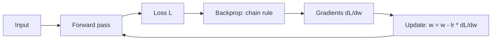

**What is gradient descent?** It is the algorithm that teaches a model by nudging its internal knobs (weights) in the direction that reduces error. **What is backpropagation?** It is how we compute *which direction* to nudge every weight — by applying the chain rule from calculus, working backward from the loss through each layer.

Together they are the engine behind almost all deep learning, including how foundation models are pre-trained and fine-tuned.

:::key
Gradient descent steps weights opposite the slope of the loss. Backpropagation computes that slope efficiently for every parameter in a layered network.
:::

## Intuition

Picture a hiker stuck in heavy fog on a mountain. The hiker cannot see the valley floor (minimum error), but can feel the slope underfoot. Each step goes downhill where the descent is steepest.

- **Loss** = how high you are on the mountain (how wrong the model is).
- **Gradient** = the direction of steepest *ascent* (uphill).
- **Gradient descent** = take a step in the *opposite* direction (downhill).
- **Learning rate** = step size. Too small → painfully slow. Too large → wild leaps that overshoot the valley and break the math.

**Backpropagation** is how you get the slope for *every* weight without guessing. Each layer is a function of the previous layer. Error at the output depends on the last weights; those depend on hidden activations; those depend on earlier weights. Differentiate through that chain once, reuse intermediate results, and you get `dL/dw` for all weights in one backward sweep.

## How it works

**Gradient descent update rule.** For any parameter `w`:

```
new_weight = old_weight - (learning_rate * gradient)
```

In words: move the weight a little opposite the slope of the loss. Batches of data give a **stochastic** estimate of the true gradient (stochastic gradient descent, SGD). Adaptive methods (Adam, RMSProp) rescale steps per parameter, but the core idea remains "follow the downhill direction."

**Forward then backward — four steps:**

1. **Forward pass** — compute activations and prediction `y_hat`.
2. **Loss** — measure error (e.g. MSE or cross-entropy).
3. **Backward pass** — apply the chain rule from loss through each operation.
4. **Update** — apply gradient descent (or Adam) to all weights and biases.

**Tiny network, chain rule.** Suppose `y_hat = w * x` (one weight) and `L = 0.5 * (y - y_hat)^2`:

```
dL/dy_hat = y_hat - y
dy_hat/dw = x
dL/dw     = (y_hat - y) * x
```

In a deeper net the chain looks like:

```
loss → prediction → last layer → ... → first layer → inputs
```

Each local derivative multiplies into the next. Frameworks (PyTorch, JAX) automate this with autograd.

**Worked example — one forward and backward pass.** A tiny network with input `x = 1.0`, sigmoid activations, target `y = 1.0`, learning rate = 0.5. Weights: `w1 = 0.6, w2 = 0.4, w3 = 0.8, w4 = 0.5`.

*Forward pass — hidden layer:*

```
z1 = 0.6 * 1.0 = 0.6000  →  h1 = 1 / (1 + e^(-0.6)) = 0.6457
z2 = 0.4 * 1.0 = 0.4000  →  h2 = 1 / (1 + e^(-0.4)) = 0.5987
```

*Forward pass — output and loss:*

```
z3 = (0.8 * 0.6457) + (0.5 * 0.5987) = 0.8159
y_hat = 1 / (1 + e^(-0.8159)) = 0.6934
error = 1.0 - 0.6934 = 0.3066
MSE loss = 0.5 * (0.3066)^2 = 0.0470
```

*Backward pass — output error delta (chain rule):*

```
delta_out = -(y - y_hat) * y_hat * (1 - y_hat)
          = -0.3066 * [0.6934 * (1 - 0.6934)]
          = -0.0652
```

*Weight update for w3:*

```
w3_new = 0.8000 - [0.5 * (-0.0652) * 0.6457]
       = 0.8000 + 0.0210
       = 0.8210
```

The weight moved in the direction that should reduce the error on the next forward pass.



**Why "back"?** Gradients for early layers need the error signal from later layers. You must finish the forward pass first (to know activations and loss), then push sensitivities backward. Caching forward activations makes the backward pass far cheaper than perturbing each weight one at a time.

## In code

Train a one-parameter model `y_hat = w * x` with gradient descent on MSE. Watch `w` approach the true slope.

```python
import numpy as np

rng = np.random.default_rng(42)
x = rng.normal(size=50)
y = 3.0 * x + 0.1 * rng.normal(size=50)

w = 0.0
eta = 0.05
history = []

for step in range(40):
    y_hat = w * x
    loss = np.mean((y - y_hat) ** 2)
    grad = 2.0 * np.mean((y_hat - y) * x)
    w = w - eta * grad
    history.append((step, w, loss))

for step, w_val, loss in history[::8]:
    print(f"step {step:2d}  w={w_val:.3f}  loss={loss:.4f}")
print(f"final w ~= {w:.3f} (target ~3.0)")
```

You just did a forward pass, computed `dL/dw` by hand, and applied gradient descent. Scale that pattern to every edge in a multi-layer network and you have deep learning's training loop.

## What goes wrong

- **Learning rate too large** — Loss oscillates or diverges; weights jump past the minimum. Too small: crawling progress.
- **Vanishing or exploding gradients** — Deep sigmoid stacks squash gradients toward zero; poor initialization or huge weights explode them. Residual connections, normalization, and better activations help.
- **Stopping at a bad basin** — Non-convex landscapes have local minima and saddle points; SGD noise and modern optimizers help escape many of them.
- **Buggy gradient math** — A sign flip (adding the gradient instead of subtracting) maximizes loss. Sanity-check with gradient checking.
- **Ignoring batch statistics** — One example's gradient is noisy; mini-batches stabilize the estimate.

## One-line summary

Gradient descent steps weights opposite the loss gradient; backpropagation computes those gradients for layered networks by applying the chain rule from the loss backward.

## Key terms

- **Loss landscape** — The surface of loss as a function of all parameters.
- **Gradient** — Vector of partial derivatives; direction of steepest ascent of loss.
- **Gradient descent (GD / SGD)** — Update rule: `w = w - learning_rate * (dL/dw)`, often on mini-batches.
- **Learning rate** — Step-size hyperparameter controlling how big each update is.
- **Backpropagation** — Efficient reverse-mode application of the chain rule through a computation graph.
- **Chain rule** — Calculus rule: derivative of a composition equals the product of local derivatives.
- **Forward / backward pass** — Compute predictions and loss, then propagate gradients to parameters.
