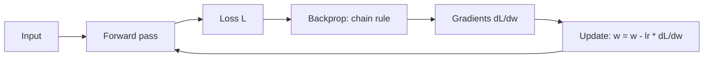

Training a neural network means repeatedly asking: “If I nudge this weight a little, does the loss go up or down?” **Gradient descent** answers that by stepping opposite the gradient. **Backpropagation** is how we compute those gradients efficiently in layered models — nothing more mystical than the chain rule applied systematically from the loss back to every parameter. Together they are the engine behind almost all deep learning, including how foundation models are pre-trained and fine-tuned.

## Intuition

Picture a foggy hillside where height is **loss** (how wrong the model is) and your position is the current weights. You cannot see the whole map, but you can feel the local slope. The **gradient** points uphill — the direction of steepest *ascent*. To minimize loss, take a step downhill: subtract a fraction of the gradient.

A small learning rate means cautious baby steps; a large learning rate means long strides that may leap past the valley and bounce. Flat plateaus feel like “no signal”; cliffs feel like exploding updates. Real loss landscapes for deep nets are high-dimensional and non-convex, but the same local rule still works surprisingly well in practice.

**Backpropagation** is how you get the slope for *every* weight without guessing. Each layer is a function of the previous layer. Error at the output depends on the last weights; those depend on the hidden activations; those depend on earlier weights. Differentiate through that chain once, reuse intermediate results, and you get `dL / dw` for all `w` in one backward sweep — far cheaper than numerically perturbing each weight.

## How it works

**Gradient descent update.** For a parameter `w`:

```
w = w - learning_rate * (dL/dw)
```

In words: move `w` a little opposite the slope of the loss. Batches of data give a **stochastic** estimate of the true gradient (SGD). Adaptive methods (Adam, RMSProp) rescale steps per-parameter, but the core idea remains “follow the downhill direction.”

**Forward then backward.**

1. **Forward pass:** compute activations and prediction `y_hat`.
2. **Loss:** e.g. MSE `L = (y - y_hat)^2` or cross-entropy.
3. **Backward pass:** apply the chain rule from `L` through each operation.
4. **Update:** apply the GD (or Adam) step to all weights and biases.

**Tiny network, chain rule.** Suppose `y_hat = w * x` (one weight, no bias) and `L = 0.5 * (y - y_hat)^2`. Then:

```
dL/dy_hat = y_hat - y
dy_hat/dw = x
dL/dw     = (y_hat - y) * x
```

In a deeper net the chain looks like:

```
loss → prediction → last layer → ... → first layer → inputs
```

Each local derivative multiplies into the next. Matrix form uses Jacobians; frameworks (PyTorch, JAX) automate this with autograd. Conceptually you are still multiplying “how loss cares about this activation” by “how this activation cares about that weight.”



**Why “back”?** Gradients for early layers need the error signal from later layers. You must finish the forward pass first (to know activations and loss), then push sensitivities backward. Caching forward activations makes the backward pass far cheaper than a naive finite-difference sweep over millions of parameters.

**Mini-batch intuition.** Full-batch GD averages the gradient over the entire dataset — stable but slow and memory-heavy. Pure online SGD uses one example — noisy but cheap. Mini-batches (e.g. 32–256) sit in between: enough averaging to calm noise, enough noise to help escape shallow bad regions, and a good fit for GPU parallelism. Learning-rate schedules (warmup, cosine decay) further stabilize long runs used in pre-training.

## In code

Train a one-parameter model `y_hat = w x` with gradient descent on MSE. Watch `w` approach the true slope.

```python
import numpy as np

# True relationship: y = 3x + noise
rng = np.random.default_rng(42)
x = rng.normal(size=50)
y = 3.0 * x + 0.1 * rng.normal(size=50)

w = 0.0          # bad initial guess
eta = 0.05
history = []

for step in range(40):
    y_hat = w * x
    # Mean squared error
    loss = np.mean((y - y_hat) ** 2)
    # dL/dw = mean( 2 (y_hat - y) * x )  — same as 2 * mean((y_hat - y) * x)
    grad = 2.0 * np.mean((y_hat - y) * x)
    w = w - eta * grad
    history.append((step, w, loss))

for step, w_val, loss in history[::8]:
    print(f"step {step:2d}  w={w_val:.3f}  loss={loss:.4f}")
print(f"final w ≈ {w:.3f} (target ~3.0)")
```

You just did a forward pass, computed `dL/dw` by hand (the “backprop” for this one-node graph), and applied GD. Scale that pattern to every edge in an MLP and you have deep learning’s training loop.

## What goes wrong

- **Learning rate too large.** Loss oscillates or diverges; `w` jumps past the minimum. Too small: crawling progress and premature stopping.
- **Vanishing or exploding gradients.** Deep sigmoid stacks squash gradients toward zero; poor initialization or huge weights explode them. Residuals, normalization, and better activations mitigate this.
- **Stopping at a bad basin.** Non-convex landscapes have local minima and saddle points; SGD noise and modern optimizers help escape many of them, but data quality and architecture still dominate.
- **Buggy gradient math.** A sign flip (adding the gradient instead of subtracting it) maximizes loss. Always sanity-check: a tiny weight increase should change loss in the direction your analytic gradient predicts (gradient checking).
- **Ignoring batch statistics.** One example’s gradient is noisy; mini-batches stabilize the estimate without requiring a full-dataset pass every step.

## One-line summary

Gradient descent steps weights opposite `grad L`; backpropagation computes those gradients for layered nets by applying the chain rule from the loss backward.

## Key terms

- **Loss landscape:** surface of loss as a function of parameters.
- **Gradient:** vector of partial derivatives; direction of steepest ascent of `L`.
- **Gradient descent (GD / SGD):** parameter update `w = w - learning_rate * (dL/dw)` (often on mini-batches).
- **Learning rate:** step-size hyperparameter.
- **Backpropagation:** efficient reverse-mode application of the chain rule through a computation graph.
- **Chain rule:** derivative of a composition equals product of local derivatives.
- **Forward / backward pass:** compute predictions and loss, then propagate gradients to parameters.
