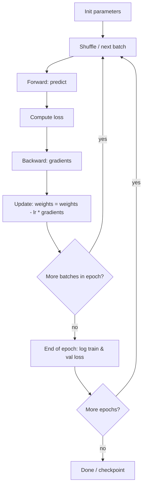

Every deep learning framework hides a short ritual behind `model.fit` or a training step: predict, score, differentiate, nudge parameters. That ritual is the training loop. The two knobs beginners feel first—learning rate and number of epochs—decide whether the loop converges smoothly, oscillates wildly, or memorizes the training set. Once you can run the loop by hand on a tiny problem, larger models stop feeling magical and start feeling like the same four steps with bigger tensors.

## Intuition

Picture a hiker in fog descending a valley (loss surface). Each step:

1. **Forward** — Stand at current parameters; compute the prediction for a batch of data.
2. **Loss** — Measure how bad that prediction is.
3. **Backward** — Feel the local slope (gradients of loss w.r.t. each weight).
4. **Update** — Take a step downhill: `theta <- theta - eta grad_theta L`.

The **learning rate** is step length. Too small: endless tiny shuffles, slow progress. Too large: leaps past the valley, loss spikes or becomes NaN. An **epoch** is one full pass through the training set. Real datasets are processed in **minibatches** so you get many updates per epoch without loading everything at once.

Training loss usually falls if the model has capacity. Validation loss tells you whether those gains transfer. Healthy runs: both drop, then flatten. Overfitting: train keeps falling while val rises. Underfitting: both stay high.

## How it works

**Batch vs epoch.** Suppose 10,000 examples and batch size 100. Each epoch has 100 update steps. After 20 epochs you have taken 2,000 gradient steps—but each example has been seen about 20 times.

**Why shuffle.** Randomizing order each epoch reduces the chance that a weird contiguous slice of data biases every update the same way.

**Learning rate schedules (awareness).** Many runs start with a constant learning rate, then decay it (step decay, cosine). Warmup starts small and ramps up for large-batch transformer training. For this lesson, a carefully chosen constant learning rate is enough.



**Monitoring.** Log train loss every N steps and validation loss every epoch. Plot both. Early stopping (previous lesson) reads this plot automatically. Also watch for exploding loss after an LR change—that is your first debugging signal.

## In code

Toy linear regression with full-batch and minibatch gradient descent. We fit `y ~= w x + b` on noisy data and watch loss fall.

```python
import numpy as np

rng = np.random.default_rng(42)

# True line: y = 3x - 1 + noise
n = 200
x = rng.normal(size=n)
y = 3.0 * x - 1.0 + rng.normal(scale=0.3, size=n)

# Train / validation split
idx = rng.permutation(n)
train_idx, val_idx = idx[:160], idx[160:]
x_train, y_train = x[train_idx], y[train_idx]
x_val, y_val = x[val_idx], y[val_idx]

def mse(y_true, y_pred):
    return np.mean((y_true - y_pred) ** 2)

def forward(x, w, b):
    return w * x + b

# --- Mini training loop ---
w, b = 0.0, 0.0
lr = 0.05
epochs = 40
batch_size = 32

history = []
for epoch in range(epochs):
    perm = rng.permutation(len(x_train))
    x_epoch, y_epoch = x_train[perm], y_train[perm]

    for start in range(0, len(x_train), batch_size):
        xb = x_epoch[start:start + batch_size]
        yb = y_epoch[start:start + batch_size]

        # Forward
        pred = forward(xb, w, b)
        # Loss (for monitoring; GD uses gradients below)
        # Backward: dL/dw, dL/db for L = mean((pred - y)^2)
        err = pred - yb
        m = len(xb)
        dw = 2.0 * np.mean(err * xb)
        db = 2.0 * np.mean(err)
        # Update
        w -= lr * dw
        b -= lr * db

    train_loss = mse(y_train, forward(x_train, w, b))
    val_loss = mse(y_val, forward(x_val, w, b))
    history.append((epoch, train_loss, val_loss))

print(f"learned w={w:.3f}, b={b:.3f} (true ~ 3, -1)")
print("epoch | train_mse | val_mse")
for epoch, tr, va in history[::8]:
    print(f"{epoch:5d} | {tr:9.4f} | {va:7.4f}")
```

Try `lr = 1.0` and watch loss explode or bounce. Try `lr = 1e-5` and notice almost no movement after many epochs. That single experiment teaches more than a paragraph of theory.

**Too-high vs too-low LR (what you will see).**

| Learning rate | Typical symptom |
| --- | --- |
| Much too high | Loss -> NaN or oscillates upward |
| Slightly high | Fast early drop, then unstable plateaus |
| Good | Smooth decrease of train (and val) loss |
| Too low | Tiny slope; needs huge epoch count |

## What goes wrong

**Silent overfitting.** Train loss looks great because you only plotted it. Always reserve a validation set and compare curves.

**Epoch worship.** “Train for 100 epochs” is meaningless without looking at val loss. Sometimes 15 epochs with early stopping beats 100.

**Batch size side effects.** Larger batches give stabler gradients but fewer steps per epoch; the same learning rate may need retuning (linear scaling rules exist, but treat them as starting points).

**Forgetting to zero gradients.** In autograd frameworks, gradients accumulate by default. Skip `optimizer.zero_grad()` and you train on summed ghosts of past batches.

**Data leakage in validation.** Preprocessing fit on train+val (e.g. scaling) makes val loss optimistic. Fit scalers on train only.

**Shuffling validation.** Optional for metrics; never required. Do shuffle training.

## One-line summary

The training loop is forward -> loss -> backward -> update, repeated over batches and epochs—with learning rate setting step size and train/val curves telling you whether you are learning or memorizing.

## Key terms

- **Training loop** — Repeated forward, loss, backward, and parameter update.
- **Learning rate** — Step size in gradient descent updates.
- **Epoch** — One full pass over the training dataset.
- **Batch / minibatch** — Subset of examples used for one update.
- **Gradient** — Vector of partial derivatives of loss w.r.t. parameters.
- **Validation loss** — Loss on held-out data used to monitor generalization.
- **Convergence** — Loss settling near a minimum rather than diverging or wandering.
