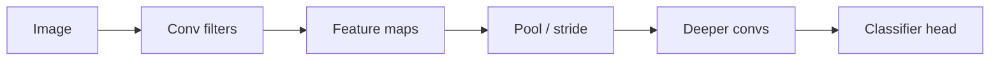

A fully connected net on a 224x224 RGB image would wire every pixel to every hidden unit and drown in parameters. **Convolutional neural networks (CNNs)** refuse that waste: they slide small filters across the input, reuse the same weights everywhere, and build a hierarchy from edges to parts to objects. Vision systems, many speech front-ends, and even some text models historically leaned on this inductive bias. Even if your day job is transformers, CNN thinking—locality, weight sharing, translation equivariance—still shows up in patches, depthwise convs, and “look at nearby structure first.”

## Intuition

Stand in front of a photo with a tiny cardboard stencil that has a 3x3 hole. At each placement you compute a weighted mix of the nine visible pixels—maybe “bright on the left, dark on the right” to detect a vertical edge. Slide the stencil across the whole image. That sliding mix is a **convolution** (in deep learning, usually a cross-correlation with a learnable kernel). One stencil produces one **feature map**. Stack many stencils and you get many feature maps: horizontal edges, blobs, color transitions.

Because the same stencil is reused at every location, a filter that learns “cat ear texture” in the top-left can fire for an ear in the bottom-right without new weights. That is **weight sharing**. Because each output depends only on a local **receptive field**, early layers stay cheap and spatially grounded. Deeper layers compose local detections into larger patterns—the receptive field grows as you stack convs and pool.

Pooling (or strided convolution) downsamples the map: keep the strongest response in each neighborhood. You trade precise pixel location for coarser, more invariant features. Classification heads usually flatten or global-pool the final maps into a vector, then apply a small MLP or linear layer.

## How it works

**2D convolution (single channel, stride 1, no padding).** Input `X` is `H x W`. Kernel `K` is `kH x kW`. Output at position `(i, j)`:

```
Y[i, j] = sum over u,v of  K[u, v] * X[i + u, j + v]
```

Output spatial size (valid convolution, no pad):

```
out_H = H - kH + 1
out_W = W - kW + 1
```

**Padding** adds a border (often zeros) so output can match input size (“same” padding). **Stride** `s` skips positions: step the filter by `s` pixels; sizes shrink roughly by `s`.

**Multiple channels.** An RGB input has `C_in = 3`. Each output channel has a kernel stack of shape `(C_in, kH, kW)`; you sum across input channels as well. A layer with `C_out` filters learns `C_out` such stacks, plus optional biases.

**Parameter count (conv vs dense).** One 3x3 filter on 64 input channels to 128 output channels has about `128 * 64 * 3 * 3` weights—independent of `H` and `W`. A dense layer from `H*W*64` to `H*W*128` scales with image size and explodes.

**Typical block.** Conv -> activation (ReLU) -> optional BatchNorm -> optional pool. Stack blocks; optionally add residual shortcuts (ResNet-style) so gradients travel further.



## In code

A tiny NumPy “valid” convolution on a 5x5 patch with a 3x3 edge-ish kernel:

```python
import numpy as np

X = np.array([
    [0, 0, 0, 0, 0],
    [0, 1, 1, 1, 0],
    [0, 1, 1, 1, 0],
    [0, 1, 1, 1, 0],
    [0, 0, 0, 0, 0],
], dtype=float)

# Emphasize left-vs-right contrast
K = np.array([
    [-1, 0, 1],
    [-1, 0, 1],
    [-1, 0, 1],
], dtype=float)

def conv2d_valid(x, k):
    kh, kw = k.shape
    h, w = x.shape
    y = np.zeros((h - kh + 1, w - kw + 1))
    for i in range(y.shape[0]):
        for j in range(y.shape[1]):
            patch = x[i:i+kh, j:j+kw]
            y[i, j] = np.sum(patch * k)
    return y

Y = conv2d_valid(X, K)
print(Y)

# Max-pool 2x2 on a feature map
def max_pool2x2(f):
    h, w = f.shape
    out = np.zeros((h // 2, w // 2))
    for i in range(out.shape[0]):
        for j in range(out.shape[1]):
            out[i, j] = np.max(f[2*i:2*i+2, 2*j:2*j+2])
    return out
```

In PyTorch this is `nn.Conv2d` / `F.conv2d`; you almost never write the nested loops—but doing it once makes the shapes unforgettable.

## What goes wrong

**Wrong spatial sizes.** Forget padding or miscount stride and the next layer’s expected `H x W` will not match—shape errors or silent cropping.

**Too little receptive field.** Tiny stacks of 3x3 without depth or dilation never “see” the whole object; the classifier guesses from local texture.

**Treating conv like a bag of dense layers.** Global FC layers early destroy the spatial bias and revive the parameter explosion CNNs were meant to avoid.

**Data without locality.** Pure tabular features with no neighborhood structure gain little from 2D conv; use models that match the data geometry.

**Overclaiming translation magic.** Weight sharing gives **equivariance** of feature maps under shifts (features move when the object moves); after global pooling you get more invariance. Neither is free robustness to rotation, scale, or occlusion—those need data, augmentation, or extra design.

## One-line summary

CNNs learn small shared filters that slide over space, turning local patterns into hierarchical feature maps without a fully connected explosion of weights.

## Key terms

- **Convolution / filter / kernel** — Small learnable tensor slid across the input to detect a local pattern.
- **Feature map** — Spatial output of one filter (or channel) after convolution.
- **Weight sharing** — Reusing the same kernel weights at every location.
- **Receptive field** — Region of the input that affects a given activation.
- **Padding / stride** — Border handling and step size that control output resolution.
- **Pooling** — Downsampling (e.g. max) that coarsens spatial grids.
- **Inductive bias** — Built-in assumption (here: local, reusable patterns) that shapes what is easy to learn.
