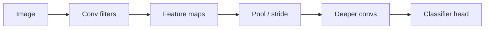

**What is a convolutional neural network (CNN)?** It is a neural network designed for images and other grid-shaped data. Instead of wiring every pixel to every neuron (which would explode in parameters), a CNN slides small learnable filters across the input and reuses the same weights everywhere.

**Why do CNNs matter?** They mimic how the human visual cortex works — processing local patches of an image to detect edges, shapes, and objects. Vision systems, speech front-ends, and even some text models historically relied on this design. Even in the transformer era, CNN thinking — locality, weight sharing, translation equivariance — still shows up in patches, depthwise convolutions, and "look at nearby structure first."

:::key
CNNs learn small shared filters that slide over space, turning local patterns into hierarchical feature maps without a fully connected explosion of weights.
:::

## Intuition

Stand in front of a photo with a tiny 3×3 cardboard stencil. At each placement you compute a weighted mix of the nine visible pixels — maybe "bright on the left, dark on the right" to detect a vertical edge. Slide the stencil across the whole image. That sliding mix is a **convolution**. One stencil produces one **feature map**. Stack many stencils and you get many feature maps: horizontal edges, blobs, color transitions.

Because the same stencil is reused at every location, a filter that learns "cat ear texture" in the top-left can fire for an ear in the bottom-right without new weights. That is **weight sharing**.

## How it works

**Core components of a CNN:**

| Component | Plain-English idea |
| --- | --- |
| **Kernel / filter** | A tiny learnable matrix (e.g. 3×3) that slides over pixel grids to scan for shapes or edges, producing a feature map |
| **Stride** | How many pixels the filter jumps each step — larger stride = smaller output |
| **Padding** | Adding a border of zeros around image edges so edge pixels get scanned as thoroughly as center pixels |
| **Max pooling** | Keeps only the brightest value in each small window (e.g. 2×2), reducing memory while keeping core visual features |
| **Fully connected layer** | Flattens the final spatial grid into a 1D vector to generate classification scores |

**2D convolution (single channel, stride 1, no padding).** Input `X` is `H × W`. Kernel `K` is `kH × kW`. Output at position `(i, j)`:

```
Y[i, j] = sum over u,v of  K[u, v] * X[i + u, j + v]
```

Output spatial size (valid convolution, no padding):

```
out_H = H - kH + 1
out_W = W - kW + 1
```

**Multiple channels.** An RGB input has 3 input channels. Each output channel has a kernel stack; you sum across input channels. A layer with 128 filters learns 128 such stacks, plus optional biases.

**Parameter count (conv vs dense).** One 3×3 filter on 64 input channels to 128 output channels has about `128 * 64 * 3 * 3` weights — independent of image height and width. A dense layer from all pixels to all hidden units scales with image size and explodes.

**Typical block.** Conv → activation (ReLU) → optional BatchNorm → optional pool. Stack blocks; optionally add residual shortcuts (ResNet-style) so gradients travel further.



**Major engineering bottlenecks:**

| Bottleneck | Plain-English idea |
| --- | --- |
| **Picasso problem** | Max pooling discards precise positioning. A CNN can detect eyes and a mouth but not know the mouth is above the eyes — it checks for feature presence, not spatial layout. Real facial recognition uses landmark detectors and 3D depth maps. |
| **Memory wall** | Deep image processing forces massive data transfers between RAM and GPU, leaving the fast GPU idle while waiting for slow pixel delivery. |
| **Fixed input size** | The final linear layer demands a fixed input vector length, forcing networks to crop, stretch, or distort images into squares. |

## In code

A tiny NumPy "valid" convolution on a 5×5 patch with a 3×3 edge-detection kernel:

```python
import numpy as np

X = np.array([
    [0, 0, 0, 0, 0],
    [0, 1, 1, 1, 0],
    [0, 1, 1, 1, 0],
    [0, 1, 1, 1, 0],
    [0, 0, 0, 0, 0],
], dtype=float)

K = np.array([
    [-1, 0, 1],
    [-1, 0, 1],
    [-1, 0, 1],
], dtype=float)

def conv2d_valid(x, k):
    kh, kw = k.shape
    h, w = x.shape
    y = np.zeros((h - kh + 1, w - kw + 1))
    for i in range(y.shape[0]):
        for j in range(y.shape[1]):
            patch = x[i:i+kh, j:j+kw]
            y[i, j] = np.sum(patch * k)
    return y

Y = conv2d_valid(X, K)
print(Y)

def max_pool2x2(f):
    h, w = f.shape
    out = np.zeros((h // 2, w // 2))
    for i in range(out.shape[0]):
        for j in range(out.shape[1]):
            out[i, j] = np.max(f[2*i:2*i+2, 2*j:2*j+2])
    return out
```

In PyTorch this is `nn.Conv2d` / `F.conv2d` — you almost never write the nested loops, but doing it once makes the shapes unforgettable.

## What goes wrong

- **Wrong spatial sizes** — Forget padding or miscount stride and the next layer's expected height × width will not match.
- **Too little receptive field** — Tiny stacks of 3×3 without depth never "see" the whole object; the classifier guesses from local texture.
- **Treating conv like dense layers** — Global fully connected layers early destroy the spatial bias and revive the parameter explosion CNNs were meant to avoid.
- **Data without locality** — Pure tabular features with no neighborhood structure gain little from 2D conv; use models that match the data geometry.
- **Overclaiming translation magic** — Weight sharing gives equivariance under shifts, not free robustness to rotation, scale, or occlusion.

## One-line summary

CNNs learn small shared filters that slide over space, turning local patterns into hierarchical feature maps without a fully connected explosion of weights.

## Key terms

- **Convolution / filter / kernel** — Small learnable tensor slid across the input to detect a local pattern.
- **Feature map** — Spatial output of one filter (or channel) after convolution.
- **Weight sharing** — Reusing the same kernel weights at every location.
- **Receptive field** — Region of the input that affects a given activation.
- **Padding / stride** — Border handling and step size that control output resolution.
- **Pooling** — Downsampling (e.g. max) that coarsens spatial grids.
- **Inductive bias** — Built-in assumption (here: local, reusable patterns) that shapes what is easy to learn.
