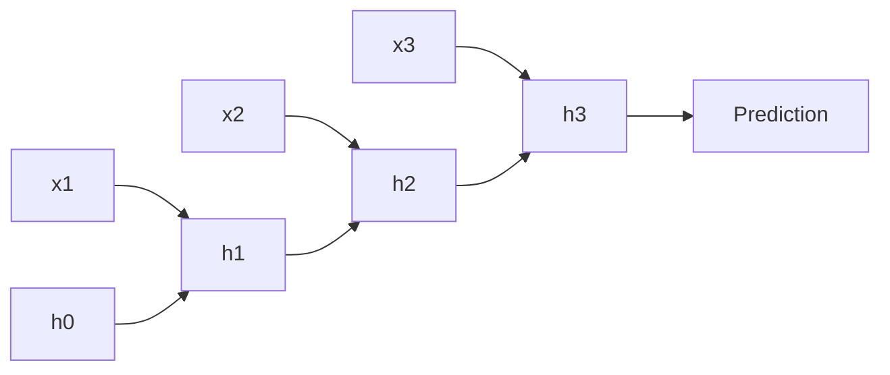

Images have height and width; language and sensor streams have **time**. A **recurrent neural network (RNN)** processes a sequence one step at a time, carrying a **hidden state** that summarizes “what I’ve seen so far.” That idea powered early machine translation, speech recognition, and next-token models—until transformers took the crown for most large-scale NLP. You still need RNNs and **LSTMs** in your mental toolkit: they explain sequential state, why long dependencies were hard, and what attention later fixed. Interview questions and older production systems still speak this dialect fluently.

## Intuition

Read a sentence left to right while holding a sticky note of your current understanding. At each word you update the note: new evidence in, old summary revised. The sticky note is the hidden state `h_t`. The update rule is shared across time—same weights for word 1 and word 100—so the model learns *how to update memory*, not a separate brain per position.

A vanilla RNN updates with a single squash (tanh or ReLU-ish). Over many steps, gradients that teach “remember the subject from 40 tokens ago” must pass through 40 multiplications by the same recurrent Jacobian. If those factors are usually `< 1`, the signal **vanishes**; if `> 1`, it **explodes**. Training becomes deaf to long-range credit.

An **LSTM** (Long Short-Term Memory) adds an explicit **cell state** highway and **gates** that learn what to forget, what to write, and what to read out. Think of a conveyor belt (cell) with controllable doors: information can coast forward with less repeated squash, so distant signals have a fighting chance. **GRUs** are a lighter cousin with fewer gates; same spirit.

RNNs are naturally online: you can consume tokens as they arrive. Their cost per step is modest, but training is sequential—step `t` waits on `t-1`—so GPUs parallelize less cleanly than transformers.

## How it works

**Vanilla RNN step.** Inputs `x_t` (e.g. embedding) and previous state `h_{t-1}`:

```
h_t = tanh( W_h @ h_{t-1} + W_x @ x_t + b )
```

For classification of a whole sequence, people often take the last `h_T` or pool all `h_t`. For language modeling, each step predicts the next token from `h_t`.

**Unrolling.** A length-`T` sequence is a deep net of depth `T` with tied weights. Backpropagation through time (BPTT) runs the chain rule backward along that unroll.

**LSTM gates (intuition + equations).** Let `[h_{t-1}, x_t]` be the concatenated input to affine maps. Four vectors in `(0, 1)` or `(-1, 1)`:

```
f_t = sigmoid(W_f @ [h_{t-1}, x_t] + b_f)   # forget
i_t = sigmoid(W_i @ [h_{t-1}, x_t] + b_i)   # input
o_t = sigmoid(W_o @ [h_{t-1}, x_t] + b_o)   # output
g_t = tanh(W_g @ [h_{t-1}, x_t] + b_g)      # candidate write

c_t = f_t * c_{t-1} + i_t * g_t             # cell update
h_t = o_t * tanh(c_t)                       # hidden readout
```

- **Forget gate** `f_t`: how much of old cell to keep (near 0 = erase).
- **Input gate** `i_t`: how much of the new candidate `g_t` to write.
- **Output gate** `o_t`: how much of cell content to expose as `h_t`.

The additive cell update `c_t = f * c_old + i * g` is the key structural fix: gradients can flow along the cell path without a tanh at every single step.

**Bidirectional RNN.** Run one RNN forward and one backward; concatenate states. Great for tagging when the whole utterance is available; wrong for true left-to-right generation (leaks the future).



## In code

Minimal NumPy RNN step and a toy LSTM gate update for one timestep:

```python
import numpy as np

def rnn_step(x_t, h_prev, W_x, W_h, b):
    # x_t: (d_in,), h_prev: (d_h,)
    z = W_x @ x_t + W_h @ h_prev + b
    return np.tanh(z)

d_in, d_h = 4, 3
rng = np.random.default_rng(0)
W_x = rng.normal(0, 0.1, size=(d_h, d_in))
W_h = rng.normal(0, 0.1, size=(d_h, d_h))
b = np.zeros(d_h)
h = np.zeros(d_h)
xs = rng.normal(size=(5, d_in))
for t, x in enumerate(xs):
    h = rnn_step(x, h, W_x, W_h, b)
    print(t, h)

def sigmoid(z):
    return 1.0 / (1.0 + np.exp(-z))

def lstm_step(x_t, h_prev, c_prev, W, b):
    # W: (4*d_h, d_h + d_in) maps [h; x] -> forget, input, output, candidate
    hx = np.concatenate([h_prev, x_t])
    gates = W @ hx + b
    d = h_prev.shape[0]
    f, i, o, g = np.split(gates, 4)
    f, i, o = sigmoid(f), sigmoid(i), sigmoid(o)
    g = np.tanh(g)
    c = f * c_prev + i * g
    h = o * np.tanh(c)
    return h, c

W_lstm = rng.normal(0, 0.1, size=(4 * d_h, d_h + d_in))
b_lstm = np.zeros(4 * d_h)
h, c = np.zeros(d_h), np.zeros(d_h)
h, c = lstm_step(xs[0], h, c, W_lstm, b_lstm)
print("LSTM h:", h, "c:", c)
```

Frameworks expose `nn.RNN`, `nn.LSTM`, `nn.GRU` with batch-first options and packed padded sequences for variable lengths.

## What goes wrong

**Vanishing / exploding gradients.** Long unrolls without LSTM/GRU, gradient clipping, or careful init make early tokens unteachable or blow up to NaNs.

**Truncated BPTT misuse.** Truncating history speeds training but can hide dependencies longer than the truncation window—your model never sees the credit path you care about.

**Leaky bidirectionality.** Using a bi-LSTM for next-token prediction or live streaming lets the model cheat with future context; keep causal direction for generation.

**Hidden state as a trash can.** Dumping a long document into a single final `h_T` for translation is the classic **bottleneck** (next lesson in the transformer track). LSTMs help; they do not create infinite memory.

**Assuming RNNs are obsolete everywhere.** For low-latency streaming, tiny devices, or strong temporal inductive bias with limited data, compact recurrent models can still win. For large-scale NLP, attention usually wins on parallelism and long-range routing.

## One-line summary

RNNs thread a shared-weight hidden state through time; LSTMs add gated cell memory so longer dependencies can survive training instead of vanishing in the unroll.

## Key terms

- **Hidden state (`h_t`)** — Vector summary of the sequence so far at step `t`.
- **Recurrence / unroll** — Feeding state from `t-1` into `t`; training expands this into a deep chain.
- **BPTT** — Backpropagation through time; reverse-mode AD on the unrolled net.
- **Vanishing / exploding gradients** — Unstable products of recurrent derivatives over long sequences.
- **LSTM** — Gated recurrent unit with cell state plus forget/input/output gates.
- **GRU** — Simpler gated recurrent alternative to LSTM.
- **Bidirectional RNN** — Forward + backward passes concatenated; needs full sequence context.
