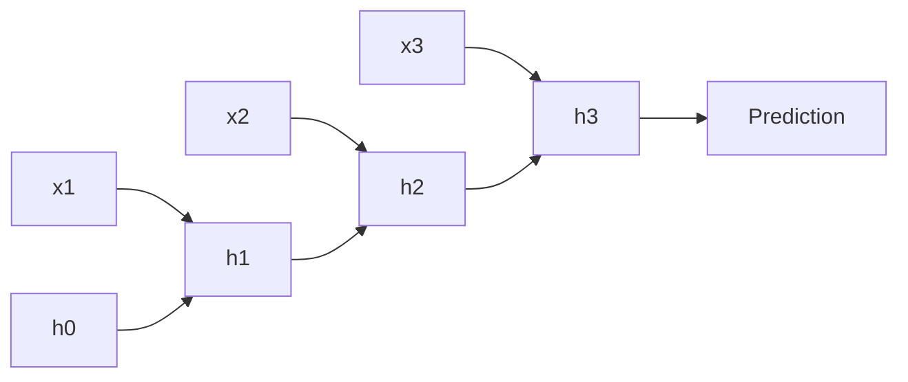

**What is a recurrent neural network (RNN)?** It is a neural network with memory. Instead of treating each input independently, an RNN carries a **hidden state** — a rolling summary of everything seen so far — from one time step to the next.

**Why do RNNs matter?** Images have height and width; language, speech, and sensor streams have **time**. Order dictates meaning: "The dog bit the man" is not the same as "The man bit the dog." Standard feedforward networks cannot track that. RNNs (and their upgrade, LSTMs) were the backbone of early machine translation, speech recognition, and next-word prediction — and they explain why long dependencies were hard before transformers.

:::key
RNNs thread a shared-weight hidden state through time. LSTMs add a gated cell-state highway so longer dependencies can survive training instead of vanishing in the unroll.
:::

## Intuition

Read a sentence left to right while holding a sticky note of your current understanding. At each word you update the note: new evidence in, old summary revised. The sticky note is the hidden state `h_t`. The update rule uses the same weights at every step — so the model learns *how to update memory*, not a separate brain per position.

**Example — predicting the next word.** An RNN reads: "The clouds are in the _____"

1. Reads "The" → stores it in memory.
2. Reads "clouds" → combines with memory of "The" → updates memory.
3. Reads "are" → combines with past memory → updates again.
4. By the blank, memory holds the context of the whole sentence → easily predicts "sky".

A vanilla RNN updates with a single squash (tanh). Over many steps, gradients that teach "remember the subject from 40 tokens ago" must pass through 40 multiplications by the same recurrent weights. If those factors are usually less than 1, the signal **vanishes**; if greater than 1, it **explodes**.

An **LSTM (Long Short-Term Memory)** adds an explicit **cell state** highway and **gates** that learn what to forget, what to write, and what to read out. Think of a conveyor belt with controllable doors: information can coast forward with less repeated squash, so distant signals have a fighting chance.

## How it works

**Vanilla RNN step.** Inputs `x_t` (e.g. word embedding) and previous state `h_{t-1}`:

```
h_t = tanh( W_h @ h_{t-1} + W_x @ x_t + b )
```

For language modeling, each step predicts the next token from `h_t`.

**Unrolling.** A length-T sequence is a deep network of depth T with tied weights. **Backpropagation through time (BPTT)** runs the chain rule backward along that unroll — repeating a multiplication step for every single word in the sequence.

**Where RNNs fail — the long-distance problem:**

| Problem | Plain-English idea | What happens |
| --- | --- | --- |
| **Exploding gradients** | Memory weights slightly greater than 1.0 get multiplied over and over (1.1 × 1.1 × 1.1...) | Training numbers grow exponentially → crashes, wild graphs, or model breakdown. **Fix:** gradient clipping (hard cap on how large numbers can grow). |
| **Vanishing gradients** | Memory weights less than 1.0 shrink repeatedly (0.9 × 0.9 × 0.9...) | By the time the signal reaches early words, it is practically zero → model forgets early clues (e.g. "France" at the start of a long essay). |

**LSTM solution — the cell state conveyor belt.** LSTMs separate long-term memory onto an isolated track called the **cell state**. This track updates using simple addition and subtraction instead of risky repeated multiplication.

Three smart **gates** control what goes on and off the conveyor belt:

| Gate | Plain-English idea |
| --- | --- |
| **Forget gate** | Looks at new data and throws away old memory that is no longer useful |
| **Input gate** | Decides which new information from the current word is important enough to save |
| **Output gate** | Decides what parts of the updated cell state to pull off for the next hidden state prediction |

**LSTM equations (one time step):**

```
f_t = sigmoid(W_f @ [h_{t-1}, x_t] + b_f)   # forget gate
i_t = sigmoid(W_i @ [h_{t-1}, x_t] + b_i)   # input gate
o_t = sigmoid(W_o @ [h_{t-1}, x_t] + b_o)   # output gate
g_t = tanh(W_g @ [h_{t-1}, x_t] + b_g)      # candidate write

c_t = f_t * c_{t-1} + i_t * g_t             # cell update (the key fix)
h_t = o_t * tanh(c_t)                       # hidden readout
```

The additive cell update `c_t = f * c_old + i * g` lets gradients flow along the cell path without a tanh at every single step.

**Bidirectional RNN (BiLSTM).** Standard LSTMs only read left to right — missing clues that come after a word. A **bidirectional LSTM** runs two tracks simultaneously: one forward, one backward. For each word, the network chains both outputs together. Example: "The crane flew away" vs "The crane lifted the steel beam" — BiLSTM knows both preceding and trailing words, giving a complete picture of context.



**Text representations — why context matters:**

| Method | Plain-English idea | Limitation |
| --- | --- | --- |
| **One-hot vector** | A long array of zeros with a single 1 at the word's slot | Wastes memory; treats every word as completely unrelated |
| **Word embedding** | A short dense array (100–300 numbers) where related words sit close together | Static — one vector per word regardless of context |
| **Word2Vec** | Maps words so analogies work: King - Man + Woman ~= Queen | Cannot distinguish homonyms ("bank" river vs "bank" money) |
| **ELMo** | Dynamic embeddings from stacked BiLSTMs — "bank" gets different vectors in "fish bank" vs "money bank" | Heavier to compute; largely superseded by transformers for large-scale NLP |

## In code

Minimal NumPy RNN step and a toy LSTM gate update for one time step:

```python
import numpy as np

def rnn_step(x_t, h_prev, W_x, W_h, b):
    z = W_x @ x_t + W_h @ h_prev + b
    return np.tanh(z)

d_in, d_h = 4, 3
rng = np.random.default_rng(0)
W_x = rng.normal(0, 0.1, size=(d_h, d_in))
W_h = rng.normal(0, 0.1, size=(d_h, d_h))
b = np.zeros(d_h)
h = np.zeros(d_h)
xs = rng.normal(size=(5, d_in))
for t, x in enumerate(xs):
    h = rnn_step(x, h, W_x, W_h, b)
    print(t, h)

def sigmoid(z):
    return 1.0 / (1.0 + np.exp(-z))

def lstm_step(x_t, h_prev, c_prev, W, b):
    hx = np.concatenate([h_prev, x_t])
    gates = W @ hx + b
    d = h_prev.shape[0]
    f, i, o, g = np.split(gates, 4)
    f, i, o = sigmoid(f), sigmoid(i), sigmoid(o)
    g = np.tanh(g)
    c = f * c_prev + i * g
    h = o * np.tanh(c)
    return h, c

W_lstm = rng.normal(0, 0.1, size=(4 * d_h, d_h + d_in))
b_lstm = np.zeros(4 * d_h)
h, c = np.zeros(d_h), np.zeros(d_h)
h, c = lstm_step(xs[0], h, c, W_lstm, b_lstm)
print("LSTM h:", h, "c:", c)
```

Frameworks expose `nn.RNN`, `nn.LSTM`, `nn.GRU` with batch-first options and packed padded sequences for variable lengths.

## What goes wrong

- **Vanishing / exploding gradients** — Long unrolls without LSTM/GRU, gradient clipping, or careful init make early tokens unteachable or blow up to NaNs.
- **Truncated BPTT misuse** — Truncating history speeds training but can hide dependencies longer than the truncation window.
- **Leaky bidirectionality** — Using a BiLSTM for next-token prediction lets the model cheat with future context; keep causal direction for generation.
- **Hidden state as a trash can** — Dumping a long document into a single final hidden state for translation is a classic bottleneck. LSTMs help; they do not create infinite memory.
- **Assuming RNNs are obsolete everywhere** — For low-latency streaming, tiny devices, or strong temporal inductive bias with limited data, compact recurrent models can still win.

## One-line summary

RNNs thread a shared-weight hidden state through time; LSTMs add gated cell memory so longer dependencies can survive training instead of vanishing in the unroll.

## Key terms

- **Hidden state (h_t)** — Vector summary of the sequence so far at step t.
- **Recurrence / unroll** — Feeding state from t-1 into t; training expands this into a deep chain.
- **BPTT (backpropagation through time)** — Reverse-mode differentiation on the unrolled network.
- **Vanishing / exploding gradients** — Unstable products of recurrent derivatives over long sequences.
- **LSTM (Long Short-Term Memory)** — Gated recurrent unit with cell state plus forget/input/output gates.
- **Cell state** — The linear conveyor-belt highway within an LSTM that preserves long-term context.
- **Gradient clipping** — Hard cap on gradient values to prevent numerical explosion.
- **BiLSTM (bidirectional LSTM)** — Forward + backward memory tracks concatenated; needs full sequence context.
