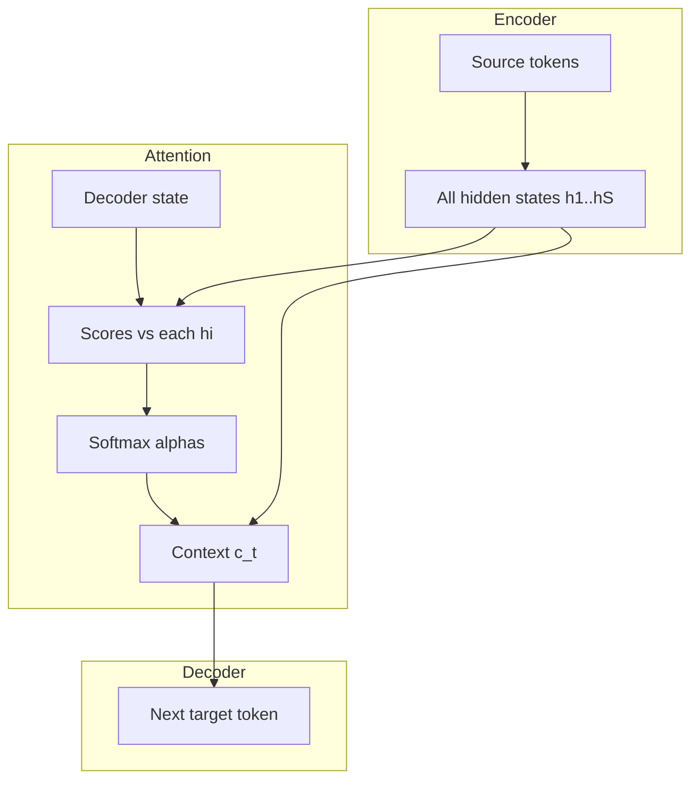

**What this is:** Sequence-to-sequence (seq2seq) models turn one sequence into another — English to French, speech to text, a paragraph to a summary.

**Why it matters:** The first neural seq2seq systems worked, but they had a serious flaw: the encoder crushed the entire input into one fixed-size vector. **Bahdanau attention** (2015) was the first big fix — it let the decoder look back at every encoder step instead of trusting one summary. That idea is the direct ancestor of the attention inside modern transformers.

## Intuition

Picture reading a long email, then replying from memory with no way to scroll back. Early details — names, negation, rare words — fade fast. Classical seq2seq did exactly that to models.

**The old flow:**

```
"The" → "cat" → "sat"  →  ONE context vector  →  "Le" → "chat" → "assis"
         (encoder reads left to right)              (decoder writes left to right)
```

The encoder reads the source one token at a time with a **recurrent neural network (RNN)**. When it reaches the last word, it hands the decoder a single **context vector** — a fixed-size summary of the whole input. The decoder must generate every output word using only that one vector plus its own past outputs.

**Why that breaks on long inputs:** Imagine translating a 100-word paragraph. The network must squeeze every adjective, clause, and verb into one vector (say, 512 numbers). By word 80, details from word 5 — like whether a noun was singular or plural — get overwritten. The decoder translates from a blurry, generic memory.

**Bahdanau's fix:** Stop throwing away intermediate encoder states. Save every hidden state `h_1, h_2, …, h_n` in a memory bank. At each decoder step, the model asks: "Which source words matter right now?" and builds a **fresh context** as a weighted blend of those saved states.

When translating the French word for "cat," the spotlight might land 90% on English "cat" and 5% on "The" and "sat":

```
Saved encoder memory:  [h1: "The"]   [h2: "cat"]   [h3: "sat"]
Focus weights:           5%            90%            5%
                              ↑
                    decoder generating "chat"
```

:::key
Attention is not yet the full Transformer — RNNs still run step by step. But the core idea — **soft lookup over a memory bank** — is exactly what query/key/value (Q/K/V) self-attention does later.
:::

## How it works

### The encoder (no attention yet)

For source tokens `x_1 … x_S`:

```
h_t = EncoderRNN(h_{t-1}, x_t)     # h_t shape: (d,)
```

Store the full list `H = [h_1, …, h_S]`. A **bidirectional** encoder runs forward and backward, then joins the two states so each `h_t` sees both left and right context.

### The decoder without attention (the bottleneck)

Initialize from the final encoder state `h_S`. At step `t` with previous target token `y_{t-1}`:

```
s_t = DecoderRNN(s_{t-1}, y_{t-1})
p_t = softmax(W_out @ s_t)         # probability over target vocabulary
```

All source information must already live inside `s_0` / `h_S`. That single-vector squeeze is the **context vector bottleneck**.

### Bahdanau (additive) attention

Given decoder state `s_{t-1}` and each encoder state `h_i`:

```
score_ti = v^T tanh(W_s @ s_{t-1} + W_h @ h_i)
alpha_t  = softmax_i(score_ti)           # weights sum to 1
c_t      = sum_i  alpha_ti * h_i         # fresh context for step t
```

Feed `c_t` into the decoder:

```
s_t = DecoderRNN(s_{t-1}, [y_{t-1}; c_t])
p_t = softmax(W_out @ [s_t; c_t])
```

| Piece | Plain-English idea |
| --- | --- |
| **score_ti** | How relevant is source word `i` to what the decoder wants to say next? |
| **alpha_ti** | Soft spotlight weights — turn up relevant words, dim the rest |
| **c_t** | A custom summary built just for this decode step |

### Training note

During training, **teacher forcing** feeds the correct previous token as `y_{t-1}`. Loss is token-level cross-entropy. At inference, the model feeds its own previous prediction back in — which can cause **exposure bias** when train and test prefixes diverge.



## In code

Toy NumPy Bahdanau scores and context for one decoder step:

```python
import numpy as np

def softmax(z):
    z = z - z.max()
    e = np.exp(z)
    return e / e.sum()

rng = np.random.default_rng(0)
S, d = 4, 8  # source length, hidden size
H = rng.normal(size=(S, d))          # encoder states
s_prev = rng.normal(size=(d,))       # decoder state

W_s = rng.normal(0, 0.1, size=(d, d))
W_h = rng.normal(0, 0.1, size=(d, d))
v = rng.normal(0, 0.1, size=(d,))

scores = np.array([
    v @ np.tanh(W_s @ s_prev + W_h @ H[i])
    for i in range(S)
])
alpha = softmax(scores)
c = alpha @ H  # weighted sum, shape (d,)

print("scores:", np.round(scores, 3))
print("alpha:", np.round(alpha, 3), "sum=", alpha.sum())
print("context norm:", np.linalg.norm(c))
```

Real systems vectorize the `tanh` scores as batched matrix math. **Luong attention** uses simpler dot products — same soft-alignment story, different scoring formula.

## What goes wrong

- **Still stuck in RNN loops.** Attention fixes the single-vector bottleneck but not the slow, step-by-step training of RNNs. Very long sources remain expensive compared with self-attention stacks.
- **Alignment failure.** If scores are noisy or encoder states are weak, weights become near-uniform or stuck on punctuation — the decoder "looks" but learns little.
- **Length explosion.** Soft attention over thousands of positions can blur; later architectures add locality, sparsity, or multi-head structure.
- **Train vs decode mismatch.** Teacher forcing hides errors the model will make at inference. Production seq2seq needs robust decoding strategies.
- **Skipping this lesson.** Without the bottleneck story, "why Q/K/V?" feels unmotivated. Attention exists because one fixed vector was not enough.

## One-line summary

Classical seq2seq crushed the source into one vector; Bahdanau attention rebuilds a soft, per-step context from all encoder states so the decoder can look back where it needs.

## Key terms

- **Seq2seq** — A model that maps an input sequence to an output sequence.
- **Encoder–decoder** — Read the source into states; generate the target from those states.
- **Context vector bottleneck** — Compressing a whole input into one fixed-size summary vector.
- **Alignment weights (alpha)** — A softmax distribution over source positions at each decode step.
- **Bahdanau attention** — Additive scoring of decoder state against each encoder state, then a weighted sum.
- **Teacher forcing** — Training the decoder on gold (correct) prefixes rather than its own predictions.
- **Exposure bias** — Train/test mismatch when inference feeds predicted tokens back in.
