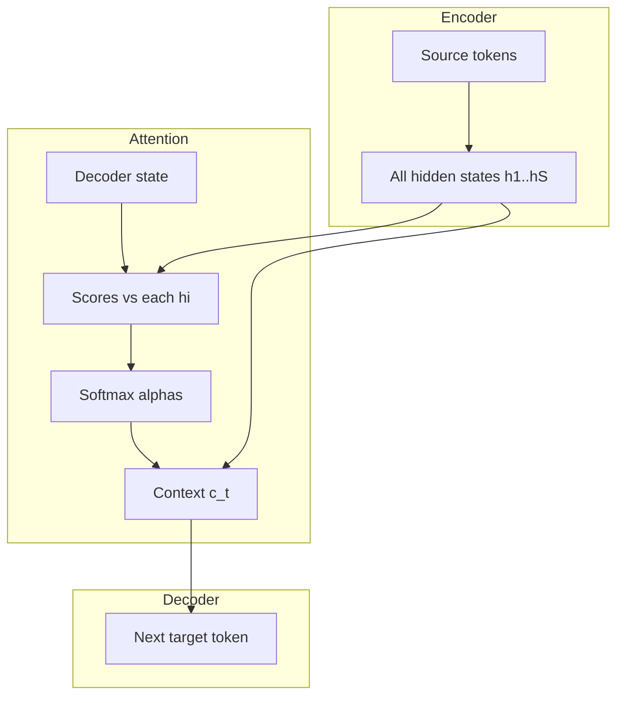

Sequence-to-sequence (**seq2seq**) learning maps one variable-length sequence to another: translate a sentence, summarize a paragraph, turn speech frames into text. The first neural systems that worked at scale used an **RNN encoder** to read the source and an **RNN decoder** to emit the target. Clever—and brittle. The encoder often handed the decoder a single fixed vector, a sticky note meant to hold an entire paragraph. **Bahdanau attention** punched holes in that sticky-note bottleneck by letting each decoding step soft-search the encoder’s full memory. This lesson is the historical and conceptual on-ramp to transformers: same problem (align source and target), different spotlight mechanism.

## Intuition

You finish reading a long email and must reply from memory alone. Early details—negation, names, rare constraints—fade. Classical seq2seq did that to models: after the last source token, only `h_T` (or a small pool) remained. The decoder then generated words conditioned mostly on that compressed **context vector** plus its own past outputs. Short, simple sentences survived. Long or information-dense inputs did not.

Bahdanau attention changes the job description. The encoder still produces a state per source position, but **keeps all of them**. At each decoder step, the model scores “how relevant is source position `i` to what I’m about to say?”, turns scores into a softmax distribution (alignment weights), and builds a **fresh** context as a weighted sum of encoder states. Translating the French word for “cat” can look directly at English “cat” instead of hoping it survived in a single summary vector.

Attention is not yet the full Transformer: recurrence remains, and training is still largely sequential. But the key idea—**content-based soft lookup over memories**—is the ancestor of Q/K/V attention you will study next.

## How it works

**Encoder.** For source tokens `x_1 … x_S` (usually embeddings):

```
h_t = EncoderRNN(h_{t-1}, x_t)     # h_t shape: (d,)
```

Store the list `H = [h_1, …, h_S]`. Bidirectional encoders concatenate forward/backward states so each `h_t` sees left and right source context.

**Decoder without attention (bottleneck).** Initialize from `h_S` (or a projection). At step `t` with previous target embedding `y_{t-1}`:

```
s_t = DecoderRNN(s_{t-1}, y_{t-1})
p_t = softmax(W_out @ s_t)         # distribution over target vocab
```

All source information must already live in `s_0` / `h_S`. That is the bottleneck.

**Bahdanau (additive) attention.** Given decoder state `s_{t-1}` (or `s_t`, depending on formulation) and each encoder state `h_i`:

```
score_ti = v^T tanh(W_s @ s_{t-1} + W_h @ h_i)
alpha_t  = softmax_i(score_ti)           # sum_i alpha_ti = 1
c_t      = sum_i  alpha_ti * h_i         # context vector for step t
```

Feed `c_t` into the decoder update and/or the output projection (concat with `s_t` is common):

```
s_t = DecoderRNN(s_{t-1}, [y_{t-1}; c_t])
p_t = softmax(W_out @ [s_t; c_t])
```

**Training.** Teacher forcing feeds the gold previous token as `y_{t-1}`. Loss is usually token-level cross-entropy summed over the target. At inference, feed the model’s own previous prediction (greedy or beam search)—exposure bias appears when train/test prefixes diverge.



## In code

Toy NumPy Bahdanau scores and context for one decoder step:

```python
import numpy as np

def softmax(z):
    z = z - z.max()
    e = np.exp(z)
    return e / e.sum()

rng = np.random.default_rng(0)
S, d = 4, 8  # source length, hidden size
H = rng.normal(size=(S, d))          # encoder states
s_prev = rng.normal(size=(d,))       # decoder state

W_s = rng.normal(0, 0.1, size=(d, d))
W_h = rng.normal(0, 0.1, size=(d, d))
v = rng.normal(0, 0.1, size=(d,))

scores = np.array([
    v @ np.tanh(W_s @ s_prev + W_h @ H[i])
    for i in range(S)
])
alpha = softmax(scores)
c = alpha @ H  # weighted sum, shape (d,)

print("scores:", np.round(scores, 3))
print("alpha:", np.round(alpha, 3), "sum=", alpha.sum())
print("context norm:", np.linalg.norm(c))
```

Real systems vectorize the `tanh` scores as a batched matmul; Luong attention uses simpler dot or general products—same soft-alignment story.

## What goes wrong

**Still-recurrent walls.** Attention fixes the single-vector bottleneck but not GPU parallelism of the RNN unroll; very long sources remain slow to train compared with self-attention stacks.

**Alignment failure.** If scores are noisy or the encoder states are weak, alphas become near-uniform or stuck on BOS/punctuation; the decoder “looks” but learns little.

**Length explosion without structure.** Soft attention over thousands of positions is differentiable but can blur; later architectures add locality, sparsity, or multi-head structure.

**Confusing train and decode.** Teacher forcing hides errors the model will make at inference. Scheduled sampling or robust decoding strategies matter for production seq2seq.

**Skipping this lesson and jumping to Transformers.** Without the bottleneck story, “why Q/K/V?” feels unmotivated. Attention exists because fixed context vectors were not enough.

## One-line summary

Classical seq2seq crushed the source into one vector; Bahdanau attention rebuilds a soft, per-step context from all encoder states so the decoder can look back where it needs.

## Key terms

- **Seq2seq** — Models that map an input sequence to an output sequence.
- **Encoder–decoder** — Read source into states; generate target conditioned on those states.
- **Context vector bottleneck** — Relying on a single fixed summary of the entire source.
- **Alignment weights (`alpha`)** — Softmax distribution over source positions at a decode step.
- **Bahdanau attention** — Additive scoring of decoder state against each encoder state, then weighted sum.
- **Teacher forcing** — Training the decoder on gold prefixes rather than its own predictions.
- **Exposure bias** — Train/test mismatch when inference feeds predicted tokens back in.
