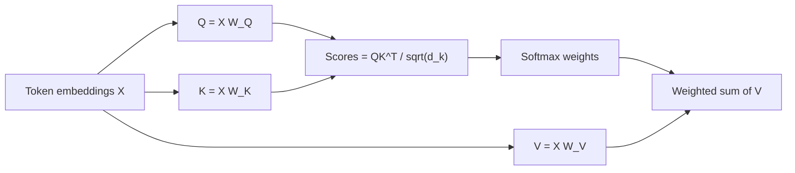

When an LLM resolves “it” in a sentence or latches onto a constraint in your system prompt, it is not searching a database — it is running **self-attention**. Each token builds a query (“what do I need?”), compares it to other tokens’ keys (“what do I offer?”), and mixes their values (“what content should flow?”). Master this block and you understand the core compute inside almost every modern GenAI model.

## Intuition

Picture YouTube search. Your **query** is the search box. Each video exposes a **key** (title, tags) for matching. The **value** is the video content you actually watch after ranking. Softmax turns match scores into a distribution; the result is a weighted blend of values, not a single hard pick.

In a sentence, the token “it” might query for animate nouns; “animal” offers a matching key and contributes its value vector into the updated representation of “it.” Attention is content-based addressing over the sequence: relevance is computed from learned projections, not from fixed offsets.

Self-attention means Q, K, and V all come from the **same** sequence (after linear maps). That lets every position refine itself using the whole context — the reason transformers handle long-range agreement better than local n-gram heuristics.

## How it works

Start with token embeddings `X` of shape `(n, d_model)` — `n` tokens, each a `d_model`-vector. Three learned matrices produce:

```
Q = X W_Q    # (n, d_k)
K = X W_K    # (n, d_k)
V = X W_V    # (n, d_v)
```

Often `d_v = d_k`. Pairwise scores are dot products between queries and keys:

```
scores_ij = (Q_i * K_j) / sqrt(d_k)
```

Divide by `sqrt(d_k)` so that as dimension grows, scores do not explode into huge magnitudes that push softmax into tiny gradients. Then:

```
Attention(Q, K, V) = softmax(Q K^T / sqrt(d_k)) V
```

Row `i` of the softmax matrix is a probability distribution over positions that token `i` will read from. Multiplying by `V` yields a new vector for each token: a soft retrieval of information from the sequence.

**Worked intuition.** Sentence: “The animal did not cross the street because it was tired.” For query position “it”, high weight often lands on “animal” (antecedent) and “tired” (predicate). The updated embedding of “it” becomes a mixture that encodes that binding — fuel for later layers and the final next-token head.

**Complexity.** Computing `Q K^T` is O(n^2 d_k). That quadratic term is why context-window length dominates cost and why “128k context” is an engineering story, not a free lunch.



In stacked layers, the *input* to attention is already a contextualized residual stream. Early layers often mix local syntax; deeper layers mix longer semantic links. You rarely inspect raw heads in production, but the same API — scores, softmax, value mix — is what kernels fuse for inference speed.

**Batching view.** Frameworks add a batch dimension: `Q` becomes `(batch, n, d_k)` or, with heads, `(batch, h, n, d_k)`. The math per sequence is unchanged; GPUs shine because every query–key score is a dense matmul. When people say “attention is all you need,” they mean this differentiable routing replaces recurrence — not that the rest of the block disappears.

## In code

A complete single-head attention forward pass on a toy sequence (fixed projections, no training).

```python
import numpy as np

def softmax(x, axis=-1):
    x = x - x.max(axis=axis, keepdims=True)
    e = np.exp(x)
    return e / e.sum(axis=axis, keepdims=True)

rng = np.random.default_rng(1)
n, d_model, d_k = 4, 8, 8
X = rng.normal(size=(n, d_model))
W_Q = rng.normal(size=(d_model, d_k)) * 0.2
W_K = rng.normal(size=(d_model, d_k)) * 0.2
W_V = rng.normal(size=(d_model, d_k)) * 0.2

Q, K, V = X @ W_Q, X @ W_K, X @ W_V
scores = (Q @ K.T) / np.sqrt(d_k)
weights = softmax(scores, axis=-1)
out = weights @ V

print("weights row 0 (sum~1):", np.round(weights[0], 3), "sum", weights[0].sum())
print("output shape", out.shape)  # (n, d_k)
```

Row sums near 1.0 confirm a valid attention distribution. Change `X[0]` drastically and watch row-0 weights shift — that is content-based routing in miniature.

## What goes wrong

- **Skipping the scale.** Without `/ sqrt(d_k)`, high-dimensional dots saturate softmax; gradients shrink and training stalls.
- **Confusing Q/K/V roles.** Q is “what I ask”; K is “how I am indexed”; V is “what I contribute.” Swapping them in an explanation is a common interview miss.
- **Thinking softmax picks one token.** Softmax is soft: many positions can share mass. Hard argmax would destroy gradient flow and nuance.
- **Numerical instability.** Softmax should subtract the row max (as in the code) before `exp` to avoid overflow.
- **Assuming one head sees everything.** A single head has limited subspace; multi-head attention (next lesson) fixes that by running several projections in parallel.

## One-line summary

Self-attention updates each token by softmax-weighted retrieval over values, with weights from scaled query–key dot products on the same sequence.

## Key terms

- **Query (Q):** projection used to ask for relevant context.
- **Key (K):** projection used to be matched against queries.
- **Value (V):** projection mixed into the output when attended.
- **Scaled dot-product attention:** `softmax(QK^T / sqrt(d_k)) V`.
- **Attention weights:** row-wise softmax distribution over positions.
- **d_k:** key/query dimension; sets the scale factor.
- **Self-attention:** Q/K/V derived from the same token sequence.
