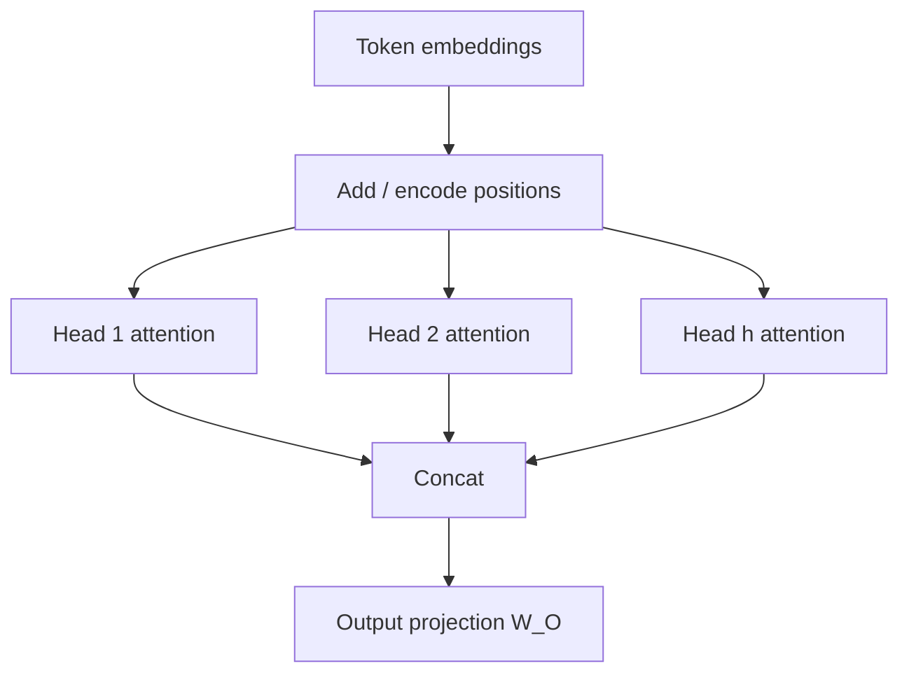

**What this is:** Self-attention compares tokens by content alone — it has no built-in sense of word order. **Positional encoding** adds that missing signal. **Multi-head attention (MHA)** runs several attention "cameras" at once so the model can track syntax, coreference, and local order in parallel.

**Why it matters:** These two design choices appear in every Transformer diagram and most ML system-design interviews.

## Intuition

Attention answers "who is relevant to whom?" based on content. Language also needs "who comes before whom?" Without position, the model is **permutation-invariant** — shuffle the tokens and the set of pairwise scores can stay equally plausible.

**Example:**

| Sentence | Without positions |
| --- | --- |
| "The cat ate the mouse." | Same word embeddings, same attention patterns |
| "The mouse ate the cat." | Same word embeddings, same attention patterns |

The model cannot tell these apart until positional signals stamp each slot with a unique location signature.

One attention head is a single soft routing pattern in one projected subspace. Real sentences need several patterns at once:

- One head may look at the next token (local syntax)
- Another at the verb for its subject (grammar)
- Another at a distant noun for a pronoun (coreference)

Multi-head attention is the ensemble of those routers, concatenated and projected back into the model dimension.

:::key
Attention moves information **between** tokens. The feed-forward network (FFN) processes information **within** a token. Residual connections and layer normalization (LN) keep both stable. A full encoder block = MHA + FFN + residual + LN — not attention alone.
:::

## How it works

### Positional encoding

The classic Transformer adds a position vector to each token embedding:

```
x_i = token_embedding_i + position_i
```

**Sinusoidal encodings** use geometric wavelengths across dimensions (even dims sine, odd dims cosine). Different frequencies let the model infer relative offsets: the difference between positions `pos` and `pos+k` has a structured form in that basis.

**Learned embeddings** store a trainable vector per index `0..max_len-1`. Simple, but weak when you need to handle sequences longer than training.

**Modern variants** (RoPE, ALiBi, relative position biases) encode distance rather than absolute index. The product intuition stays the same: inject order because attention alone does not know left from right.

### Multi-head attention (MHA)

Split into `h` heads with smaller `d_k = d_model / h`:

```
head_i = Attention(X * W_Q_i, X * W_K_i, X * W_V_i)
MultiHead(X) = Concat(head_1, ..., head_h) * W_O
```

Each head has its own Q/K/V projections. Concatenation restores width; output projection `W_O` mixes head outputs. Capacity grows with diverse subspaces, not merely with a fatter single head.

| Design choice | Plain-English idea |
| --- | --- |
| **Multiple heads** | Several parallel "spotlights" on different relationship types |
| **Smaller d_k per head** | Each head works in a focused subspace |
| **Concat + W_O** | Glue head outputs back into one unified representation |

### The complete encoder block pipeline

Inside each of the 6 stacked encoder blocks:

```
Input x
  → Multi-head attention
  → ADD (x + Attn(x))          ← residual connection
  → Layer normalization
  → Feed-forward network (FFN)
  → ADD (Norm + FFN(Norm))     ← residual connection
  → Layer normalization
  → Output to next block
```



## In code

Build sinusoidal-style positions and run two tiny heads, then concatenate:

```python
import numpy as np

def sinusoidal_positions(n, d_model):
    pos = np.arange(n)[:, None]
    i = np.arange(d_model)[None, :]
    angles = pos / (10000 ** (2 * (i // 2) / d_model))
    pe = np.zeros((n, d_model))
    pe[:, 0::2] = np.sin(angles[:, 0::2])
    pe[:, 1::2] = np.cos(angles[:, 1::2])
    return pe

def softmax(x, axis=-1):
    x = x - x.max(axis=axis, keepdims=True)
    e = np.exp(x)
    return e / e.sum(axis=axis, keepdims=True)

def attention(Q, K, V):
    d_k = Q.shape[-1]
    weights = softmax((Q @ K.T) / np.sqrt(d_k), axis=-1)
    return weights @ V, weights

rng = np.random.default_rng(2)
n, d_model, h = 5, 8, 2
d_k = d_model // h
tokens = rng.normal(size=(n, d_model))
X = tokens + sinusoidal_positions(n, d_model)

outs, weight_rows = [], []
for _ in range(h):
    W_Q = rng.normal(size=(d_model, d_k)) * 0.2
    W_K = rng.normal(size=(d_model, d_k)) * 0.2
    W_V = rng.normal(size=(d_model, d_k)) * 0.2
    out, w = attention(X @ W_Q, X @ W_K, X @ W_V)
    outs.append(out)
    weight_rows.append(w[0])

multi = np.concatenate(outs, axis=-1)  # (n, d_model)
print("multi-head out shape", multi.shape)
print("head0 row0", np.round(weight_rows[0], 3))
print("head1 row0", np.round(weight_rows[1], 3))
```

Heads disagree on where token 0 looks — that diversity is the point. Swap the order of `tokens` *without* adding positional encoding and patterns become order-blind; with positions, shuffled inputs no longer match the original.

## What goes wrong

- **Forgetting positions entirely.** Models confuse order-sensitive tasks; code and natural language both break.
- **Absolute embeddings and long context.** Learned tables do not extrapolate cleanly past `max_len`; production long-context models usually use relative or RoPE-style schemes.
- **Too few heads or tiny d_k.** Extreme splits starve each head of capacity; extreme merges waste the multi-pattern idea.
- **Reading head visualizations as gospel.** Attention maps are hints, not causal proofs of reasoning.
- **Ignoring residuals and norms in explanations.** In interviews, "Transformer block = MHA + FFN + residual + LN" is the expected unit.

## One-line summary

Positional signals make attention order-aware, and multi-head attention runs several scaled dot-product routers in parallel before concatenating them back into the residual stream.

## Key terms

- **Permutation invariance** — Bag-like behavior of pure attention without positions.
- **Positional encoding** — Vectors or biases that inject word order or distance.
- **Sinusoidal encoding** — Fixed sine/cosine patterns across dimensions.
- **RoPE / relative bias** — Modern schemes that encode relative offsets between tokens.
- **Multi-head attention (MHA)** — Parallel heads with distinct Q/K/V projections.
- **Output projection (W_O)** — Mixes concatenated head outputs back to model width.
- **Residual connection** — A shortcut path that lets gradients flow deeper without degrading.
- **Layer normalization (LN)** — Standardizes feature distributions to keep activations balanced.
