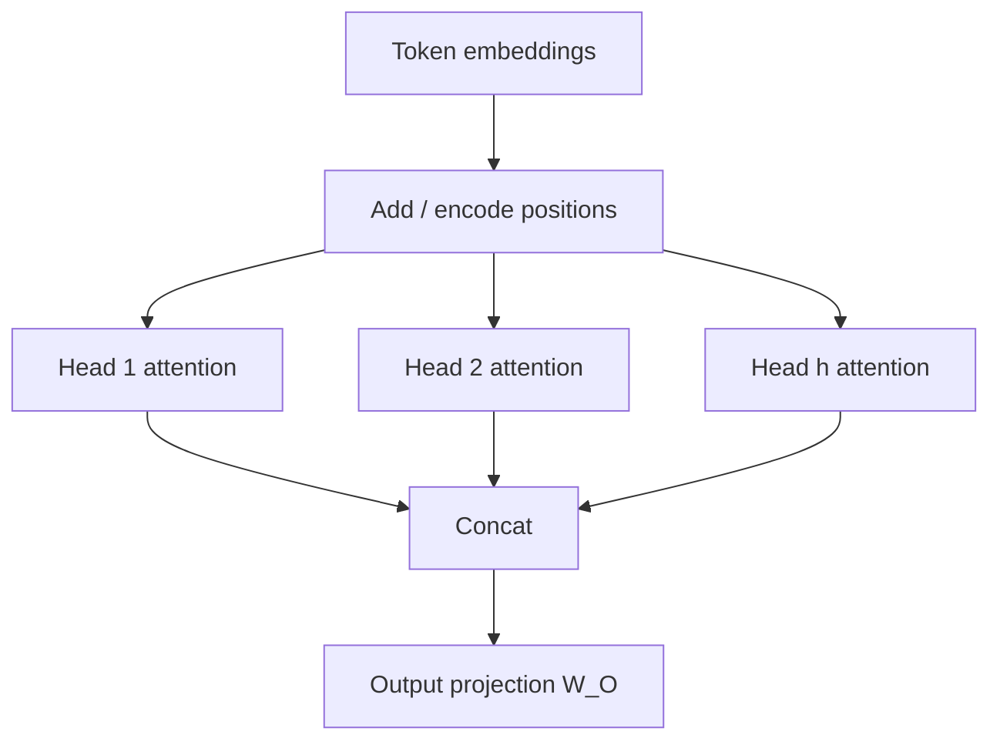

Self-attention is a bag-of-vectors mixer unless you tell it where each token sits. “Dog bites man” and “Man bites dog” can share the same multiset of embeddings and produce the same attention patterns if position is absent. **Positional encodings** break that symmetry. **Multi-head attention (MHA)** then runs several attention “cameras” at once so the model can track syntax, coreference, and local order in parallel — two design choices you will meet in every Transformer diagram and most ML system-design interviews.

## Intuition

Attention answers “who is relevant to whom?” based on content. Language also needs “who comes before whom?” Without position, the model is **permutation-invariant**: shuffle the tokens and the set of pairwise scores can stay equally plausible. Adding a position vector (or relative bias) stamps each slot with a unique pattern so order becomes a feature.

One attention head is a single soft routing pattern in one projected subspace. Real sentences need several patterns at once: one head may look at the next token, another at the verb for a subject, another at closing punctuation. Multi-head attention is the ensemble of those routers, concatenated and projected back into the model dimension.

## How it works

**Absolute positions.** The classic Transformer adds a position vector to each token embedding:

```
x_i = token_embedding_i + position_i
```

Sinusoidal encodings use geometric wavelengths across dimensions (even dims sine, odd dims cosine). Different frequencies let the model infer relative offsets: the difference between positions `pos` and `pos+k` has a structured form in that basis. Learned embeddings instead store a vector per index `0..max_len-1` and train them — simple, but weak when you extrapolate past the trained length.

**Relative and modern variants.** Many LLMs use relative position biases, rotary embeddings (RoPE), or ALiBi-style slopes so distance, not absolute index, drives the interaction. The product intuition stays the same: inject order because attention alone does not know left from right.

**Multi-head attention.** Split (or project) into `h` heads with smaller `d_k = d_model / h`:

```
head_i = Attention(X W_Q_i, X W_K_i, X W_V_i)
MultiHead(X) = Concat(head_1, ..., head_h) W_O
```

Each head has its own Q/K/V projections. Concatenation restores width; `W_O` mixes head outputs. Capacity grows with diverse subspaces, not merely with a fatter single head (which still computes one similarity metric).



**Stack glue.** Around attention you almost always find residual connections and layer norm (pre-norm is common in LLMs): `x + Attention(Norm(x))`, then `x + FFN(Norm(x))`. Residuals keep gradients healthy; the FFN applies token-wise nonlinear compute after the routing step. Interview framing: attention moves information *between* tokens; the MLP processes information *within* a token.

## In code

Build sinusoidal-style positions and run two tiny heads, then concatenate.

```python
import numpy as np

def sinusoidal_positions(n, d_model):
    pos = np.arange(n)[:, None]
    i = np.arange(d_model)[None, :]
    angles = pos / (10000 ** (2 * (i // 2) / d_model))
    pe = np.zeros((n, d_model))
    pe[:, 0::2] = np.sin(angles[:, 0::2])
    pe[:, 1::2] = np.cos(angles[:, 1::2])
    return pe

def softmax(x, axis=-1):
    x = x - x.max(axis=axis, keepdims=True)
    e = np.exp(x)
    return e / e.sum(axis=axis, keepdims=True)

def attention(Q, K, V):
    d_k = Q.shape[-1]
    weights = softmax((Q @ K.T) / np.sqrt(d_k), axis=-1)
    return weights @ V, weights

rng = np.random.default_rng(2)
n, d_model, h = 5, 8, 2
d_k = d_model // h
tokens = rng.normal(size=(n, d_model))
X = tokens + sinusoidal_positions(n, d_model)

# Two heads with separate projections
outs, weight_rows = [], []
for _ in range(h):
    W_Q = rng.normal(size=(d_model, d_k)) * 0.2
    W_K = rng.normal(size=(d_model, d_k)) * 0.2
    W_V = rng.normal(size=(d_model, d_k)) * 0.2
    out, w = attention(X @ W_Q, X @ W_K, X @ W_V)
    outs.append(out)
    weight_rows.append(w[0])

multi = np.concatenate(outs, axis=-1)  # (n, d_model)
print("multi-head out shape", multi.shape)
print("head0 row0", np.round(weight_rows[0], 3))
print("head1 row0", np.round(weight_rows[1], 3))
```

Heads disagree on where token 0 looks — that diversity is the point. Swap the order of `tokens` *without* adding `pe` and patterns become order-blind; with `pe`, shuffled inputs no longer match the original.

## What goes wrong

- **Forgetting positions entirely.** Models confuse order-sensitive tasks; code and natural language both break.
- **Absolute embeddings and long context.** Learned tables do not extrapolate cleanly past `max_len`; production long-context models usually use relative/RoPE-style schemes.
- **Too few heads or tiny `d_k`.** Extreme splits starve each head of capacity; extreme merges waste the multi-pattern idea.
- **Reading head visualizations as gospel.** Attention maps are hints, not causal proofs of reasoning.
- **Ignoring residuals/norms in explanations.** In interviews, “Transformer block = MHA + FFN + residual + norm” is the expected unit, not attention alone.

## One-line summary

Positional signals make attention order-aware, and multi-head attention runs several scaled dot-product routers in parallel before concatenating them back into the residual stream.

## Key terms

- **Permutation invariance:** bag-like behavior of pure attention without positions.
- **Positional encoding:** vectors or biases that inject order or distance.
- **Sinusoidal encoding:** fixed sine/cosine patterns across dimensions.
- **RoPE / relative bias:** modern schemes that encode relative offsets.
- **Multi-head attention (MHA):** parallel heads with distinct Q/K/V projections.
- **Output projection `W_O`:** mixes concatenated head outputs.
- **Residual + layer norm:** stabilization pattern wrapping attention and FFN blocks.
