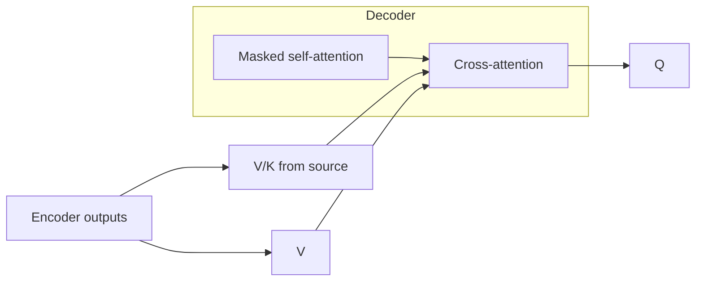

Training a language model on “The cat sat on the ___” only works if the network cannot peek at the answer token while predicting it. **Causal (look-ahead) masking** enforces that rule inside decoder self-attention. In encoder–decoder models, a second mechanism — **cross-attention** — lets each target position read from the *source* sequence. Together they explain GPT-style stacks (mask only) and classic Transformer translation (mask + cross).

## Intuition

Think of writing a sentence on a strip of paper covered by a sliding sleeve: you may see everything up to the pen tip, never beyond it. That sleeve is the causal mask. During training we still process the whole target in parallel for speed, but illegal future links get score `-inf` before softmax so their weights become zero.

Cross-attention is a second meeting room. The decoder brings questions (queries from the target side); the encoder brings a library of notes (keys and values from the source). Generating the French word for “cat” can attend strongly to the English token “cat” even though self-attention on the French prefix knows nothing about English.

Decoder-only LLMs skip the encoder library and use the prompt + generated tokens as the only sequence — still causal self-attention, no cross-attn block. Encoder–decoder models (summarization, MT, some T5-style setups) keep both.

## How it works

**Causal mask.** For length `n`, build an `n × n` matrix `M` where `M_ij = 0` if `j <= i` and `-inf` if `j > i` (upper triangle forbidden). Then:

```
scores = Q K^T / sqrt(d_k) + M
weights = softmax(scores)   # future positions ~ 0
output  = weights V
```

Position `i` may attend to keys `0..i` only. Training can still use teacher forcing: feed the full gold target, predict all next tokens in parallel under the mask — much faster than truly sequential loops.

**Cross-attention.** Let `H_enc` be encoder outputs `(n_src, d)` and `H_dec` the current decoder states `(n_tgt, d)`:

```
Q = H_dec W_Q
K = H_enc W_K
V = H_enc W_V
CrossAttn = softmax(Q K^T / sqrt(d_k)) V
```

No causal mask is required across the source (the encoder already saw the full input). Masking still applies to *decoder self-attention* so the target side remains autoregressive.



**Self vs cross (cheat sheet).**

| Mechanism | Q from | K/V from | Typical role |
| --- | --- | --- | --- |
| Decoder self-attn | Target | Target (masked) | Fluency, local target context |
| Cross-attn | Target | Source / encoder | Alignment to input |
| Encoder self-attn | Source | Source (unmasked) | Bidirectional source context |

**Padding masks.** Separate from causality: set scores for pad tokens to `-inf` so empty slots do not soak probability mass. Production batches always combine padding masks with causal masks on the decoder side.

**Training vs inference.** Masks make *training* parallel: the whole target length can be predicted in one forward pass under the triangle. At *inference*, you still generate left to right because the true future tokens do not exist yet — the mask’s job is to keep the training objective honest so that skill transfers to that serial loop.

## In code

Apply a causal mask and contrast with unmasked attention on the same scores.

```python
import numpy as np

def softmax(x, axis=-1):
    x = x - np.nanmax(x, axis=axis, keepdims=True)
    e = np.exp(x)
    return e / e.sum(axis=axis, keepdims=True)

rng = np.random.default_rng(3)
n, d = 4, 6
X = rng.normal(size=(n, d))
W_Q = W_K = W_V = np.eye(d)
Q, K, V = X @ W_Q, X @ W_K, X @ W_V
raw = (Q @ K.T) / np.sqrt(d)

causal = np.triu(np.ones((n, n)) * -1e9, k=1)  # forbid j > i
masked_weights = softmax(raw + causal, axis=-1)
open_weights = softmax(raw, axis=-1)

print("causal weights (row 1):", np.round(masked_weights[1], 3))
print("open weights   (row 1):", np.round(open_weights[1], 3))

# Toy cross-attention: 3 source positions, 2 target queries
H_enc = rng.normal(size=(3, d))
H_dec = rng.normal(size=(2, d))
cross_scores = (H_dec @ H_enc.T) / np.sqrt(d)
cross_w = softmax(cross_scores, axis=-1)
print("cross-attn weights:\n", np.round(cross_w, 3))
```

Row 1 under the causal mask should put ~0 on columns 2 and 3, while the open matrix can peek ahead — exactly the training cheat masking prevents.

## What goes wrong

- **Leaking future tokens.** A broken mask yields unrealistically high training accuracy and useless models at inference (where futures do not exist).
- **Mixing up architectures.** Saying “GPT uses cross-attention to the prompt” is sloppy: the prompt lives in the same causal self-attention stream.
- **Forgetting pad masks.** Models attend to padding and waste capacity or invent ghost tokens.
- **Encoder bidirectional vs decoder causal.** Encoders *should* see both directions; decoders must not. Blurring that distinction confuses MT explanations.
- **Assuming masks slow training to serial.** Masks allow parallel teacher-forced training; only *inference* generation is inherently serial (next lesson).

## One-line summary

Causal masks stop decoder self-attention from seeing future tokens, while cross-attention lets decoder queries read encoder keys/values for source–target alignment.

## Key terms

- **Causal / look-ahead mask:** triangular mask enforcing `attend only to ≤ i`.
- **Teacher forcing:** train on gold prefixes while predicting the next token at each position.
- **Cross-attention:** Q from decoder, K/V from encoder (or another sequence).
- **Self-attention:** Q/K/V from the same sequence.
- **Padding mask:** blocks non-content positions in batched sequences.
- **Encoder–decoder:** bidirectional encoder + masked decoder with cross-attn.
- **Decoder-only:** single stack with causal self-attention (typical LLMs).
