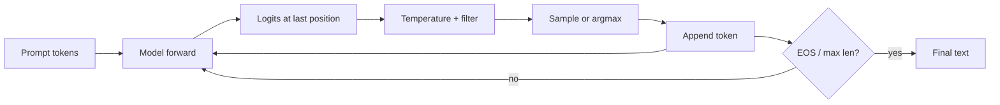

An LLM does not emit a paragraph in one shot. It runs an **autoregressive loop**: condition on the prompt, score the next token, append the choice, repeat until a stop condition. Architecture (causal Transformer) makes that loop valid; **decoding strategy** decides whether you get a safe factual tone, a creative draft, or a repetitive spiral. If you ship GenAI features, this lesson is the difference between “the model is dumb” and “we sampled badly.”

## Intuition

Think of improv storytelling: each sentence must fit everything already said. The model outputs a logit vector over the vocabulary; softmax turns it into probabilities; a policy picks an ID; that ID becomes part of the context for the next round. There is no separate “planning module” unless you add tools or search on top — the default product path *is* this token treadmill.

Greedy pick (always argmax) is like always choosing the safest next word: coherent early, often bland or locally trapped. Sampling from the full distribution is creative but can wander into nonsense. **Top-k** and **top-p (nucleus)** keep only the plausible head of the distribution, then sample — the practical middle ground behind many chat APIs.

## How it works

**The loop.**

1. Start with tokenized prompt (and optional BOS).
2. Forward the causal model -> logits for the last position.
3. Optionally divide logits by **temperature** `T` (`logits / T`): `T < 1` sharpens; `T > 1` flattens.
4. Convert to probabilities; apply a decoding policy.
5. Append the chosen token; stop on EOS, stop string, or `max_tokens`.

```
P(token_t | token_1..t-1) = softmax(logits_t / T)
```

Autoregressive factorization of a sequence:

```
P(x_1..x_L) = product_t P(x_t | x_1..x_{t-1})
```

**Policies.**

| Method | Rule | Trade-off |
| --- | --- | --- |
| Greedy | `argmax P` | Fast, deterministic, myopic |
| Beam search | Keep top-`B` partial strings | Better global score, less diversity, heavier |
| Top-k | Sample from k largest probs | Fixed-size candidate set |
| Top-p | Smallest set with mass >= p | Adaptive support; common in chat |

**KV cache (systems note).** Naively recomputing attention over the full prefix every step is wasteful. Inference stacks cache prior keys/values so each new token only pays for the new row — critical for product latency, even though the *algorithm* is still left-to-right.



**Why this matters for GenAI apps.** Temperature and nucleus settings change user-visible personality. RAG and tool calling still end in the same loop: retrieved text lands in the prompt, then decoding writes the answer. Evaluation should log seed/policy, not only the prompt — otherwise “flaky model” bugs are often flaky sampling.

**Repetition controls.** Frequency and presence penalties (API-side) down-weight tokens already used, fighting loops like “Yes. Yes. Yes.” They are not part of the Transformer math, but they sit on the same logits you just produced — another reminder that product quality is model *plus* decoding policy.

## In code

A toy vocabulary and one decoding step with temperature, greedy, and top-p.

```python
import numpy as np

def softmax(logits):
    x = logits - logits.max()
    e = np.exp(x)
    return e / e.sum()

def top_p_filter(probs, p=0.9):
    order = np.argsort(-probs)
    sorted_p = probs[order]
    cum = np.cumsum(sorted_p)
    keep = cum <= p
    keep[0] = True  # always keep the top token
    mask = np.zeros_like(probs, dtype=bool)
    mask[order[keep]] = True
    trimmed = np.where(mask, probs, 0.0)
    return trimmed / trimmed.sum()

vocab = ["the", "cat", "sat", "mat", "because", "it", "<EOS>"]
logits = np.array([2.0, 3.5, 1.2, 0.4, 0.8, 1.5, -1.0])

for T in (0.5, 1.0, 1.5):
    probs = softmax(logits / T)
    print(f"T={T}:", dict(zip(vocab, np.round(probs, 3))))

probs = softmax(logits / 1.0)
print("greedy ->", vocab[int(np.argmax(probs))])
rng = np.random.default_rng(4)
nucleus = top_p_filter(probs, p=0.85)
token = rng.choice(len(vocab), p=nucleus)
print("top-p sample ->", vocab[token], "mass kept", nucleus[nucleus > 0].sum())
```

Lower `T` concentrates mass on “cat”; higher `T` lifts the long tail. Nucleus sampling renormalizes after dropping the tail — the same knob exposed as `top_p` in many APIs.

## What goes wrong

- **Temperature too high.** Fluent-looking gibberish, contradicted facts, wild code.
- **Temperature too low / always greedy.** Repetition loops, generic phrasing, stuck patterns.
- **Beam search for open-ended chat.** Often dull or repetitive; beams shine more on short, exact tasks (some translation setups).
- **Ignoring stop conditions.** Models ramble past usefulness; always set `max_tokens` and stop sequences.
- **Blaming the base model for sampling bugs.** Non-deterministic APIs need logged parameters; compare greedy when debugging grounding issues.
- **Forgetting left-to-right cost.** Latency grows with output length; streaming tokens improves UX but not total FLOPs.

## One-line summary

Autoregressive decoding builds text token by token from causal next-token probabilities, with greedy, beam, top-k, and top-p policies shaping the trade-off between reliability and diversity.

## Key terms

- **Autoregressive:** each token depends on previous tokens only.
- **Logits:** raw scores over the vocabulary before softmax.
- **Temperature:** divides logits to sharpen or flatten the distribution.
- **Greedy decoding:** always pick the highest-probability token.
- **Beam search:** keep multiple partial hypotheses ranked by score.
- **Top-k / top-p (nucleus):** truncate the distribution, then sample.
- **KV cache:** inference optimization reusing past attention keys/values.
- **EOS / stop sequence:** termination signals for the generation loop.
