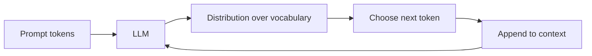

Large language models (LLMs) feel like they “know” things because they produce fluent paragraphs on demand. Under the hood they are not search engines or knowledge graphs: they are **next-token predictors** trained to continue text. That single idea explains their strengths (style, paraphrase, code patterns) and their failures (confident nonsense, stale facts, invented citations).

## Intuition

Imagine finishing your friend’s sentence. Given “The capital of France is”, you almost always say “Paris”. An LLM does a scaled-up version of that game over **tokens** (subword pieces), not whole words only.

Generation is **autoregressive**: predict one token, append it, predict the next, repeat until a stop condition. Each step conditions on everything already in the **context window** — the sliding (or fixed-size) buffer of recent tokens the model can attend to.

:::key
An LLM is a probability machine over sequences. Fluency comes from modeling language statistics well — not from looking up a verified fact table.
:::

## How it works

### Tokens (high level)

Text is split into tokens before the model sees it. Roughly:

- Short common words may be one token (`the`).
- Rare or long words may split (`unbelievable` -> pieces).
- Spaces and punctuation count.

Exact tokenization depends on the model’s vocabulary. For mental math, English often lands around ~0.75 words per token — useful for estimating context limits, not for precision.

### Next-token prediction

Training pushes the model to assign high probability to the actual next token in vast amounts of text. At inference time you sample (or greedily pick) from the predicted distribution.



### Context window

The **context window** is the maximum number of tokens the model can consider at once (prompt + generated so far, depending on API). If you overflow it, earlier tokens fall out of view — the model literally cannot “see” them. Long documents therefore need truncation, summarization, or retrieval, not wishful thinking.

Context is also where *instructions* live. System prompts, few-shot examples, retrieved snippets, and the user’s question all compete for the same budget. A 128k window sounds large until you paste three PDFs and wonder why the model ignored the policy buried on page one.

### Decoding choices (preview)

At each step the model emits a full distribution over the vocabulary. You then choose:

- **Greedy** — always take the top token (stable, sometimes dull or repetitive).
- **Sampling** — draw randomly according to probabilities (more variety, more risk).
- Later knobs (temperature, top-p, top-k) reshape that distribution before you choose.

You do not need the full decoding toolkit yet; you only need to remember that “the model said X” always means “given this context and this decoding policy, X was produced.”

### Why they feel smart but are not databases

LLMs compress statistical regularities of training text into weights. That yields:

- Strong pattern completion and style matching.
- Weak guarantees on factuality, freshness, or citation integrity.
- No built-in notion of “I looked this up in our CRM.”

A useful analogy: the model is closer to a very flexible **autocomplete** trained on the public internet (plus whatever else was in the mix) than to a curated encyclopedia with citations. Autocomplete can draft a brilliant email and still invent a meeting that never happened.

Treat them as **generators** you can steer with prompts, tools, and retrieval — not as authoritative stores.

:::tip
When you need a fact that must be right, ground the model with retrieved documents or an API call, then ask it to use that evidence — do not rely on memorized weights alone.
:::

## In code

Below is a tiny **bigram** table: given the previous word, pick the most likely next word (greedy). It is not an LLM, but it makes autoregressive generation concrete.

```python
# Toy "model": P(next | previous) as counts, then greedy decode
bigrams = {
    "<start>": {"The": 3, "A": 1},
    "The": {"cat": 4, "dog": 1},
    "cat": {"sat": 5, "ran": 1},
    "sat": {"on": 6},
    "on": {"the": 5},
    "the": {"mat": 4, "rug": 1},
    "mat": {".": 3},
}


def greedy_next(prev: str) -> str:
    choices = bigrams[prev]
    return max(choices, key=choices.get)


def generate(max_words: int = 12) -> str:
    words = []
    prev = "<start>"
    for _ in range(max_words):
        nxt = greedy_next(prev)
        words.append(nxt)
        if nxt == ".":
            break
        prev = nxt
    return " ".join(words).replace(" .", ".")


print(generate())
# The cat sat on the mat.
```

Swap the greedy `max` for random sampling weighted by counts and you get variety — the same trade-off real LLMs face between deterministic decoding and creative sampling (temperature, top-p, etc., covered later).

A slightly richer metaphor: store a few “prompt prefixes” and continue from them to show conditioning.

```python
def continue_from(seed: list[str], steps: int = 4) -> str:
    words = list(seed)
    for _ in range(steps):
        prev = words[-1]
        if prev not in bigrams:
            break
        words.append(greedy_next(prev))
        if words[-1] == ".":
            break
    return " ".join(words).replace(" .", ".")


print(continue_from(["The", "cat"]))
# The cat sat on the mat.
```

Sampling instead of greedy makes the “feels creative” path visible even with a tiny table:

```python
import random


def sample_next(prev: str) -> str:
    choices = bigrams[prev]
    words, weights = zip(*choices.items())
    return random.choices(words, weights=weights, k=1)[0]


random.seed(0)
print(sample_next("The"))  # often "cat", sometimes "dog"
```

Real LLMs replace this hand-built table with a neural net that conditions on *many* previous tokens at once. The control loop — score candidates, pick one, append, repeat — stays the same.

## What goes wrong

- **Hallucinations** — The model invents plausible names, APIs, or papers because those strings fit the local pattern.
- **Context blindness** — Critical instructions at the start of a huge prompt may get diluted or truncated; put constraints where the model still sees them and keep prompts lean.
- **Mistaking memorization for retrieval** — Asking “what did Alice email last Tuesday?” without tools yields fiction or generic guesses.
- **Over-trusting fluency** — Smooth prose raises perceived confidence; it does not raise truth probability.
- **Stopping rules** — Without max tokens or stop sequences, generation can ramble; with bad stops, it cuts mid-thought.
- **Toy models mislead** — Bigram greed is local; real transformers condition on the whole context window with attention, which is why they handle long-range agreement better — but the *loop* (predict -> append -> repeat) is the same.

:::warn
Never ship an LLM answer as a system of record. Log prompts, ground facts, and verify high-stakes outputs with humans or deterministic checks.
:::

## One-line summary

LLMs generate text by repeatedly predicting the next token from the current context — they are powerful sequence models, not databases of verified truth.

## Key terms

- **LLM (Large Language Model)** — A neural model trained on large text corpora to predict and generate language.
- **Token** — A vocabulary unit (often a subword) that the model reads and writes.
- **Next-token prediction** — Training/inference objective of guessing the following token given prior tokens.
- **Autoregressive generation** — Producing a sequence one token at a time, feeding outputs back as inputs.
- **Context window** — Maximum token span the model can attend to in one pass.
- **Greedy decoding** — Always choosing the highest-probability next token.
- **Hallucination** — Fluent but false or unsupported content produced by the model.
