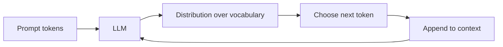

Large language models (LLMs) feel like they "know" things because they write smooth paragraphs on demand. Under the hood they are **not** search engines or fact databases. They are **next-token predictors** — programs trained to guess what text comes next. That one idea explains both their strengths (style, paraphrase, code patterns) and their failures (confident wrong answers, stale facts, invented citations).

## Intuition

**What is an LLM?** A neural network trained on huge amounts of text to predict the next small piece of language.

**Why does that matter?** It explains why the model can sound brilliant and still be wrong. Fluency comes from language patterns, not from looking up verified facts.

Imagine finishing your friend's sentence. Given "The capital of France is", you almost always say "Paris." An LLM does a scaled-up version of that game over **tokens** (subword pieces), not always whole words.

Generation is **autoregressive** (one token at a time, feeding each output back as input): predict one token, append it, predict the next, repeat until a stop condition. Each step only "sees" what fits in the **context window** — the fixed-size buffer of recent tokens the model can attend to.

:::key
An LLM is a probability machine over text sequences. Smooth writing means the model learned language statistics well — not that it checked a verified fact table.
:::

## How it works

### Tokens (high level)

Before the model reads your text, a **tokenizer** splits it into **tokens** — vocabulary pieces the model actually processes.

| Plain-English idea | What it means |
| --- | --- |
| **Token** | A small chunk of text (often a subword) the model reads and writes |
| **Common words** | Often one token each (`the`, `cat`) |
| **Rare or long words** | May split into several pieces |
| **Spaces and punctuation** | Count toward the token budget |

Exact tokenization depends on the model. For rough planning in English, think ~0.75 words per token — useful for estimating context limits, not for billing.

### Next-token prediction

During **pretraining** (learning from massive text), the model learns to assign high probability to the actual next token. At **inference** (when you call the model), you pick from that probability distribution — either the top choice (greedy) or a random sample.



### Context window

The **context window** is the maximum number of tokens the model can consider at once (prompt + generated text, depending on the API). If you overflow it, earlier tokens fall out of view — the model literally cannot "see" them.

Context is also where instructions live. System prompts, few-shot examples, retrieved snippets, and the user's question all compete for the same budget. A 128k window sounds huge until you paste three PDFs and wonder why the model ignored the policy on page one.

### Decoding choices (preview)

At each step the model emits a full distribution over the vocabulary. You then choose:

- **Greedy decoding** — always take the highest-probability token (stable, sometimes dull or repetitive).
- **Sampling** — draw randomly according to probabilities (more variety, more risk).

Later lessons cover **temperature**, **top-p**, and **top-k** — knobs that reshape that distribution before you choose. For now, remember: "the model said X" always means "given this context and this decoding policy, X was produced."

### Why they feel smart but are not databases

LLMs compress statistical regularities of training text into **weights** (learned numbers inside the network). That yields:

- Strong pattern completion and style matching.
- Weak guarantees on factuality, freshness, or citation integrity.
- No built-in notion of "I looked this up in our customer database."

A useful analogy: the model is closer to a very flexible **autocomplete** trained on public text than to a curated encyclopedia with citations. Autocomplete can draft a brilliant email and still invent a meeting that never happened.

Treat them as **generators** you can steer with prompts, tools, and retrieval — not as authoritative stores of truth.

:::tip
When you need a fact that must be right, ground the model with retrieved documents or an API call, then ask it to use that evidence — do not rely on memorized weights alone.
:::

## In code

Below is a tiny **bigram** table: given the previous word, pick the most likely next word (greedy). It is not an LLM, but it makes autoregressive generation concrete.

```python
# Toy "model": P(next | previous) as counts, then greedy decode
bigrams = {
    "<start>": {"The": 3, "A": 1},
    "The": {"cat": 4, "dog": 1},
    "cat": {"sat": 5, "ran": 1},
    "sat": {"on": 6},
    "on": {"the": 5},
    "the": {"mat": 4, "rug": 1},
    "mat": {".": 3},
}


def greedy_next(prev: str) -> str:
    choices = bigrams[prev]
    return max(choices, key=choices.get)


def generate(max_words: int = 12) -> str:
    words = []
    prev = "<start>"
    for _ in range(max_words):
        nxt = greedy_next(prev)
        words.append(nxt)
        if nxt == ".":
            break
        prev = nxt
    return " ".join(words).replace(" .", ".")


print(generate())
# The cat sat on the mat.
```

Swap the greedy `max` for random sampling weighted by counts and you get variety — the same trade-off real LLMs face between deterministic decoding and creative sampling.

Real LLMs replace this hand-built table with a neural net that conditions on *many* previous tokens at once. The control loop — score candidates, pick one, append, repeat — stays the same.

## What goes wrong

- **Hallucinations** — The model invents plausible names, APIs, or papers because those strings fit the local pattern.
- **Context blindness** — Critical instructions at the start of a huge prompt may get diluted or truncated; keep prompts lean.
- **Mistaking memorization for retrieval** — Asking "what did Alice email last Tuesday?" without tools yields fiction or generic guesses.
- **Over-trusting fluency** — Smooth prose raises perceived confidence; it does not raise truth probability.
- **Stopping rules** — Without max tokens or stop sequences, generation can ramble; with bad stops, it cuts mid-thought.

:::warn
Never ship an LLM answer as a system of record. Log prompts, ground facts, and verify high-stakes outputs with humans or deterministic checks.
:::

## One-line summary

LLMs generate text by repeatedly predicting the next token from the current context — they are powerful sequence models, not databases of verified truth.

## Key terms

- **LLM (Large Language Model)** — A neural model trained on large text corpora to predict and generate language.
- **Token** — A vocabulary unit (often a subword) that the model reads and writes.
- **Next-token prediction** — The training and inference goal of guessing the following token given prior tokens.
- **Autoregressive generation** — Producing a sequence one token at a time, feeding outputs back as inputs.
- **Context window** — Maximum token span the model can attend to in one pass.
- **Greedy decoding** — Always choosing the highest-probability next token.
- **Hallucination** — Fluent but false or unsupported content produced by the model.
