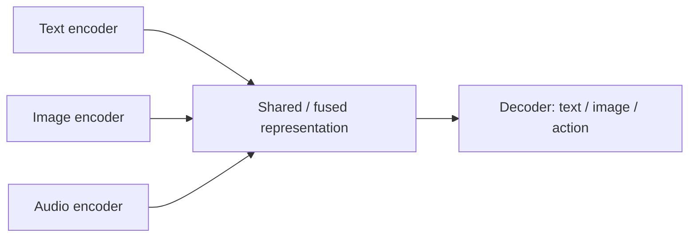

Not every problem wants a chat box. Speech notes, product photos, surveillance clips, and support tickets each live in a different **modality** — a type of signal the model consumes or produces. Choosing the wrong pipeline wastes compute and creates awkward user experience (forcing users to describe a screenshot in words when vision would suffice).

## Intuition

**What is a modality?** A channel of information: text, images, audio, video, tabular fields, or sensor streams.

**Why does it matter?** Models are often **unimodal** (one channel in, one out) or **multimodal** (multiple channels, jointly). Pick the modality that matches the *native* form of the user's problem.

| Plain-English idea | Typical input → output | Good at |
| --- | --- | --- |
| **Text / LLM** | text → text | Reasoning over language, code, structured drafts |
| **Image generation** | text/noise → image | Concepts, layouts, creative variants |
| **Image understanding** | image → labels/captions | Search, moderation, OCR assist |
| **Speech / audio** | audio ↔ text | Transcription, voice interfaces |
| **Video** | video → understanding or new video | Short clips, summarization, detection over time |
| **Multimodal** | text + image + audio → answer | Same chat loop, richer inputs |

:::key
Pick the modality that matches the *native* form of the user's problem. Translation into text is a workaround, not always the best architecture.
:::

## How it works

### Unimodal families (high level)

| Family | Typical I/O | What they are good at | Common failure mode |
| --- | --- | --- | --- |
| **Text / LLM** | text → text | Reasoning over language, code, structured drafts | Weak on pixels/sound without tools |
| **Image generation** | text/noise → image | Concepts, layouts, variants | Text spelling, precise counts, brand fidelity |
| **Image understanding** | image → labels/captions/embeddings | Search, moderation, OCR assist | Fine print, rare objects without fine-tuning |
| **Speech / audio** | audio ↔ text or audio | Transcription, voice interfaces, SFX | Accents, overlap, domain jargon |
| **Video** | text/video → video or understanding | Short clips, summarization, detection over time | Cost, temporal consistency, long duration |

### Multimodal in practice

Multimodal systems usually:

1. **Encode** each modality into vectors (numeric representations).
2. **Fuse or align** those vectors (shared space, cross-attention, adapters).
3. **Decode** into the target modality (text answer, caption, edited image).



You do not need one giant model for every demo. Many production stacks are **pipelines**: speech-to-text → LLM → text-to-speech, or image embedder → vector search → LLM for explanations. That is multimodal *as a system* even if each step is unimodal.

### Model families without the vendor brochure

Keep architecture shapes in mind, not slogans:

| Plain-English idea | What it does |
| --- | --- |
| **Autoregressive text models** | Generate left-to-right tokens (most chat LLMs) |
| **Embedding / dual-encoder models** | Map text or images to vectors for search and clustering |
| **Diffusion-style image models** | Iteratively refine noise into an image guided by text |
| **Speech recognition / synthesis** | Specialized encoders and decoders for hearing and speaking |
| **Vision-language models** | Image encoder + language model for captioning and visual Q&A |

### When to pick which pipeline

1. **Source of truth is text** (tickets, policies, code) → text LLM plus optional retrieval.
2. **User shows something visual** (receipt, UI bug, shelf photo) → vision or multimodal understanding.
3. **Hands-busy / voice-native** (driving, warehouse) → speech in/out; keep text as the internal reasoning layer if helpful.
4. **Creative assets** (ads, storyboards) → image/video generation with human review.
5. **Compliance or exact numbers** → prefer structured extractors plus databases; use generative models for narrative around verified fields.

Also separate **understanding** from **generation**. Classifying whether a photo shows a damaged package is different from generating a marketing image of a package.

:::tip
Start with the cheapest modality that preserves information. Transcribing audio then prompting an LLM is often enough; jump to native audio-in models when latency, prosody, or overlapping speakers matter.
:::

## Worked example

A field-support app receives: a photo of an error screen, a voice note, and a short typed symptom.

| Approach | Pipeline | Pros | Cons |
| --- | --- | --- | --- |
| A. Text-only | User must type everything | Simple | Loses visual detail; high user effort |
| B. Stitched unimodal | ASR → OCR/caption → LLM | Clear ownership per step | Error compounds across stages |
| C. Multimodal model | Image + transcript → answer | Fewer handoffs | Harder to debug; vendor lock-in risk |

```python
from dataclasses import dataclass


@dataclass
class Ticket:
    text: str
    image_bytes: bytes | None = None
    audio_bytes: bytes | None = None


def choose_pipeline(ticket: Ticket) -> str:
    has_image = ticket.image_bytes is not None
    has_audio = ticket.audio_bytes is not None

    if has_image and has_audio:
        return "multimodal_or_asr_plus_vision_then_llm"
    if has_image:
        return "vision_caption_or_vqa_then_llm"
    if has_audio:
        return "asr_then_llm"
    return "text_llm_with_optional_rag"


print(choose_pipeline(Ticket("app crashes on save")))
# text_llm_with_optional_rag
```

The function is deliberately boring: modality choice is a product decision before it is a model-zoo decision.

## What goes wrong

- **Modality mismatch** — Feeding screenshots into a text-only bot via "describe the image" creates lossy telephone games.
- **Pipeline latency stacking** — ASR (automatic speech recognition) + OCR + LLM + TTS (text-to-speech) can exceed interactive budgets; measure end-to-end.
- **Silent failure at boundaries** — Bad transcription becomes confident LLM advice; always surface low-confidence ASR or OCR.
- **Over-buying multimodal** — A full video model for "extract the total from this invoice PDF" is overkill; OCR + rules/LLM may win.
- **Privacy** — Images and audio often contain personally identifiable information (PII); modality upgrades expand your threat surface.

:::warn
Multimodal does not mean "smarter about facts." It means "can see or hear more." Grounding and permissions still apply.
:::

## One-line summary

Match models to modalities — text, image, audio, video, or multimodal fusion — and prefer the simplest pipeline that keeps the user's native signal intact.

## Key terms

- **Modality** — A type of input/output signal such as text, image, audio, or video.
- **Unimodal model** — Operates primarily on a single modality.
- **Multimodal model** — Jointly handles two or more modalities.
- **Encoder / decoder** — Modules that map a modality into vectors or back out to raw signals/tokens.
- **ASR (Automatic Speech Recognition)** — Speech → text.
- **TTS (Text-to-Speech)** — Text → audio.
- **VQA (Visual Question Answering)** — Answer questions about an image.
- **Embedding** — Dense vector representation used for search, clustering, or fusion across modalities.
