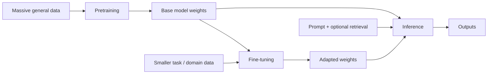

Every language model you call sits somewhere in a three-stage lifecycle: **pretraining**, optional **fine-tuning**, and **inference**. Mixing those stages up causes the classic mistake of "we'll just retrain GPT on our PDFs this sprint" — or the opposite mistake of fine-tuning when a better prompt and retrieval would have been enough.

## Intuition

**What are the three stages?**

| Stage | Plain-English idea | Who usually runs it |
| --- | --- | --- |
| **Pretraining** | Teach general language skill from huge, broad data | Labs / cloud providers |
| **Fine-tuning** | Adapt an existing model to your tone, schema, or domain | Product teams / specialists |
| **Inference** | Use the fixed model to answer live user requests | Everyone shipping a product |

**Why does the order matter?** Pretraining is expensive and rare for most teams. Fine-tuning needs curated examples. Inference is what you pay for on every API call.

Prompting sits *at inference time*: you change the input, not the weights. Fine-tuning changes the weights (or adapters). Retrieval (RAG — retrieval-augmented generation) changes the *context* you feed at inference.

:::key
Pretrain once (usually someone else), fine-tune occasionally, infer constantly. Cost and data scale follow that order.
:::

## How it works



### Cost and data at a glance

| Stage | Data scale | Compute | Changes weights? |
| --- | --- | --- | --- |
| **Pretraining** | Billions–trillions of tokens | Enormous (clusters, weeks–months) | Yes (from random init) |
| **Fine-tuning** | Hundreds–millions of examples | GPU-hours to days | Yes (full or adapters) |
| **Inference** | Live user inputs | Per-request GPU/CPU | No |

### What each stage optimizes for

- **Pretraining objective** — Predict or reconstruct broad data so the model learns syntax, world regularities, and transferable features.
- **Fine-tuning objective** — Make the model behave well on *your* distribution: correct JSON, preferred tone, domain abbreviations, refusal style.
- **Inference objective** — Latency, cost per request, reliability, and safety filters under live load. No gradient updates — only serving.

Those three scoreboards disagree. A model with great pretraining loss can still fail your support rubric; a fine-tune that nails the rubric can still be too slow in production.

### Prompt vs fine-tune (preview)

Prefer **prompting (+ tools/RAG)** when:

- The base model already can do the task with clear instructions.
- Knowledge must stay fresh (policies change weekly).
- You need fast iteration and easy rollback.
- Failures are mostly missing *context*, not missing *skill*.

Consider **fine-tuning** when:

- You need a stable output format or style at high volume.
- Prompting is long, fragile, or costly per call.
- Domain language is rare in the base model and few-shot examples are not enough.
- You have a clean labeled dataset and an offline eval harness.

A practical sequence most teams should follow: (1) strong base model + prompt, (2) add retrieval/tools, (3) measure, (4) fine-tune only if the remaining errors are systematic and data-backed.

:::tip
If the failure is "doesn't know yesterday's price list," fix retrieval or data access — fine-tuning will only bake in yesterday's list.
:::

## In code

A toy metaphor: a "pretrained" scoring table encodes general word preferences. Fine-tuning **overrides** a few weights for a domain. Inference reads the final table — prompts only change which keys you look up, not the table itself.

```python
# "Pretrained" general preferences (higher = more likely)
pretrained = {
    ("hello", "world"): 2.0,
    ("hello", "there"): 1.5,
    ("error", "please"): 0.2,
    ("error", "traceback"): 1.8,
}

# Fine-tune on support-desk style: boost polite continuations
finetune_deltas = {
    ("error", "please"): +2.5,   # domain override
    ("hello", "there"): +0.5,
}


def merge(base: dict, deltas: dict) -> dict:
    out = dict(base)
    for k, d in deltas.items():
        out[k] = out.get(k, 0.0) + d
    return out


adapted = merge(pretrained, finetune_deltas)


def infer(prev: str, weights: dict, prompt_bias: dict | None = None) -> str:
    """Greedy next-word from bigram-like weights; prompt_bias is inference-only."""
    prompt_bias = prompt_bias or {}
    candidates = {w: s for (p, w), s in weights.items() if p == prev}
    for w, b in prompt_bias.items():
        candidates[w] = candidates.get(w, 0.0) + b
    return max(candidates, key=candidates.get)


print("base:", infer("error", pretrained))
# base: traceback

print("fine-tuned:", infer("error", adapted))
# fine-tuned: please

# Prompting without fine-tune: temporary bias at inference
print(
    "prompted base:",
    infer("error", pretrained, prompt_bias={"please": 3.0}),
)
# prompted base: please
```

Notice three different levers:

1. **Pretrained table** — general prior.
2. **Fine-tune deltas** — durable weight changes.
3. **prompt_bias** — ephemeral steering that vanishes next call unless you pass it again.

Real systems replace this dict with billions of neural parameters, but the lifecycle roles stay the same.

## What goes wrong

- **Fine-tuning to store facts** — Facts rot; weights are a bad content management system. Use RAG or databases for living knowledge.
- **Catastrophic specialization** — Heavy fine-tuning can hurt general skills. Prefer adapters / LoRA (Low-Rank Adaptation) when possible.
- **Data leakage** — Putting secrets into fine-tune sets can make models regurgitate them later.
- **Evaluating only at training time** — A fine-tune that looks good on training JSONL may fail on messy live tickets.
- **Skipping the base model check** — Teams fine-tune before trying a stronger base model or clearer prompt.

:::warn
Pretraining from scratch is almost never your first move. Borrow a strong base model, measure with prompts, then fine-tune only with a clear failure mode and dataset.
:::

## One-line summary

**Pretraining** builds general weights, **fine-tuning** adapts them to a domain or format, and **inference** (optionally with prompts and retrieval) is where those fixed weights serve live users.

## Key terms

- **Pretraining** — Large-scale training that creates a general-purpose model from broad data.
- **Fine-tuning** — Further training that adapts pretrained weights to a narrower task or domain.
- **Inference** — Running a trained model to produce outputs without updating weights.
- **Base model** — Pretrained model before task-specific adaptation.
- **Prompting** — Steering behavior by changing inputs at inference time.
- **RAG (Retrieval-Augmented Generation)** — Fetching external evidence into the prompt at inference.
- **Adapter / LoRA** — Parameter-efficient fine-tuning methods that update small add-on weights instead of the full network.
- **Catastrophic forgetting** — Loss of prior capabilities after aggressive fine-tuning on a narrow dataset.
