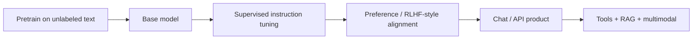

If you only remember one story about modern GenAI, make it this: we went from “finetune a classifier per task” to “prompt a general sequence model,” then to “align it with humans,” then to “wire it to tools and other modalities.” Model names change every quarter; the family shapes below stay useful for years.

## Intuition

Think of three different jobs for language models:

1. **Understand** text you already have (classify, extract, embed for search).
2. **Generate** new text conditioned on a prompt (chat, code, summaries).
3. **Transform** input into a different output sequence (translate, rewrite under a schema).

Encoder-only models excel at (1). Decoder-only models dominate (2) and most chat products. Encoder–decoder models were built for (3) and still shine when both sides of a mapping matter. Everything else — RLHF, mixture-of-experts, multimodal towers, “reasoning” post-training — is a refinement on top of one of these skeletons.

:::key
Pick the architecture family for the job shape first; pick a vendor or checkpoint second. Marketing names change; encoder / decoder / encoder–decoder do not.
:::

## How it works

### Pretrain, then specialize

Modern foundation models share a two-phase life:

- **Pretraining** — optimize a self-supervised objective on massive corpora (masked tokens, next tokens, or denoising). This builds general representations and fluency.
- **Post-training** — supervised instruction data, preference optimization (RLHF / DPO-style methods), safety filters, and sometimes tool-use or chain-of-thought style traces. This turns a raw predictor into a product-shaped assistant.

### Milestone map (engineer view)

| Era | Example shape | What changed for builders |
| --- | --- | --- |
| Encoder boom | BERT-like | Pretrain once, finetune small heads for NLP tasks |
| Generative scale | GPT-like decoders | In-context learning; less per-task finetuning |
| Text-to-text | T5 / BART-like | One model, many tasks via prefixes and denoising |
| Alignment | Instruct / chat models | Helpful defaults; chat APIs become the product surface |
| Open weights | LLaMA-class, Mistral-class | Self-host, finetune, and compete on cost/latency |
| Multimodal + tools | Vision-language, audio | Same chat loop, richer inputs and function calls |
| Reasoning-heavy | Long CoT / test-time compute | Spend more tokens/latency for harder problems |



### Architecture families

**Encoder-only (BERT-like).** Bidirectional attention over the input. Great for classification, NER, and dense embeddings. Not a chat generator by default — you usually attach a task head or use the embedding tower.

**Decoder-only (GPT-like).** Causal (left-to-right) attention. Autoregressive generation is native. Almost every modern chat and coding assistant sits here. Scaling laws, long context, and tool calling all grew fastest in this family.

**Encoder–decoder (T5/BART-like).** Encode the full source, then decode the target. Natural for translation, structured rewrite, and some summarization setups. Less common as the default chat API today, but still a strong mental model for “map X -> Y.”

### Why two “similar” models feel different

Same Transformer math does not mean same product behavior. Differences compound from:

- Data mix and decontamination quality
- Alignment recipes and refusal boundaries
- Context length and positional schemes
- Tokenizer and vocabulary quirks
- Inference stack (quantization, speculative decoding, batching)
- Tool schemas and system-prompt conventions

So “switch vendors” is never a drop-in rename of the model string. Re-run evals on your prompts, latency budget, and failure modes.

### Choosing a family in practice

- Need search embeddings or a cheap classifier -> encoder / embedding models.
- Need chat, agents, code -> decoder chat models.
- Need tight X->Y transforms with clear input/output -> consider encoder–decoder or a decoder with strict structured output.
- Need private deployment or deep finetuning -> open-weights decoder families.
- Need images/PDFs in the same loop -> multimodal chat models, not a text-only base plus wishful thinking.

## In code

You do not need a GPU to practice the *decision* layer. Model a tiny registry that maps product jobs to family recommendations:

```python
FAMILIES = {
    "encoder": {
        "jobs": ["classify", "ner", "embed"],
        "notes": "Bidirectional; add a head or use embeddings.",
    },
    "decoder": {
        "jobs": ["chat", "code", "agents", "summarize"],
        "notes": "Causal LM; default for GenAI products.",
    },
    "encoder_decoder": {
        "jobs": ["translate", "rewrite", "text_to_text"],
        "notes": "Strong when input and output are both sequences.",
    },
}


def recommend(job: str) -> list[str]:
    return [name for name, meta in FAMILIES.items() if job in meta["jobs"]]


print(recommend("embed"))   # ['encoder']
print(recommend("agents"))  # ['decoder']
```

Track a fake “release lineage” so product notes stay honest about base vs chat vs reasoning variants:

```python
from dataclasses import dataclass


@dataclass
class Checkpoint:
    name: str
    family: str
    stage: str  # base | instruct | preference | reasoning


lineage = [
    Checkpoint("corp-7b-base", "decoder", "base"),
    Checkpoint("corp-7b-instruct", "decoder", "instruct"),
    Checkpoint("corp-7b-chat", "decoder", "preference"),
]

assert lineage[-1].stage == "preference"
# Chat APIs almost always expose a post-trained checkpoint, not the raw base.
```

Illustrative API selection (no real keys):

```python
# Pseudocode: pick model tier by job, not by hype
def pick_model(job: str, need_vision: bool) -> str:
    if job in {"embed", "classify"}:
        return "text-embedding-or-encoder-small"
    if need_vision:
        return "multimodal-chat-mid"
    if job == "hard_reasoning":
        return "reasoning-chat-large"  # higher latency / cost
    return "chat-mid"
```

## What goes wrong

- **Using a base model as a product chatbot** — without instruction/preference training, the model continues text instead of following user intent.
- **Treating every decoder as interchangeable** — tokenizers, refusal styles, and tool formats break prompts that “worked on Model A.”
- **Forcing chat models into pure embedding jobs** — possible with tricks, usually worse than a dedicated encoder/embedding model.
- **Ignoring post-training stage** — “7B” is not a quality label; base vs instruct vs reasoning variants behave differently.
- **Chasing multimodal when text + OCR pipeline is enough** — modality expands failure modes (layout, OCR noise, image injection).
- **Assuming open weights equal free lunch** — you inherit hosting, eval, safety, and update burden.

:::warn
Never equate parameter count with fitness. A smaller, well-aligned model with tools and retrieval often beats a larger raw generator on real product metrics.
:::

## One-line summary

Foundation-model history is a shift from task-specific encoders to aligned, tool-using generative families — choose encoder, decoder, or encoder–decoder by job shape, then validate the specific checkpoint.

## Key terms

- **Foundation model** — Large pretrained model adapted to many downstream tasks.
- **Encoder-only** — Bidirectional model optimized for understanding / embeddings.
- **Decoder-only** — Causal LM optimized for autoregressive generation and chat.
- **Encoder–decoder** — Seq2seq family for mapping an input sequence to an output sequence.
- **Pretraining** — Self-supervised training on broad data before task specialization.
- **Post-training / alignment** — Instruction and preference stages that shape assistant behavior.
- **In-context learning** — Steering a model with examples and instructions inside the prompt.
- **Open weights** — Released parameters you can host or finetune yourself.
- **Multimodal model** — Model that accepts more than text (e.g. images) in one interface.
)