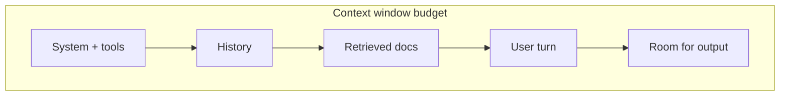

GenAI bills and bugs both start with the same unit: the **token**. Once you see prompts, context limits, and sampling knobs in token terms, pricing, truncation failures, and "why did it get weird?" stop feeling mystical.

## Intuition

**What is a token?** The model never reads "words." A tokenizer chops your string into discrete IDs from a fixed vocabulary. Those IDs fill a **context window** — a hard budget shared by system instructions, history, retrieved docs, tools, and the reply.

**Why do sampling knobs matter?** After the model scores the next token, **temperature** and **top-p** reshape which candidates you are willing to sample. Low and narrow → boring but stable. High and wide → creative but risky.

:::key
Tokens drive cost and context. Sampling knobs drive variance. Separate "did it see the right evidence?" from "did we sample too wildly?"
:::

## How it works

### Tokens

Tokenization is model-specific. Rough patterns for English:

- Common words and punctuation often map to one token.
- Rare words, code identifiers, and non-English scripts may split into many pieces.
- Whitespace and formatting count.

Rule-of-thumb for planning (not billing truth): ~4 characters per token for English prose, or ~100 tokens ~= 75 words. Always measure with the real tokenizer in CI for anything cost-sensitive.

### Context window

If the window is `W` tokens, everything the model can attend to in one call must fit in `W`. Overflow typically means:

- Silent truncation of the oldest or middle content
- API errors
- Worse: your safety policy or schema falls out of view



Long RAG dumps are the classic way to spend the whole budget on noise. Prefer ranked snippets, summaries, and hard caps per source.

### Temperature

Let `z_i` be the **logit** (raw score) for vocabulary item `i`. Softmax turns logits into probabilities. Temperature `T > 0` scales logits before softmax:

```
p_i = softmax(z_i / T)
```

| Temperature | Plain-English effect |
| --- | --- |
| `T → 0` (very small) | Distribution collapses toward the top choice → greedy-like, stable |
| `T = 1` | Use the model's native distribution |
| `T > 1` | Flatten the distribution → more surprise, more nonsense risk |

Temperature does not add knowledge. It only changes how aggressively you explore the model's uncertainty.

### Top-p (nucleus sampling)

Sort tokens by probability descending. Keep the smallest prefix whose cumulative probability is at least `p`. Sample only inside that nucleus.

- `top_p = 0.1` → tiny, high-confidence set
- `top_p = 0.9` → broader, still cuts the long tail
- `top_p = 1.0` → effectively no nucleus cutoff

Top-p adapts to the shape of the distribution: when the model is peaked, the nucleus is small; when it is flat, the nucleus grows.

### Practical presets

| Task | Temperature | Top-p | Why |
| --- | --- | --- | --- |
| Extraction / JSON | 0–0.2 | 0.1–0.5 | Minimize format drift |
| Support answers | 0.2–0.4 | 0.5–0.8 | Stable tone, light variety |
| Code | 0.1–0.3 | 0.5–0.9 | Prefer correctness |
| Brainstorm | 0.7–1.0 | 0.9–0.95 | Explore alternatives |

Tune **one** primary diversity control first (often temperature *or* top-p), then the other.

### Cost and latency mental model

Every call roughly costs `price_in * prompt_tokens + price_out * completion_tokens`. Output tokens are often more expensive and always more latency-sensitive because generation is sequential.

## In code

Approximate English token count without a real tokenizer — good for budgeting demos, bad for invoices:

```python
def estimate_tokens(text: str) -> int:
    # Rough: ~4 chars/token for English prose
    return max(1, (len(text) + 3) // 4)


prompt = "System: be brief.\nUser: Explain tokens."
print(estimate_tokens(prompt))
```

Simulate a context packer that reserves output room:

```python
def pack(parts: list[str], window: int, reserve_out: int) -> list[str]:
    budget = window - reserve_out
    kept = []
    used = 0
    for part in reversed(parts):  # keep newest first
        cost = estimate_tokens(part)
        if used + cost > budget:
            continue
        kept.append(part)
        used += cost
    return list(reversed(kept))


history = ["old policy...", "mid turn...", "latest user question"]
print(pack(history, window=200, reserve_out=50))
```

Temperature on a toy logit vector (numpy-free):

```python
import math


def softmax(xs):
    m = max(xs)
    exps = [math.exp(x - m) for x in xs]
    s = sum(exps)
    return [e / s for e in exps]


def with_temperature(logits, T: float):
    return softmax([z / T for z in logits])


logits = [2.0, 1.0, 0.1]  # pretend vocabulary of 3
print([round(p, 3) for p in with_temperature(logits, 0.5)])  # peakier
print([round(p, 3) for p in with_temperature(logits, 1.5)])  # flatter
```

Nucleus filter:

```python
def nucleus(probs: list[float], p: float) -> list[int]:
    order = sorted(range(len(probs)), key=lambda i: probs[i], reverse=True)
    kept, cum = [], 0.0
    for i in order:
        kept.append(i)
        cum += probs[i]
        if cum >= p:
            break
    return kept


probs = [0.5, 0.3, 0.15, 0.05]
print(nucleus(probs, 0.8))  # indices covering >= 0.8 mass
```

## What goes wrong

- **Counting words as tokens** — code and CJK blow past naive estimates; you hit limits or surprise bills.
- **Filling context with raw PDFs** — the answer evidence is present in the file but not in the packed window.
- **High temperature for factual JSON** — field names mutate; parsers fail.
- **Stacking high T and high top-p** — you sample the junk tail.
- **Forgetting output reservation** — a 128k window with 120k of prompt leaves a tiny completion budget.
- **Assuming temperature 0 is fully deterministic** — floating-point and batching can still yield rare ties; treat "low T" as *more* stable, not formally deterministic.

:::tip
Log `prompt_tokens`, `completion_tokens`, and sampling params on every production call. When quality regresses, you want to know whether context or sampling changed.
:::

## One-line summary

Tokens meter cost and memory; the context window is a shared budget; temperature and top-p reshape sampling — use them deliberately for stability vs diversity.

## Key terms

- **Token** — Vocabulary piece the model reads/writes; billing and limits are usually token-based.
- **Tokenizer** — Algorithm mapping text ↔ token IDs for a model family.
- **Context window** — Max tokens attendable in one model call.
- **Temperature** — Softmax temperature that sharpens or flattens next-token probabilities.
- **Top-p / nucleus sampling** — Sample from the smallest set of tokens whose cumulative probability ≥ p.
- **Logit** — Raw score for a vocabulary item before softmax.
- **Truncation** — Dropping content that does not fit the context budget.
