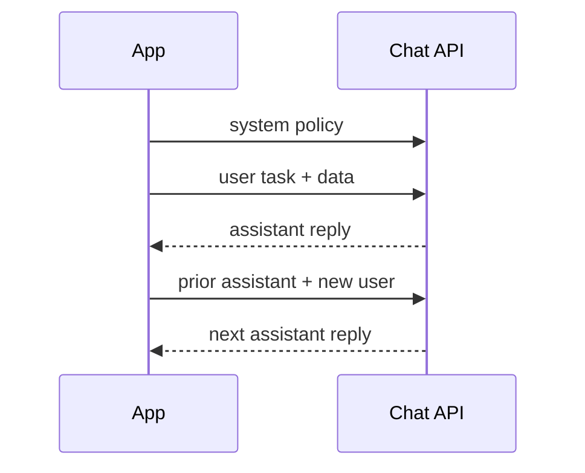

A model that “knows” your domain still fails if the prompt is mush. Prompting is not poetry; it is an interface contract: tell the model the job, the constraints, the data, and the shape of a successful answer — then keep that contract stable across versions.

## Intuition

Chat APIs are not a single blob of text. They are a **role-tagged transcript**: system (or developer) messages set policy, user messages state the task, assistant messages carry prior replies. The model continues the transcript under those roles. Confusing “who said what” is how you get leaked instructions, ignored policies, and brittle few-shots.

Good prompts look boring on purpose: short instruction, explicit format, one example if needed, clear failure behavior when uncertain.

:::key
Separate policy (system), task (user), and demonstration (few-shot turns). If everything lives in one user blob, every feature fights for attention.
:::

## How it works

### Four prompt components

1. **Instruction** — the verb phrase: classify, extract, rewrite, refuse if...
2. **Context** — facts, policies, retrieved snippets, product glossary
3. **Input data** — the customer email, JSON row, or code under review
4. **Output indicator** — schema, labels, bullet rules, “answer only with...”

Minimal pattern:

```
Instruction: Classify sentiment as Positive, Neutral, or Negative.
Input: "The food was okay."
Output: Sentiment:
```

### Chat roles

| Role | Typical contents | Lifetime |
| --- | --- | --- |
| system / developer | Persona, safety, tools policy, house style | Stable across turns |
| user | Task + payload | Per request / turn |
| assistant | Prior model replies (and sometimes tool results, depending on API) | History |

Multi-turn apps append assistant and user turns. That history **is** context — it burns tokens and can contradict a new system policy if you never refresh it.



### Patterns that pull weight

- **Output contract** — JSON keys, enums, max bullets, banned phrases.
- **Success criteria** — “Must cite field X; must not invent IDs.”
- **Few-shot** — 1–3 labeled examples that match the real distribution, not toy sentences.
- **Uncertainty clause** — “If evidence is missing, say UNKNOWN; do not guess.”
- **Delimiter discipline** — fence user data (`"""` or XML-ish tags) so instructions and payloads do not blend.

### System vs user: who wins?

Providers differ on how strongly system messages outweigh user text. Defense in depth still matters: put non-negotiables in system **and** repeat critical format rules near the user task for long contexts. Never assume a buried system line survives a 50-turn thread packed with RAG.

### Zero-shot vs few-shot vs “just yell louder”

- **Zero-shot** — instruction + input. Fast to maintain; fails when the label set or style is unusual.
- **Few-shot** — shows the mapping. Best when edge cases are visual (weird enums, terse style). Keep examples short and representative.
- **Chain-style hints** — “think step by step” or scratchpads help some reasoning tasks, but they burn tokens and are not a substitute for tools on arithmetic or live facts.

Prefer clarifying the contract over stacking adjectives (“be extremely careful and very precise...”). Models respond better to checkable rules than to emotional intensity.

### Production prompt hygiene

Version prompts like code (`support_v3`). Keep a golden set of inputs with expected properties (label, JSON keys, refusal). On model upgrades, run the suite before you celebrate the new default. For multi-tenant apps, never put another customer’s history in the few-shot block.

## In code

Represent messages as structured objects — never concatenate roles into one ambiguous string in production:

```python
from typing import Literal, TypedDict


class Message(TypedDict):
    role: Literal["system", "user", "assistant"]
    content: str


def build_sentiment_messages(text: str) -> list[Message]:
    return [
        {
            "role": "system",
            "content": (
                "You label sentiment. Reply with exactly one of: "
                "Positive, Neutral, Negative. If unclear, Neutral."
            ),
        },
        {
            "role": "user",
            "content": f'Text:\n"""{text}"""\nSentiment:',
        },
    ]


print(build_sentiment_messages("I think the food was okay.")[1]["content"])
```

Few-shot as prior turns (keeps the final user turn clean):

```python
def with_few_shots(text: str) -> list[Message]:
    shots = [
        ("Loved the quick refund.", "Positive"),
        ("Package arrived damaged and late.", "Negative"),
    ]
    msgs: list[Message] = [
        {
            "role": "system",
            "content": "Classify sentiment. One word: Positive, Neutral, or Negative.",
        }
    ]
    for example, label in shots:
        msgs.append({"role": "user", "content": f'Text: """{example}"""'})
        msgs.append({"role": "assistant", "content": label})
    msgs.append({"role": "user", "content": f'Text: """{text}"""'})
    return msgs
```

Illustrative request body (no live API):

```python
payload = {
    "model": "chat-mid",
    "messages": build_sentiment_messages("Service was fine."),
    "temperature": 0.2,
}
# requests.post(url, json=payload, headers={"Authorization": "Bearer ..."})
```

Prompt lint for empty instruction or missing delimiters:

```python
def lint_user_prompt(prompt: str) -> list[str]:
    issues = []
    if '"""' not in prompt and "<<<" not in prompt:
        issues.append("Consider fencing untrusted input.")
    if len(prompt) < 20:
        issues.append("Prompt looks underspecified.")
    return issues
```

## What goes wrong

- **Instruction buried under data** — the model summarizes the email instead of extracting fields.
- **Role collapse** — stuffing policy into the user message makes it easy for hostile input to override (“ignore previous...”).
- **Too many few-shots** — examples consume context and can bias toward the demo domain.
- **Contradictory rules** — system says brief; user says write an essay; history says use JSON.
- **Unfenced untrusted text** — customer content that looks like instructions becomes prompt injection fuel.
- **Unstable prompts across model upgrades** — without golden tests, a “minor” model swap breaks tone and format.

:::warn
Treat user-provided text as hostile data. Delimit it, never execute it as instructions, and keep privileged policy in system/developer channels plus server-side checks.
:::

## One-line summary

Prompting is a structured contract — instruction, context, input, and output shape — delivered through stable chat roles so the model can do the job you meant.

## Key terms

- **Prompt** — The full input (and role transcript) that conditions generation.
- **System / developer message** — High-priority behavioral and policy instructions.
- **User message** — Task statement and application data.
- **Assistant message** — Prior model output kept for multi-turn continuity.
- **Few-shot prompting** — Teaching via in-prompt examples.
- **Output indicator** — Cue that specifies format or starts the answer scaffold.
- **Delimiter** — Markers that separate instructions from untrusted payload text.
`)