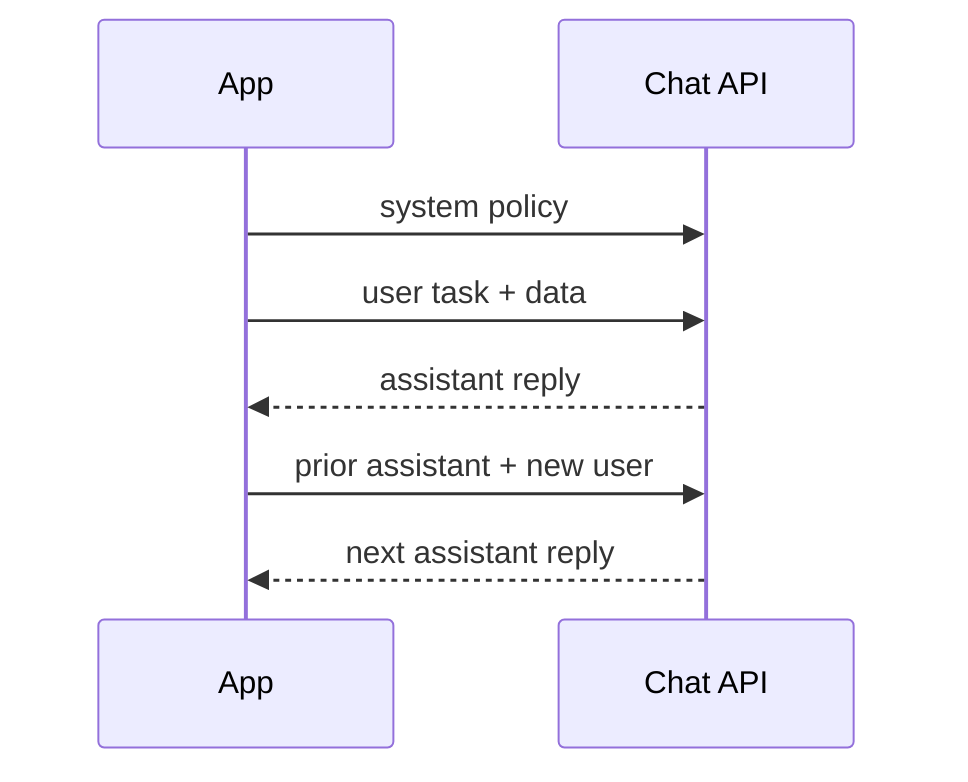

A model that "knows" your domain still fails if the prompt is mush. **Prompting** is not poetry; it is an interface contract: tell the model the job, the constraints, the data, and the shape of a successful answer — then keep that contract stable across versions.

## Intuition

**What is a prompt?** The application-level interface between a human goal and the model's next-token machinery. A good prompt reduces ambiguity.

**Why do roles matter?** Chat APIs are not a single blob of text. They are a **role-tagged transcript**: system (or developer) messages set policy, user messages state the task, assistant messages carry prior replies. Confusing "who said what" is how you get leaked instructions, ignored policies, and brittle few-shots.

Good prompts look boring on purpose: short instruction, explicit format, one example if needed, clear failure behavior when uncertain.

:::key
Separate policy (system), task (user), and demonstration (few-shot turns). If everything lives in one user blob, every feature fights for attention.
:::

## How it works

### Four prompt components

| Component | Plain-English idea | Mini example |
| --- | --- | --- |
| **Instruction** | What to do | Classify the review as positive, neutral, or negative |
| **Context** | Background the model should use | You are analyzing restaurant reviews for a dashboard |
| **Input data** | The actual content | Review: "The food was okay, but service was slow." |
| **Output indicator** | The desired shape | Return JSON: `{sentiment, reason}` |
| **Constraints** | Rules and boundaries | Use one sentence for reason. Do not invent missing facts. |

Minimal pattern:

```
Instruction: Classify sentiment as Positive, Neutral, or Negative.
Input: "The food was okay."
Output: Sentiment:
```

### Chat roles

| Role | Typical contents | Lifetime |
| --- | --- | --- |
| system / developer | Persona, safety, tools policy, house style | Stable across turns |
| user | Task + payload | Per request / turn |
| assistant | Prior model replies | History |

Multi-turn apps append assistant and user turns. That history **is** context — it burns tokens and can contradict a new system policy if you never refresh it.



### Prompting patterns with examples

**Zero-shot** — instruction + input only. Fast to maintain; fails when the label set or style is unusual.

```
Classify the sentiment as positive, neutral, or negative.
Text: I think the food was okay.
Sentiment:
```

**Few-shot** — shows the mapping with labeled examples in the prompt.

```
Classify the sentiment.
Text: The soup was cold and late.
Sentiment: negative
Text: The staff were polite and the meal was fine.
Sentiment: neutral
Text: The dessert was amazing.
Sentiment:
```

**Structured prompt** — strict extraction with a schema.

```
You are a strict extraction engine.
Extract a customer support ticket into JSON with:
- issue_type: billing | login | bug | other
- urgency: low | medium | high
- summary: <= 20 words
Ticket: I was charged twice this month and need this fixed today.
```

### Common prompting mistakes

- **Vague task** — Ask "summarize this for a technical manager in 5 bullets" instead of just "summarize."
- **Missing output contract** — If downstream code expects JSON, ask for a schema or use structured outputs.
- **Conflicting instructions** — Do not say "be detailed" and "answer in one word" unless the precedence is clear.
- **No grounding** — For factual answers about private or changing data, provide context or use retrieval/tools.
- **Over-prompting** — Long prompts can hide the actual task. Prefer clear sections and remove dead text.

### Production prompt hygiene

Version prompts like code (`support_v3`). Keep a golden set of inputs with expected properties (label, JSON keys, refusal). On model upgrades, run the suite before you celebrate the new default.

## In code

Represent messages as structured objects — never concatenate roles into one ambiguous string in production:

```python
from typing import Literal, TypedDict


class Message(TypedDict):
    role: Literal["system", "user", "assistant"]
    content: str


def build_sentiment_messages(text: str) -> list[Message]:
    return [
        {
            "role": "system",
            "content": (
                "You label sentiment. Reply with exactly one of: "
                "Positive, Neutral, Negative. If unclear, Neutral."
            ),
        },
        {
            "role": "user",
            "content": f'Text:\n"""{text}"""\nSentiment:',
        },
    ]


print(build_sentiment_messages("I think the food was okay.")[1]["content"])
```

Few-shot as prior turns (keeps the final user turn clean):

```python
def with_few_shots(text: str) -> list[Message]:
    shots = [
        ("Loved the quick refund.", "Positive"),
        ("Package arrived damaged and late.", "Negative"),
    ]
    msgs: list[Message] = [
        {
            "role": "system",
            "content": "Classify sentiment. One word: Positive, Neutral, or Negative.",
        }
    ]
    for example, label in shots:
        msgs.append({"role": "user", "content": f'Text: """{example}"""'})
        msgs.append({"role": "assistant", "content": label})
    msgs.append({"role": "user", "content": f'Text: """{text}"""'})
    return msgs
```

Illustrative request body (no live API):

```python
payload = {
    "model": "chat-mid",
    "messages": build_sentiment_messages("Service was fine."),
    "temperature": 0.2,
}
# requests.post(url, json=payload, headers={"Authorization": "Bearer ..."})
```

## What goes wrong

- **Instruction buried under data** — the model summarizes the email instead of extracting fields.
- **Role collapse** — stuffing policy into the user message makes it easy for hostile input to override ("ignore previous...").
- **Too many few-shots** — examples consume context and can bias toward the demo domain.
- **Contradictory rules** — system says brief; user says write an essay; history says use JSON.
- **Unfenced untrusted text** — customer content that looks like instructions becomes prompt injection fuel.

:::warn
Treat user-provided text as hostile data. Delimit it, never execute it as instructions, and keep privileged policy in system/developer channels plus server-side checks.
:::

## One-line summary

Prompting is a structured contract — instruction, context, input, and output shape — delivered through stable chat roles so the model can do the job you meant.

## Key terms

- **Prompt** — The full input (and role transcript) that conditions generation.
- **System / developer message** — High-priority behavioral and policy instructions.
- **User message** — Task statement and application data.
- **Assistant message** — Prior model output kept for multi-turn continuity.
- **Few-shot prompting** — Teaching via in-prompt examples.
- **Output indicator** — Cue that specifies format or starts the answer scaffold.
- **Delimiter** — Markers that separate instructions from untrusted payload text.
