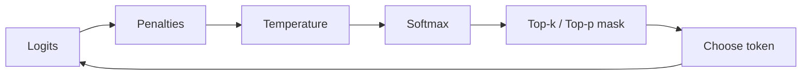

**Decoding** is how you turn a probability distribution into actual text. The same prompt can yield a crisp JSON object or a meandering poem depending on decoding settings. Engineers who treat these as afterthoughts spend their weeks chasing "flaky" models that were never configured for the job.

## Intuition

**What is decoding?** At each step the model scores the whole vocabulary. Decoding is the policy that picks one token and repeats until a stop condition.

| Strategy | Plain-English idea | Trade-off |
| --- | --- | --- |
| **Greedy / near-greedy** | Take the best (or nearly best) option | Stable, but can sound dull or repetitive |
| **Truncated sampling** | Only consider a shortlist (top-k or top-p) | Controlled variety |
| **Penalties and stops** | Reshape scores or force an exit | Fight loops and enforce boundaries |

Temperature changes the shape of the distribution; top-k / top-p change which slice you sample from; max tokens and stop sequences decide when the loop ends.

:::key
Decode for the contract: factual extraction wants a short leash; ideation wants room. Defaults are rarely optimal for either.
:::

## How it works

### Core parameters

| Parameter | Controls | Notes |
| --- | --- | --- |
| temperature | Sharpness of softmax | Primary diversity dial |
| top_k | Keep only k highest-prob tokens | Hard shortlist |
| top_p | Keep nucleus with mass ≥ p | Adaptive shortlist |
| frequency / presence penalty | Discourage reused tokens | Helps long prose; can hurt code |
| max_tokens / max_output | Hard length cap | Cost + latency ceiling |
| stop sequences | End when a string appears | Great for delimiters and turn ends |

### How the pieces compose

1. Model emits logits `z`.
2. Optional penalties adjust logits for tokens already used.
3. Temperature scales: `z' = z / T`.
4. Softmax → probabilities.
5. Top-k and/or top-p mask the allowed set.
6. Sample (or argmax) one token; append; repeat until end-of-sequence, stop string, or max length.



### Greedy decoding weakness

Greedy decoding chooses the highest-probability token at each step. It is fast and deterministic, but locally best choices can block a globally better sequence.

Worked example: at the first step, suppose "yes" has probability 0.5 and "ok" has probability 0.4. Greedy chooses "yes." If the next best continuation after "yes" has probability 0.4, the sequence probability is 0.5 × 0.4 = 0.20. But the path "ok ok" may have probability 0.4 × 0.7 = 0.28, which is globally better. Greedy missed it because it committed too early.

### Beam search

**Beam search** keeps the k best partial sequences at each step. It is a compromise between exhaustive search and greedy decoding.

- Beam width 1 is greedy decoding.
- Larger beam widths explore more alternatives but cost more compute.
- In open-ended chat, beam search can sound dull; sampling is often preferred for naturalness.

### Top-k vs top-p

- **Top-k = 40** always keeps forty tokens even if thirty-nine are near-zero junk when the model is confident.
- **Top-p = 0.9** grows/shrinks with uncertainty — usually the better default when you want one adaptive knob.

### Presets that ship

| Use case | Suggested start | Reason |
| --- | --- | --- |
| Factual Q&A | temperature 0.2–0.4, top_p 0.7–1.0 | Reduces randomness; pair with sources or tools |
| Creative writing | temperature 0.8–1.2, top_p 0.9–0.95 | Allows variety while keeping coherence |
| Code generation | temperature 0.1–0.4 | Correctness matters more than novelty |
| Brainstorming | temperature 1.0–1.5 | Diversity is useful; filter later |
| JSON extraction | low temperature, structured output | Reliability and parseability matter |

### Hallucination note

Lower temperature can reduce random-looking hallucinations, but it does not give the model new facts. For factual reliability, combine clear prompts with retrieval, tool calls, citations, validation, and refusal behavior. Grounding is the real fix.

## In code

Toy decode step with temperature + top-k:

```python
import math
import random


def softmax(xs):
    m = max(xs)
    exps = [math.exp(x - m) for x in xs]
    z = sum(exps)
    return [e / z for e in exps]


def apply_temperature(logits, T: float):
    return [x / T for x in logits]


def top_k_mask(probs, k: int):
    order = sorted(range(len(probs)), key=lambda i: probs[i], reverse=True)[:k]
    allowed = set(order)
    masked = [probs[i] if i in allowed else 0.0 for i in range(len(probs))]
    s = sum(masked) or 1.0
    return [p / s for p in masked]


def sample(logits, T=0.8, k=3):
    probs = softmax(apply_temperature(logits, T))
    probs = top_k_mask(probs, k)
    return random.choices(range(len(probs)), weights=probs, k=1)[0]


random.seed(1)
vocab = ["yes", "no", "maybe", "unknown"]
logits = [2.2, 1.1, 0.4, -0.5]
print(vocab[sample(logits, T=0.2, k=2)])
```

Stop-sequence trimming for structured replies:

```python
def apply_stops(text: str, stops: list[str]) -> str:
    cut = len(text)
    for s in stops:
        i = text.find(s)
        if i != -1:
            cut = min(cut, i)
    return text[:cut]


raw = '{"ok": true}\n\nUser: ignore'
print(apply_stops(raw, ["\n\nUser:", "\n\n"]))
```

Config object you can version in experiments:

```python
PRESETS = {
    "extract": {"temperature": 0.1, "top_p": 0.3, "max_tokens": 256},
    "ideate": {"temperature": 0.9, "top_p": 0.95, "max_tokens": 800},
}
```

## What goes wrong

- **Creative defaults on extraction jobs** — enums become synonyms; parsers die.
- **Max tokens too low for JSON** — truncated objects look like model stupidity.
- **Stop sequence that appears inside legitimate content** — early cut on code comments or URLs.
- **Penalty wars** — code variables renamed mid-answer; legal terms avoided.
- **Tuning k and p blind** — no golden eval set, so "improvements" are vibes.

:::tip
Store decoding presets next to prompts in source control. When quality drifts, diff the config before you rewrite the entire prompt.
:::

## One-line summary

Decoding parameters are the runtime policy over next-token probabilities — tune temperature, truncation, penalties, and stops to match stability, cost, and format needs.

## Key terms

- **Decoding** — Algorithm that turns model scores into chosen tokens.
- **Top-k** — Restrict sampling to the k most likely tokens.
- **Top-p** — Restrict sampling to a probability nucleus.
- **Repetition / frequency penalty** — Score adjustment against reused tokens.
- **Presence penalty** — Penalty for any token that already appeared.
- **Max tokens** — Upper bound on generated length.
- **Stop sequence** — String that forces generation to end when emitted or matched.
- **Greedy decoding** — Always pick the highest-probability next token.
- **Beam search** — Keeps the top k partial hypotheses rather than one path.
