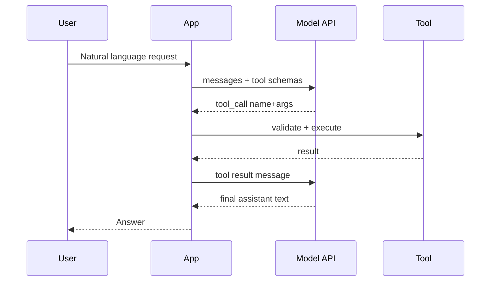

Chat completions alone make fluent text. Production systems need **side effects and facts**: prices, tickets, calendars, SQL. Tool calling is the bridge — the model proposes a typed function call; your server executes it; the model reads the result and answers the user. Skip that loop and you are asking the weights to pretend they are your database.

## Intuition

Treat the LLM as a **router with language skills**, not as a system of record:

1. User asks in natural language.
2. Model chooses a tool (or none) and fills arguments from the schema.
3. Your app validates args, runs the tool, returns a tool result message.
4. Model drafts the final answer grounded in that result.

If step 3 is missing, “What’s Alice’s balance?” becomes creative writing.

:::key
The model suggests; your code decides. Never execute tool calls without authz, validation, and allowlists.
:::

## How it works

### What model APIs typically expose

- Chat completions with role-structured messages
- Model tiers trading cost, latency, and quality
- Optional modalities (vision, audio) and embeddings endpoints
- Token-based billing and rate limits
- Tool / function schemas attached to a request

### Tool-calling loop



Multi-tool turns are normal: search, then fetch, then answer. Cap the hop count so a confused model cannot loop forever.

### Schema design

Tools should be **narrow, typed, and boring**:

```json
{
  "name": "get_weather",
  "description": "Current weather for a city.",
  "parameters": {
    "type": "object",
    "properties": {
      "location": {"type": "string", "description": "City name"},
      "units": {"type": "string", "enum": ["metric", "imperial"]}
    },
    "required": ["location"]
  }
}
```

Descriptions are part of the prompt. Vague tool names (“do_stuff”) cause wrong calls. Overlapping tools cause thrash — prefer one clear verb per capability.

### Why this reduces hallucination

The model still might invent an argument, but the **payload** of truth comes from your tool. Grounded answers cite returned fields; empty tool results should produce an honest “not found,” not a fabricated row.

### API practicalities GenAI engineers hit daily

- **Idempotency** — retries after timeouts can double-charge if your tool is not idempotent; use keys for writes.
- **Timeouts** — tool latency sits inside the user-visible request; set budgets and degrade gracefully (“weather unavailable”).
- **Model routing** — cheap model for classification, stronger model for tool planning; do not pay frontier rates for every “yes/no.”
- **Observability** — log tool name, latency, arg hashes (not secrets), and whether the final answer used the result.
- **Parallel tool calls** — some APIs return several calls at once; execute independently when safe, serialize when there are dependencies.

### Parallel vs sequential tools

If the user asks for “weather in two cities,” two independent `get_weather` calls can run together. If the second tool needs an ID from the first, force a sequence and feed intermediate results back through the model or through your orchestrator. Blind parallelism on dependent steps causes empty IDs and wasted hops.

## In code

Illustrative client (requests-style, no real key):

```python
# Pseudocode — teaches the shape; do not commit secrets
payload = {
    "model": "chat-mid",
    "messages": [
        {"role": "system", "content": "Use tools for facts. Do not invent IDs."},
        {"role": "user", "content": "Weather in Bengaluru?"},
    ],
    "tools": [
        {
            "type": "function",
            "function": {
                "name": "get_weather",
                "description": "Current weather for a city.",
                "parameters": {
                    "type": "object",
                    "properties": {
                        "location": {"type": "string"},
                    },
                    "required": ["location"],
                },
            },
        }
    ],
}
# resp = requests.post(URL, json=payload, headers={"Authorization": f"Bearer {KEY}"})
```

Local dispatcher with allowlist + validation:

```python
import json
from typing import Any, Callable


TOOLS: dict[str, Callable[..., Any]] = {
    "get_weather": lambda location, units="metric": {
        "location": location,
        "temp_c": 28,
        "units": units,
    },
}


def run_tool_call(name: str, args_json: str) -> dict:
    if name not in TOOLS:
        return {"error": "tool_not_allowed", "name": name}
    try:
        args = json.loads(args_json)
    except json.JSONDecodeError:
        return {"error": "invalid_json_args"}
    if "location" not in args:
        return {"error": "missing_location"}
    return {"ok": True, "data": TOOLS[name](**args)}


print(run_tool_call("get_weather", '{"location": "Bengaluru"}'))
```

Append tool results as structured messages (shape varies by vendor; concept is stable):

```python
def after_tool(messages: list, call_id: str, result: dict) -> list:
    messages = list(messages)
    messages.append(
        {
            "role": "tool",
            "tool_call_id": call_id,
            "content": json.dumps(result),
        }
    )
    return messages
```

Hop limit:

```python
def agent_loop(max_hops: int = 3):
    for hop in range(max_hops):
        # call model → if tool_calls: execute → continue; else return text
        pass
    return {"error": "max_tool_hops_exceeded"}
```

## What goes wrong

- **Blind execution** — model asks `transfer_funds`; app runs it without authz.
- **Giant kitchen-sink tools** — one `run_sql(query)` with no guardrails is a breach waiting for a prompt.
- **Schema drift** — renamed parameters; model still emits old keys; silent failures.
- **Leaking tool dumps into the UI** — raw JSON errors shown as “assistant personality.”
- **Infinite tool loops** — no hop cap; latency and bill explode.
- **Using tools as optional decoration** — model answers from memory even when a tool exists; force tool use for high-stakes fact classes when your API supports it, or check that facts came from results.

:::warn
Tool arguments are untrusted. Validate types, ranges, and tenancy (user can only access their rows) in application code before any side effect.
:::

## One-line summary

LLM APIs expose chat plus optional tools — the model proposes typed calls, your app executes and returns results, and answers stay grounded in real systems.

## Key terms

- **Chat completions API** — Endpoint that continues a role-tagged message list.
- **Tool / function calling** — Model emits structured calls your app can execute.
- **Tool schema** — JSON Schema-like description of name, args, and types.
- **Tool result message** — API message carrying execution output back to the model.
- **Allowlist** — Explicit set of tools the app is willing to run.
- **Hop / step limit** — Cap on tool rounds per user request.
- **Grounding** — Basing claims on retrieved or tool-returned evidence.
