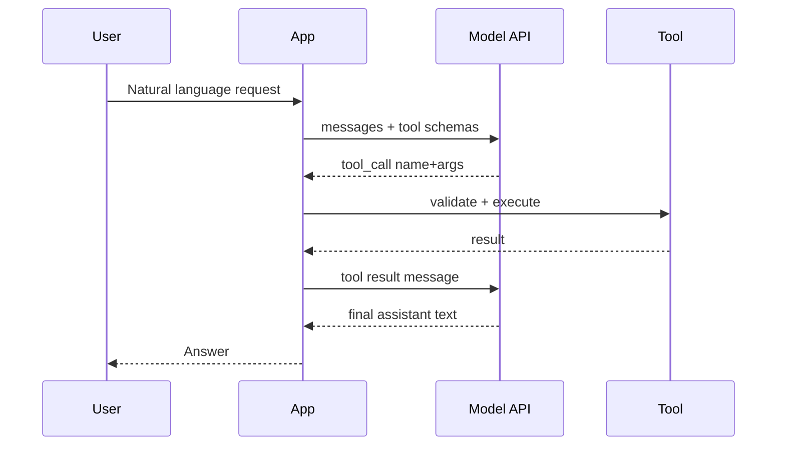

Chat completions alone make fluent text. Production systems need **side effects and facts**: prices, tickets, calendars, SQL. **Tool calling** is the bridge — the model proposes a typed function call; your server executes it; the model reads the result and answers the user. Skip that loop and you are asking the weights to pretend they are your database.

## Intuition

**What is tool calling?** The model does not magically execute your Python function. It emits a structured call; your application executes the function; then you pass the result back to the model.

**Why does it matter?** Treat the LLM as a **router with language skills**, not as a system of record:

1. User asks in natural language.
2. Model chooses a tool (or none) and fills arguments from the schema.
3. Your app validates args, runs the tool, returns a tool result message.
4. Model drafts the final answer grounded in that result.

:::key
The model suggests; your code decides. Never execute tool calls without authorization, validation, and allowlists.
:::

## How it works

### Roles and instruction priority

| Role | Plain-English meaning | Example |
| --- | --- | --- |
| developer/system | Application-level behavior, business rules, safety boundaries | You are a refund assistant. Never issue refunds above Rs. 5000 without approval. |
| user | The end user's task or question | Refund order 123 because it arrived damaged. |
| assistant | Previous model responses | I can help. Please share the order ID. |
| tool | External result returned after a tool was executed | Order 123 status: delivered; amount: Rs. 3400. |

Modern OpenAI-style APIs use a messages array. Newer documentation emphasizes separating developer instructions from user-specific content. The stable lesson is **role separation**, not a particular endpoint name.

### Tool-calling loop



Multi-tool turns are normal: search, then fetch, then answer. Cap the hop count so a confused model cannot loop forever.

### Schema design

Tools should be **narrow, typed, and boring**:

```json
{
  "name": "get_weather",
  "description": "Current weather for a city.",
  "parameters": {
    "type": "object",
    "properties": {
      "location": {"type": "string", "description": "City name"},
      "units": {"type": "string", "enum": ["metric", "imperial"]}
    },
    "required": ["location"]
  }
}
```

Descriptions are part of the prompt. Vague tool names ("do_stuff") cause wrong calls. Overlapping tools cause thrash — prefer one clear verb per capability.

### Why this reduces hallucination

The model still might invent an argument, but the **payload** of truth comes from your tool. Grounded answers cite returned fields; empty tool results should produce an honest "not found," not a fabricated row.

### Tool calling safety checklist

- Validate all tool arguments before execution.
- Use allowlists for tools and APIs; never let the model construct arbitrary shell commands or SQL unchecked.
- Separate read-only tools from action tools such as purchase, refund, email, delete, or update.
- Require confirmation for irreversible or high-value actions.
- Log tool calls, arguments, results, and model versions for debugging.
- Treat retrieved web pages, PDFs, emails, and tool outputs as untrusted data, not instructions.

### Building a reliable LLM application

| Problem | Naive approach | Better approach |
| --- | --- | --- |
| Changing facts | Ask the model from memory | Use retrieval or tools, then answer only from supplied evidence |
| JSON parsing failures | Tell it "return JSON" | Use structured outputs or schema validation plus retry/repair |
| Long documents | Paste everything | Chunk, retrieve relevant sections, summarize with citations |
| Hallucinated actions | Let the model decide silently | Expose tool plans and require confirmation for risky actions |
| Cost explosion | Send full history every turn | Summarize or compact history, cache stable context, cap max tokens |

## In code

Illustrative OpenAI-style minimal text call:

```python
from openai import OpenAI

client = OpenAI()
response = client.responses.create(
    model="gpt-4o-mini",
    instructions="Explain concepts clearly for a beginner.",
    input="Explain RAG in one sentence.",
)
print(response.output_text)
```

Illustrative Anthropic-style minimal message call:

```python
import anthropic

client = anthropic.Anthropic()
message = client.messages.create(
    model="claude-sonnet-4-20250514",
    max_tokens=256,
    system="Explain concepts clearly for a beginner.",
    messages=[
        {"role": "user", "content": "Explain RAG in one sentence."}
    ],
)
print(message.content[0].text)
```

Local dispatcher with allowlist + validation:

```python
import json
from typing import Any, Callable


TOOLS: dict[str, Callable[..., Any]] = {
    "get_weather": lambda location, units="metric": {
        "location": location,
        "temp_c": 28,
        "units": units,
    },
}


def run_tool_call(name: str, args_json: str) -> dict:
    if name not in TOOLS:
        return {"error": "tool_not_allowed", "name": name}
    try:
        args = json.loads(args_json)
    except json.JSONDecodeError:
        return {"error": "invalid_json_args"}
    if "location" not in args:
        return {"error": "missing_location"}
    return {"ok": True, "data": TOOLS[name](**args)}


print(run_tool_call("get_weather", '{"location": "Bengaluru"}'))
```

Why use a tool for arithmetic? The model can often do small math directly, but a tool makes the result deterministic, auditable, and reusable. This matters more for databases, payment actions, calendars, search, and private enterprise APIs.

Hop limit:

```python
def agent_loop(max_hops: int = 3):
    for hop in range(max_hops):
        # call model -> if tool_calls: execute -> continue; else return text
        pass
    return {"error": "max_tool_hops_exceeded"}
```

## What goes wrong

- **Blind execution** — model asks `transfer_funds`; app runs it without authorization.
- **Giant kitchen-sink tools** — one `run_sql(query)` with no guardrails is a breach waiting for a prompt.
- **Schema drift** — renamed parameters; model still emits old keys; silent failures.
- **Infinite tool loops** — no hop cap; latency and bill explode.
- **Using tools as optional decoration** — model answers from memory even when a tool exists.

:::warn
Tool arguments are untrusted. Validate types, ranges, and tenancy (user can only access their rows) in application code before any side effect.
:::

## One-line summary

LLM APIs expose chat plus optional tools — the model proposes typed calls, your app executes and returns results, and answers stay grounded in real systems.

## Key terms

- **Chat completions API** — Endpoint that continues a role-tagged message list.
- **Tool / function calling** — Model emits structured calls your app can execute.
- **Tool schema** — JSON Schema-like description of name, args, and types.
- **Tool result message** — API message carrying execution output back to the model.
- **Allowlist** — Explicit set of tools the app is willing to run.
- **Hop / step limit** — Cap on tool rounds per user request.
- **Grounding** — Basing claims on retrieved or tool-returned evidence.
