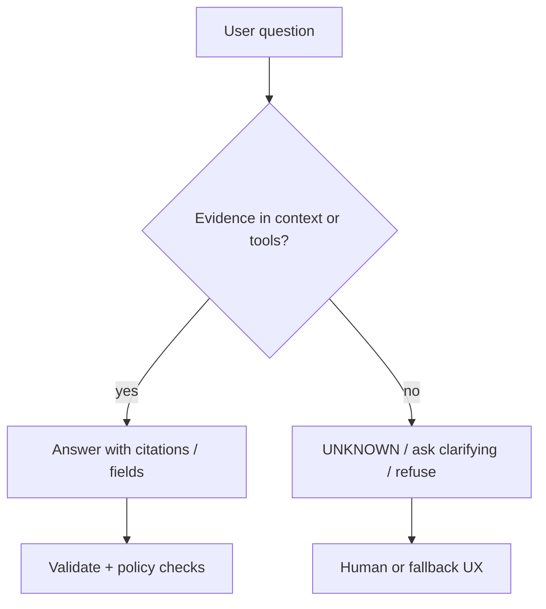

The most dangerous LLM failure is not a crash — it is a **confident wrong answer**. **Hallucinations** look like expertise: citations, APIs, medical details, legal clauses. Until you treat fluency as separate from truth, every feature you ship will eventually embarrass you in front of a customer or an auditor.

## Intuition

**What is a hallucination?** An LLM samples plausible continuations. Training rewarded looking like the training distribution, not checking a ledger. When the prompt asks for a fact the weights never reliably stored — or that changed last week — the model still has to emit tokens. Plausible tokens win.

**Why does fluency mislead us?** Smooth prose raises perceived confidence; it does not raise truth probability.

Sibling limitations share the same root: sensitivity to wording, shallow multi-step reasoning without scaffolding, bias from data, and non-determinism under sampling. Mitigations are engineering: retrieval, tools, validation, evals, and humans on the high-impact path.

:::key
Fluency is not evidence. Design for verification, not for trust in tone.
:::

## How it works

### Why hallucinations happen

| Cause | Plain-English idea |
| --- | --- |
| **Objective mismatch** | Next-token likelihood ≠ factual correctness |
| **Missing or stale knowledge** | Cutoffs, private data, rare entities |
| **Prompt pressure** | "List three papers" pushes invention if none are known |
| **Context gaps** | Evidence never entered the window, or was truncated |
| **Decoding noise** | High temperature amplifies low-probability fabrications |
| **Role-play leakage** | Model continues a confident persona instead of abstaining |

### Taxonomy useful in products

| Type | Example | Typical fix |
| --- | --- | --- |
| Factual | Wrong capital, fake metric | RAG / tools / abstain |
| Citation | Invented DOI or URL | Require fetchable sources |
| Faithfulness | Summary adds claims | Ground on source text only |
| Tool / API | Invented endpoint fields | Schema + live docs tool |
| Reasoning | Arithmetic or logic slip | Tools, scratchpads, checks |



### Broader limitations

- **Prompt brittleness** — paraphrase flips the answer; golden tests must cover paraphrases.
- **Long-horizon tasks** — multi-step plans drift without decomposition and checks.
- **Bias and safety** — training data skews show up as stereotyped or unsafe completions.
- **Non-determinism** — sampling and infra variance complicate debugging; pin seeds where supported and log params.
- **Context dilution** — policies in a giant prompt lose to the nearest noisy user text.
- **No true persistent memory** — unless you build storage; "remembering" across sessions is your database, not magic.

### Mitigation playbook

1. **Ground** — RAG, tools, SQL, calculators for anything that must be true.
2. **Abstain** — teach and test "I don't know" / UNKNOWN paths.
3. **Constrain** — structured outputs, low temperature for facts.
4. **Verify** — validators, citation link checks, unit tests on extracts.
5. **Evaluate** — offline suites for hallucination and faithfulness; sample production traces.
6. **Human-in-the-loop** — mandatory for medical, legal, financial, and irreversible actions.

### Why low temperature is not enough

Lower temperature reduces randomness but does not add missing facts or verify truth. Factual reliability needs grounding through retrieval, tools, citations, validation, and uncertainty handling.

## In code

Detect empty grounding before you let the model "be helpful":

```python
def should_abstain(docs: list[str], min_chars: int = 40) -> bool:
    return sum(len(d.strip()) for d in docs) < min_chars


docs = ["", " "]
if should_abstain(docs):
    answer = "UNKNOWN: no supporting documents retrieved."
else:
    answer = "(call model with docs)"
print(answer)
```

Faithfulness check sketch — every claim sentence must overlap the source:

```python
def unsupported_sentences(answer: str, source: str) -> list[str]:
    src = source.lower()
    bad = []
    for sent in answer.split("."):
        s = sent.strip()
        if not s:
            continue
        tokens = [t for t in s.lower().split() if len(t) > 3]
        if not tokens:
            continue
        hit = sum(1 for t in tokens if t in src)
        if hit / len(tokens) < 0.3:
            bad.append(s)
    return bad


src = "Refunds arrive in 5 to 7 business days."
ans = "Refunds arrive in 5 to 7 business days. Platinum users get same-day cash."
print(unsupported_sentences(ans, src))
```

Force an evidence field in structured answers:

```python
import json


def validate_grounded(raw: str) -> dict:
    data = json.loads(raw)
    if data.get("status") == "ok" and not data.get("evidence_spans"):
        raise ValueError("ok answers require evidence_spans")
    if data.get("status") == "unknown" and data.get("answer"):
        raise ValueError("unknown must not include a factual answer")
    return data
```

## What goes wrong

- **Shipping demo prompts to prod** — demos reward confident answers; prod needs abstention.
- **Citations without fetch** — model invents links; nobody clicks until a lawyer does.
- **RAG theater** — retrieve docs but never instruct "use only these sources."
- **Over-trusting "reasoning" modes** — longer chain-of-thought can still be wrong; verify outcomes.
- **No eval for hallucinations** — you only discover them via screenshots on social media.
- **One-size temperature** — creative preset left on a compliance bot.

:::warn
For medical, legal, or safety-critical domains, model output is a draft under expert review — never the sole authority.
:::

## One-line summary

Hallucinations are fluent, unsupported claims from a next-token predictor — contain them with grounding, abstention, validation, evals, and human review.

## Key terms

- **Hallucination** — False or unsupported content produced confidently by a model.
- **Faithfulness** — Staying true to provided source text without adding claims.
- **Grounding** — Conditioning answers on retrieved or tool-returned evidence.
- **Abstention** — Declining to answer when evidence is insufficient.
- **Knowledge cutoff** — Date beyond which the model's weights are not reliably updated.
- **Prompt brittleness** — Large output changes from small wording changes.
- **Human-in-the-loop** — Requiring human approval for high-impact actions or answers.
