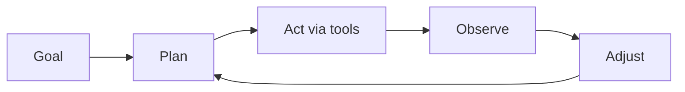

**What is this for?** To explain what turns a plain LLM (large language model) into an **agent**—a system that can plan, use tools, remember context, and keep working until the job is done or stopped.

**Why does it exist?** A chat model by itself only predicts the next word. It can talk, but it cannot check logs, restart a server, or search again when the first answer is incomplete. Agents add the control loop that real work needs.

## Intuition

A one-shot retrieval-augmented generation (RAG) pipeline looks like this:

```
query  ->  retrieve top documents  ->  generate answer
```

That works for simple questions. It breaks when the task needs several steps—read a code diff, check live logs, compare both, maybe search again.

An **agentic** flow looks like this:

```
observe  ->  think  ->  act  ->  observe  ->  think  ->  ...  ->  answer
```

Plain English: an agent watches what is happening, reasons about it, chooses an action, reads the result, and decides again. Linear retrieval is a helper inside that loop—it is not the whole control system.

| Plain-English idea | What it means |
| --- | --- |
| **Chat / one-shot RAG** | Read evidence once, answer once |
| **Agent** | Loop: plan, act with tools, observe, adjust |
| **Agency** | The system can change things in the world, not only print text |

:::key
An agent is an LLM plus tools, memory, and planning—not "smarter text," but a goal-seeking loop with side effects.
:::



If there is no goal, no tools, and no loop, you have a single-turn completer. Useful—but not an agent.

## How it works

### Core properties

Every agent needs at least these pieces:

1. **Explicit goal** — something checkable ("report posted," "ticket closed," "tests green").
2. **Planning** — break the goal into ordered steps.
3. **Tools** — search, databases, APIs, code runners, ticket systems.
4. **Observation** — read tool results, errors, and environment state.
5. **Adjustment** — retry, replan, ask a human, or stop.

Not every property must be fancy. A narrow agent with two tools and a fixed checklist is still an agent if it loops on results. A free-chat LLM with no tools is not.

### The agent loop (ASCII)

```
agent_loop(input):
    while not done:
        thought   = llm_think(state)
        action    = choose_tool(thought)
        observation = run_tool(action)
        state     = update_state(observation)
    return final_answer
```

**Budgets matter:** max steps, max tokens, max cost, max time. Without them, "agency" becomes an infinite bill.

### Degrees of autonomy

| Level | Behavior | Example |
| --- | --- | --- |
| Assisted | Draft only; human executes | Suggested SQL, user runs it |
| Supervised | Auto on low risk; human-in-the-loop (HITL) on high | Auto-tag tickets; human approves refunds |
| Autonomous (scoped) | Full loop inside a sandbox | Nightly report in read-only business intelligence (BI) |

Ship the lowest level that delivers value. Autonomy is a product choice, not a badge.

### What is not required

- Multi-agent teams
- Fancy frameworks
- Perfect long-term memory
- Open-ended "do anything" tools

Those are optional upgrades. The defining loop is **goal → plan → act → observe → adjust**.

## In code

A tiny agent loop with a stop budget. The "model" is faked so the control flow is obvious.

```python
from dataclasses import dataclass

@dataclass
class Goal:
    description: str
    done_when: str  # simple flag name

TOOLS = {
    "fetch_sales": lambda: {"rows": 120, "revenue": 54000},
    "summarize": lambda data: f"Revenue={data['revenue']} from {data['rows']} rows",
    "post_report": lambda text: {"posted": True, "preview": text[:40]},
}

def fake_policy(state: dict) -> tuple[str, dict] | tuple[str, None]:
    if "data" not in state:
        return "fetch_sales", {}
    if "summary" not in state:
        return "summarize", {"data": state["data"]}
    if not state.get("posted"):
        return "post_report", {"text": state["summary"]}
    return "final", None

def run_agent(goal: Goal, max_steps: int = 8) -> dict:
    state: dict = {"goal": goal.description}
    for step in range(max_steps):
        action, args = fake_policy(state)
        if action == "final":
            state["status"] = "success"
            return state
        if action not in TOOLS:
            state["status"] = "bad_action"
            return state
        result = TOOLS[action](**args) if args else TOOLS[action]()
        if action == "fetch_sales":
            state["data"] = result
        elif action == "summarize":
            state["summary"] = result
        elif action == "post_report":
            state["posted"] = result["posted"]
        state["last_step"] = step
    state["status"] = "budget_exhausted"
    return state

print(run_agent(Goal("weekly sales pack", "posted")))
```

Replace `fake_policy` with an LLM that emits structured tool calls; keep the budget and validation in your host code.

## What goes wrong

- **Goal mush.** "Be helpful" is not a terminating condition; loops wander.
- **No observation.** Ignoring tool errors and retrying blindly burns tokens.
- **Unbounded autonomy.** Missing max-steps or timeouts creates runaway agents.
- **Chatbot cosplay.** Marketing calls every chat UI an "agent" and skips tools and loops.
- **Hidden side effects.** Acting without audit logs makes incidents hard to debug.
- **Premature multi-agent.** Split into many agents before a single loop works end to end.

## Putting it into practice

Before you rename a feature an "agent," write three sentences: the **goal**, the **tools**, and the **stop conditions**. If any sentence is empty, you still have a chatbot or a script.

Instrument the loop from day one: log step index, tool name, latency, and whether the run ended in success, budget exhaustion, or escalation. Those four fields teach you more than another framework tutorial.

When stakeholders ask for "full autonomy," translate the request into the autonomy table above and pick **Supervised** as the default launch mode. Expand only after task success rate and safety probes clear a written bar for two consecutive weeks.

## One-line summary

An AI agent is a goal-seeking loop that plans, uses tools, observes results, and adjusts—under explicit budgets and stop conditions—not merely a model that replies in chat.

## Key terms

- **Agent:** LLM wrapped with tools, memory, and planning so it can act.
- **Tool / action:** external capability the host executes on the model's request.
- **Observation:** tool result or environment feedback fed back into context.
- **Autonomy level:** how much the system may do without a human.
- **Step budget:** hard cap on iterations, time, or cost.
- **Success criterion:** checkable condition that ends the loop.
- **Agentic RAG:** RAG upgraded with planning, looping, tools, and memory.
