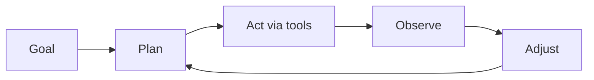

A chatbot answers. An **agent** pursues a goal: it decides steps, uses tools, reads outcomes, and keeps going until success, failure, or a stop condition. The difference is not “smarter text” — it is a control loop with side effects.

## Intuition

Give a model a question and it returns prose. Give an agent a goal like “prepare the weekly sales pack” and it must choose a sequence: fetch data, clean it, summarize, attach a chart, post to a channel. Between steps it looks at tool results and revises the plan. That observe–adjust cycle is what people mean by agency in product systems.



If there is no goal, no tools, and no loop, you have a single-turn completer — useful, but not an agent.

## How it works

### Core properties

1. **Explicit goal** — success criteria the loop can test (“report posted,” “tests green,” “ticket resolved”).
2. **Planning / sequencing** — break the goal into ordered steps with dependencies.
3. **Action through tools/APIs** — search, databases, calendars, code runners, ticket systems.
4. **Observation** — parse tool results, errors, and environment state.
5. **Adjustment** — retry, replan, escalate to a human, or stop.

Not every property must be maximal. A narrow agent with two tools and a fixed checklist is still an agent if it loops on results. A free-chat LLM with no tools is not.

### Anatomy of a turn

Typical runtime:

1. Load goal, memory, and allowed tools.
2. Model proposes either a final answer or a tool call.
3. Host validates and executes the tool.
4. Result is appended to context.
5. Repeat until final answer, max steps, timeout, or human gate.

Budgets matter: max steps, max tokens, max dollars, max wall-clock. Without them, “agency” becomes an infinite bill.

### Degrees of autonomy

| Level | Behavior | Example |
| --- | --- | --- |
| Assisted | Draft only; human executes | Suggested SQL, user runs it |
| Supervised | Auto on low risk; HITL on high | Auto-tag tickets; human for refunds |
| Autonomous (scoped) | Full loop inside a sandbox | Nightly report in read-only BI |

Ship the lowest level that delivers value. Autonomy is a product choice, not a badge.

### What is not required

- Multi-agent teams
- Fancy frameworks
- Perfect long-term memory
- Open-ended “do anything” tools

Those are optional upgrades. The defining loop is goal -> plan -> act -> observe -> adjust.

## In code

A tiny agent loop with a stop budget. The “model” is faked so the control flow is obvious.

```python
from dataclasses import dataclass

@dataclass
class Goal:
    description: str
    done_when: str  # simple flag name

TOOLS = {
    "fetch_sales": lambda: {"rows": 120, "revenue": 54000},
    "summarize": lambda data: f"Revenue={data['revenue']} from {data['rows']} rows",
    "post_report": lambda text: {"posted": True, "preview": text[:40]},
}

def fake_policy(state: dict) -> tuple[str, dict] | tuple[str, None]:
    if "data" not in state:
        return "fetch_sales", {}
    if "summary" not in state:
        return "summarize", {"data": state["data"]}
    if not state.get("posted"):
        return "post_report", {"text": state["summary"]}
    return "final", None

def run_agent(goal: Goal, max_steps: int = 8) -> dict:
    state: dict = {"goal": goal.description}
    for step in range(max_steps):
        action, args = fake_policy(state)
        if action == "final":
            state["status"] = "success"
            return state
        if action not in TOOLS:
            state["status"] = "bad_action"
            return state
        result = TOOLS[action](**args) if args else TOOLS[action]()
        if action == "fetch_sales":
            state["data"] = result
        elif action == "summarize":
            state["summary"] = result
        elif action == "post_report":
            state["posted"] = result["posted"]
        state["last_step"] = step
    state["status"] = "budget_exhausted"
    return state

print(run_agent(Goal("weekly sales pack", "posted")))
```

Replace `fake_policy` with an LLM that emits structured tool calls; keep the budget and validation in your host code.

## What goes wrong

- **Goal mush.** “Be helpful” is not a terminating condition; loops wander.
- **No observation.** Ignoring tool errors and retrying blindly burns tokens.
- **Unbounded autonomy.** Missing max-steps/timeouts creates runaway agents.
- **Chatbot cosplay.** Marketing calls every chat UI an “agent” and skips tools and loops.
- **Hidden side effects.** Acting without audit logs makes incidents undebuggable.
- **Premature multi-agent.** Split into many agents before a single loop works end to end.

## Putting it into practice

Before you rename a feature an “agent,” write three sentences: the goal, the tools, and the stop conditions. If any sentence is empty, you still have a chatbot or a script. Instrument the loop from day one: log step index, tool name, latency, and whether the run ended in success, budget exhaustion, or escalation. Those four fields will teach you more than another framework tutorial.

When stakeholders ask for “full autonomy,” translate the request into an autonomy level table and pick Supervised as the default launch mode. Expand only after task success rate and safety probes clear a written bar for two consecutive weeks. Agency without instrumentation is just unpredictability with better copy.

## One-line summary

An AI agent is a goal-seeking loop that plans, uses tools, observes results, and adjusts — under explicit budgets and stop conditions — not merely a model that replies in chat.

## Key terms

- **Agent:** goal-driven system with plan–act–observe–adjust loops.
- **Tool / action:** external capability the host executes on the model’s request.
- **Observation:** tool result or environment feedback fed back into context.
- **Autonomy level:** how much the system may do without a human.
- **Step budget:** hard cap on iterations, time, or cost.
- **Success criterion:** checkable condition that ends the loop.
