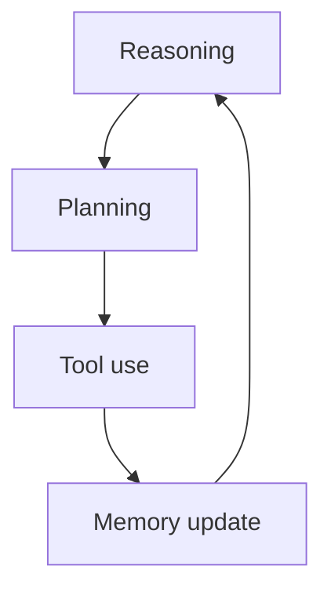

**What is this for?** To show the four building blocks that turn a demo into a useful agent: **reasoning**, **planning**, **tool use**, and **memory**.

**Why does it exist?** Missing any one piece turns a system into a fragile script or a chatty dead end. Together they let an agent finish real multi-step jobs.

## Intuition

Imagine a weekly sales report request:

- **Reasoning** clarifies what success means ("last 7 days, US dollars, exclude test accounts").
- **Planning** orders the work (fetch → clean → summarize → deliver).
- **Tools** talk to your business intelligence (BI) system and docs.
- **Memory** recalls that this stakeholder wants three bullet points, not a novel.

Alone, each piece is ordinary. Together they complete jobs.

| Capability | Plain-English idea | What it does |
| --- | --- | --- |
| **Reasoning** | "What does done look like?" | Turns a vague ask into constraints and success checks |
| **Planning** | "In what order?" | Breaks the goal into named, retryable steps |
| **Tool use** | "How do we touch the world?" | Calls APIs, search, databases, automations |
| **Memory** | "What must we remember?" | Keeps session state and durable facts |

:::key
Reasoning sets the target. Planning sets the route. Tools do the work. Memory keeps context from vanishing between steps.
:::



## How it works

### Reasoning

Interpret intent, constraints, and success conditions. Distinguish must-haves from nice-to-haves. Detect underspecified goals ("optimize the funnel") and ask or assume explicitly.

Reasoning here is not mystical chain-of-thought theater—it is producing a machine-checkable brief: inputs, outputs, limits, risk level.

### Planning

Split the goal into ordered subtasks with dependencies. Good plans are short, named, and retryable. Prefer checkpoints ("data fetched") over vague phases ("analyze").

**Planner vs executor (plain English):**

| Role | Plain-English idea | Focus |
| --- | --- | --- |
| **Planner** | Decides *what* should happen | Outputs a step list |
| **Executor** | Does *one* step safely | Outputs tool calls and reads results |

Why split them?

- Less mental load per model call.
- Cheaper runs—not every step needs the biggest model.
- Better fault tolerance—a failed step can be re-planned without throwing away everything.

Example plan for a payment outage:

```
Planner:   Check code diff  ->  Check logs  ->  Compare  ->  Synthesize
Executor:  Run github.get_commit_diff(...)
Executor:  Run splunk.query_logs(...)
```

Replan when observations invalidate assumptions (empty API response, schema changed). For many production workflows, a fixed playbook beats open-ended free planning.

### Tool use

Call APIs, search, run scripts, query databases, trigger automations. The model proposes; the **host** (your application code) validates and executes.

Design tools as narrow verbs with typed arguments (`get_orders(start, end)`), not a single `do_anything(command)`. Return structured, truncated results so the context window stays usable.

### Memory

Retain what future steps need:

- **Working memory (episodic):** current plan, recent tool results—like RAM for this session.
- **Semantic memory:** durable facts and lessons across sessions—like a hard drive or knowledge base.

Write memory deliberately. Dumping full transcripts forever creates cost, privacy risk, and confusion.

### Example workflow

1. User asks for weekly sales report.
2. Agent reasons: date range, currency, audience.
3. Plans: fetch → clean → summarize → chart → post.
4. Calls BI and spreadsheet tools.
5. Reads memory for preferred format; stores "posted URL" for next week.

### How the four fail together

| Weak link | Symptom |
| --- | --- |
| Reasoning | Solves the wrong problem confidently |
| Planning | Random tool thrash; no progress |
| Tools | Hallucinated numbers with no fetch |
| Memory | Repeats questions; ignores preferences |

## In code

A sketch that separates the four concerns in code structure.

```python
from dataclasses import dataclass, field

@dataclass
class Brief:
    goal: str
    constraints: list[str]
    success: str

@dataclass
class Plan:
    steps: list[str]
    idx: int = 0

@dataclass
class Memory:
    prefs: dict = field(default_factory=dict)
    scratch: dict = field(default_factory=dict)

def reason(user: str) -> Brief:
    return Brief(
        goal="weekly sales report",
        constraints=["last_7_days", "USD", "no_test_accounts"],
        success="summary_posted_to_slack",
    )

def plan(brief: Brief) -> Plan:
    return Plan(["fetch", "clean", "summarize", "deliver"])

def call_tool(name: str, mem: Memory):
    if name == "fetch":
        mem.scratch["rows"] = [{"rev": 100}, {"rev": 250}]
    elif name == "clean":
        mem.scratch["rows"] = [r for r in mem.scratch["rows"] if r["rev"] > 0]
    elif name == "summarize":
        total = sum(r["rev"] for r in mem.scratch["rows"])
        style = mem.prefs.get("style", "bullets")
        mem.scratch["summary"] = f"{style}: total={total}"
    elif name == "deliver":
        mem.scratch["posted"] = True

def run(user: str) -> Memory:
    mem = Memory(prefs={"style": "exec_bullets"})
    brief = reason(user)
    p = plan(brief)
    while p.idx < len(p.steps):
        call_tool(p.steps[p.idx], mem)
        p.idx += 1
    assert mem.scratch.get("posted")
    return mem

print(run("weekly sales please"))
```

In production, `reason` / `plan` / tool choice may be LLM-driven, but keep memory writes and tool execution in deterministic host code.

## What goes wrong

- **Reasoning without tools.** Fluent plans that never touch real data.
- **Tools without planning.** Spray of API calls with no terminating structure.
- **Memory bloat.** Entire histories stuffed into every prompt; cost and distraction rise.
- **Stale memory.** Old preferences override new instructions.
- **Over-planning.** Twenty-step plans for a two-step task; fragility multiplies.
- **Skipping success checks.** Declaring victory because the model said "done."

## Putting it into practice

On a whiteboard, draw four boxes—Reason, Plan, Tools, Memory—and assign owners: which parts are LLM-generated vs deterministic code. Most teams should keep tool execution and memory writes in code; let the model propose plans and arguments.

Add one eval case per box: wrong-goal detection, bad step order, invalid tool args, and stale preference override. If a box has no test, it will rot.

For the sales-report example, freeze the playbook steps in YAML and only ask the model to fill parameters (date range, channel). Free-form planning can wait until the playbook's pass rate plateaus.

## One-line summary

Wire reasoning, planning, tool use, and memory as separate, testable pieces so the agent interprets the goal, sequences work, acts on systems, and remembers only what future steps need.

## Key terms

- **Reasoning:** turning a request into constraints and success criteria.
- **Planning:** ordered, dependent subtasks toward the goal.
- **Planner:** part that breaks a complex task into steps.
- **Executor:** part that performs one planned step safely.
- **Tool use:** host-executed actions proposed by the model.
- **Episodic memory:** short-term thread state for the current interaction.
- **Semantic memory:** long-term stored facts across sessions.
- **Playbook / DAG (directed acyclic graph):** fixed workflow skeleton the model fills rather than invents.
