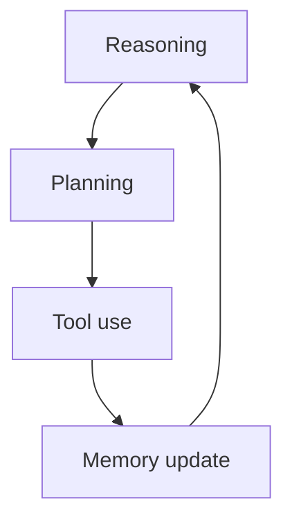

Useful agents combine four capabilities: **reasoning** (what does success mean?), **planning** (in what order?), **tool use** (how do we affect the world?), and **memory** (what must we remember?). Missing any one turns a demo into a fragile script or a chatty dead end.

## Intuition

Imagine a weekly sales report request. Reasoning clarifies constraints (“last 7 days, USD, exclude test accounts”). Planning orders work (fetch → clean → summarize → visualize → deliver). Tools talk to BI and docs. Memory recalls that this stakeholder wants a three-bullet exec summary, not a novel. Alone, each piece is ordinary; together they complete jobs.



## How it works

### Reasoning

Interpret intent, constraints, and success conditions. Distinguish must-haves from nice-to-haves. Detect underspecified goals (“optimize the funnel”) and ask or assume explicitly. Reasoning here is not mystical chain-of-thought theater — it is producing a machine-checkable brief: inputs, outputs, limits, risk level.

### Planning

Split the goal into ordered subtasks with dependencies. Good plans are short, named, and retryable. Prefer checkpoints (“data fetched”) over vague phases (“analyze”). Replan when observations invalidate assumptions (API empty, schema changed). For many production workflows, a fixed playbook beats open-ended free planning — use the LLM to fill slots inside a known DAG.

### Tool use

Call APIs, search, run scripts, query databases, trigger automations. The model proposes; the host validates and executes. Design tools as narrow verbs with typed args (`get_orders(start, end)`), not a single `do_anything(command)`. Return structured, truncated results so the context window stays usable.

### Memory

Retain what future steps need:

- **Working memory:** current plan, recent tool results (session).
- **Episodic notes:** what happened last Tuesday’s run.
- **Preferences / profiles:** durable user or org settings.

Write memory deliberately. Dumping full transcripts forever creates cost, privacy risk, and confusion.

### Example workflow

1. User asks for weekly sales report.
2. Agent reasons: date range, currency, audience.
3. Plans: fetch → clean → summarize → chart → post.
4. Calls BI and spreadsheet tools.
5. Reads memory for preferred format; stores “posted URL” for next week.

### How the four fail together

| Weak link | Symptom |
| --- | --- |
| Reasoning | Solves the wrong problem confidently |
| Planning | Random tool thrash; no progress |
| Tools | Hallucinated numbers with no fetch |
| Memory | Repeats questions; ignores preferences |

## In code

A sketch that separates the four concerns in code structure.

```python
from dataclasses import dataclass, field

@dataclass
class Brief:
    goal: str
    constraints: list[str]
    success: str

@dataclass
class Plan:
    steps: list[str]
    idx: int = 0

@dataclass
class Memory:
    prefs: dict = field(default_factory=dict)
    scratch: dict = field(default_factory=dict)

def reason(user: str) -> Brief:
    return Brief(
        goal="weekly sales report",
        constraints=["last_7_days", "USD", "no_test_accounts"],
        success="summary_posted_to_slack",
    )

def plan(brief: Brief) -> Plan:
    return Plan(["fetch", "clean", "summarize", "deliver"])

def call_tool(name: str, mem: Memory):
    if name == "fetch":
        mem.scratch["rows"] = [{"rev": 100}, {"rev": 250}]
    elif name == "clean":
        mem.scratch["rows"] = [r for r in mem.scratch["rows"] if r["rev"] > 0]
    elif name == "summarize":
        total = sum(r["rev"] for r in mem.scratch["rows"])
        style = mem.prefs.get("style", "bullets")
        mem.scratch["summary"] = f"{style}: total={total}"
    elif name == "deliver":
        mem.scratch["posted"] = True

def run(user: str) -> Memory:
    mem = Memory(prefs={"style": "exec_bullets"})
    brief = reason(user)
    p = plan(brief)
    while p.idx < len(p.steps):
        call_tool(p.steps[p.idx], mem)
        p.idx += 1
    assert mem.scratch.get("posted")
    return mem

print(run("weekly sales please"))
```

In production, `reason` / `plan` / tool choice may be LLM-driven, but keep memory writes and tool execution in deterministic host code.

## What goes wrong

- **Reasoning without tools.** Fluent plans that never touch real data.
- **Tools without planning.** Spray of API calls with no terminating structure.
- **Memory bloat.** Entire histories stuffed into every prompt; cost and distraction rise.
- **Stale memory.** Old preferences override new instructions.
- **Over-planning.** Twenty-step plans for a two-step task; fragility multiplies.
- **Skipping success checks.** Declaring victory because the model said “done.”

## Putting it into practice

On a whiteboard, draw four boxes — Reason, Plan, Tools, Memory — and assign owners: which parts are LLM-generated vs deterministic code. Most teams should keep tool execution and memory writes in code; let the model propose plans and arguments. Add one eval case per box: wrong-goal detection, bad step order, invalid tool args, and stale preference override. If a box has no test, it will rot.

For the sales-report example, freeze the playbook steps in YAML and only ask the model to fill parameters (date range, channel). Free-form planning can wait until the playbook’s pass rate plateaus. That ordering — scripted skeleton first, freer reasoning later — is how you get reliability without giving up future flexibility.

## One-line summary

Wire reasoning, planning, tool use, and memory as separate, testable pieces so the agent interprets the goal, sequences work, acts on systems, and remembers only what future steps need.

## Key terms

- **Reasoning:** turning a request into constraints and success criteria.
- **Planning:** ordered, dependent subtasks toward the goal.
- **Tool use:** host-executed actions proposed by the model.
- **Working memory:** short-lived state for the current run.
- **Long-term memory:** durable preferences or facts across sessions.
- **Playbook / DAG:** fixed workflow skeleton the model fills rather than invents.
