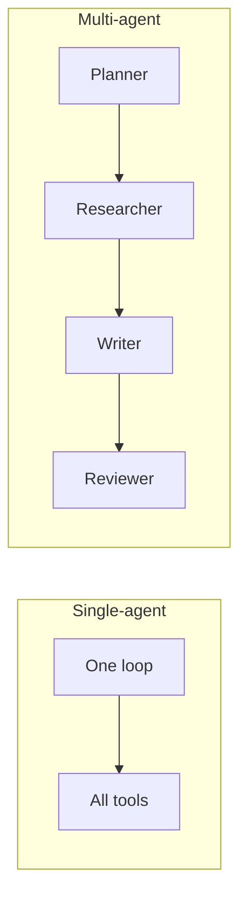

A **single-agent** system puts one loop in charge of the whole job. A **multi-agent** system splits work across specialized agents that collaborate. Multi-agent is not automatically smarter — it is an organizational choice with real coordination costs.

## Intuition

One skilled generalist can close a ticket: research policy, draft a reply, file the note. That is single-agent. A newsroom-style pipeline — researcher, writer, fact-checker — is multi-agent. The second can be higher quality at scale, but you now own handoffs, shared memory, and “who is stuck?” debugging.



**Default:** start single-agent. Move to multi-agent when specialization and parallelism clearly beat the orchestration tax.

## How it works

### Single-agent

- One policy prompt, one tool set (possibly gated), one memory.
- Easier tracing: one timeline of thoughts and calls.
- Best for moderate workflows: “triage + draft,” “report fetch + summarize.”
- Risk: prompt and tool catalog grow into a swamp; the model juggles too many roles.

### Multi-agent

- Specialized roles with narrower prompts and tools.
- Useful pipelines: planner → researcher → implementer → reviewer.
- Needs **orchestration**: who speaks when, what is passed, how disagreements resolve.
- Needs **contracts**: typed artifacts between agents (brief, sources, draft, verdict).

### Collaboration patterns

| Pattern | Idea | Watch-out |
| --- | --- | --- |
| Pipeline | Fixed stage order | Brittle if a stage fails silently |
| Supervisor | Boss agent delegates | Boss becomes a bottleneck / single point of failure |
| Peer debate | Two agents critique | Cost explodes; needs a judge and stop rule |
| Router | Classifier picks one specialist | Mis-routing causes confident wrong specialist |

### Decision guide

Stay single-agent while:

- One person could do the job with a checklist.
- Tools are few and coherent.
- Latency budget is tight.

Consider multi-agent when:

- Skills conflict in one prompt (creative writer vs strict compliance).
- Stages need different models or tool permissions.
- You can parallelize expensive research.
- Review/critique measurably lifts quality on evals.

Measure before splitting: if a single agent plus a deterministic reviewer script hits your bar, skip the second LLM.

## In code

A supervisor that delegates to two specialists with a shared artifact — still simple enough to debug.

```python
from dataclasses import dataclass

@dataclass
class Artifact:
    brief: str = ""
    notes: str = ""
    draft: str = ""
    verdict: str = ""

def researcher(art: Artifact) -> Artifact:
    art.notes = f"facts for: {art.brief}"
    return art

def writer(art: Artifact) -> Artifact:
    art.draft = f"Draft based on [{art.notes}]"
    return art

def reviewer(art: Artifact) -> Artifact:
    art.verdict = "pass" if "facts" in art.notes and art.draft else "fail"
    return art

def single_agent(brief: str) -> Artifact:
    art = Artifact(brief=brief)
    # one brain does all roles sequentially
    return reviewer(writer(researcher(art)))

def multi_pipeline(brief: str) -> Artifact:
    art = Artifact(brief=brief)
    for stage in (researcher, writer, reviewer):
        art = stage(art)
        if art.verdict == "fail":
            break
    return art

print(single_agent("weekly support themes").verdict)
print(multi_pipeline("weekly support themes").verdict)
```

Frameworks differ in APIs; the invariant is explicit artifacts and stop conditions.

## What goes wrong

- **Multi-agent as fashion.** Extra agents without eval gains — only latency and bill.
- **Fuzzy handoffs.** Free-text dumps between agents lose requirements.
- **Permission soup.** Every agent gets every tool “for flexibility.”
- **Infinite debates.** Agents critique forever without a round limit.
- **Opaque orchestration.** No trace of which agent caused a bad tool call.
- **Split too early.** You never finished a working single-agent path.

## Putting it into practice

Run an honest A/B on your golden set: single-agent baseline vs a two-role pipeline (implementer + reviewer). Compare pass rate, p95 latency, and cost per success. Promote multi-agent only if the quality lift beats the cost/latency hit by a margin you would defend to finance. Many “reviewer agents” can be replaced by schema validators and unit tests at a fraction of the price.

If you do split, publish a one-page orchestration diagram: roles, tools per role, artifact schema, and max turns. On-call engineers should debug from that page at 2 a.m. Without it, multi-agent systems become blame pinatas where nobody knows which role invented the bad refund call.

## Cost and latency math

Rough planning math helps. If each agent turn costs about C dollars and takes T seconds, a supervisor plus three specialists that each speak twice costs roughly 8CT in the worst chatter pattern. A single agent that makes four tool calls costs about 4CT plus tool time. Unless eval quality rises enough to justify the multiplier — or parallelism cuts wall-clock — the multi-agent bill is vanity. Write the inequality down before the rewrite.

## One-line summary

Use one agent until specialization clearly improves measured quality or safety; only then add multi-agent roles with typed handoffs, narrow tools, and hard stop rules.

## Key terms

- **Single-agent:** one loop owns the goal end to end.
- **Multi-agent:** collaborating specialized loops.
- **Orchestration:** control of turn-taking, routing, and retries.
- **Handoff contract:** structured artifact passed between agents.
- **Supervisor pattern:** a coordinator delegates to workers.
- **Orchestration tax:** extra cost/latency/complexity of coordination.
