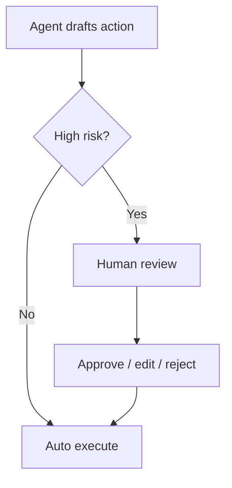

**Human-in-the-loop (HITL)** means people approve, edit, or reject AI decisions at critical points. It is not a failure of automation — it is how you ship agents into domains where mistakes cost money, rights, or trust.

## Intuition

Let the agent draft freely. Pause when the next action is hard to undo. A support agent can auto-tag tickets; a human should still green-light a $2,000 refund. HITL turns “autonomous” from all-or-nothing into a risk dial.



## How it works

### Where HITL pays off

- Financial transactions and credit changes.
- Legal, medical, or compliance-facing text.
- Security and account-access changes.
- External communications in sensitive contexts (PR, executive email).
- Irreversible deletes or production deploys.
- Novel cases outside the eval distribution.

### HITL patterns

| Pattern | Behavior | Good for |
| --- | --- | --- |
| Approve / reject | Binary gate | Refunds, sends |
| Edit then run | Human fixes draft | Customer emails |
| Tool allow on ask | Agent requests elevation | Rare admin ops |
| Review sampling | Spot-check auto path | Quality audits |
| Escalation on confidence | Low score -> human | Ambiguous intents |

### Designing the queue

Humans are a scarce resource. Rank the queue by risk and uncertainty, not FIFO alone. Show the reviewer: goal, proposed action, evidence, policy citations, and blast radius. Capture the decision as structured feedback (approved / edited / rejected + reason) so you can train graders and tighten auto paths later.

### Benefits beyond safety

- Reduces catastrophic risk and builds user trust.
- Creates labeled feedback for evals and fine-tuning.
- Clarifies accountability: a named approver for regulated actions.
- Lets you expand autonomy gradually as pass rates rise.

### Autonomy schedule

1. Shadow: agent proposes, human always acts.
2. Supervised: auto on allowlisted low-risk; HITL otherwise.
3. Autonomous scoped: auto inside sandbox + budgets; HITL for elevations.

Move a class of actions to auto only when offline probes and online error rates stay under threshold for a defined window.

## In code

Risk-aware gating with an approval record.

```python
from dataclasses import dataclass
from typing import Callable

RISKY = {"create_refund", "delete_user", "send_external_email"}

@dataclass
class Proposal:
    tool: str
    args: dict
    evidence: str
    risk_score: float  # 0..1

@dataclass
class Decision:
    status: str  # approved | rejected | edited
    args: dict
    reviewer: str

def needs_hitl(p: Proposal) -> bool:
    return p.tool in RISKY or p.risk_score >= 0.6

def human_review(p: Proposal) -> Decision:
    # stand-in: approve small refunds only
    if p.tool == "create_refund" and p.args.get("amount_cents", 0) <= 5000:
        return Decision("approved", p.args, reviewer="alex")
    return Decision("rejected", p.args, reviewer="alex")

def execute(tool: str, args: dict) -> str:
    return f"ran {tool}({args})"

def run(p: Proposal, reviewer_fn: Callable[[Proposal], Decision] = human_review) -> str:
    if needs_hitl(p):
        d = reviewer_fn(p)
        if d.status == "rejected":
            return f"blocked by {d.reviewer}"
        args = d.args
    else:
        args = p.args
    return execute(p.tool, args)

print(run(Proposal("tag_ticket", {"id": "T1"}, "keyword", 0.1)))
print(run(Proposal("create_refund", {"amount_cents": 2000}, "policy#12", 0.7)))
print(run(Proposal("create_refund", {"amount_cents": 80000}, "VIP ask", 0.9)))
```

Wire `human_review` to a real queue UI; keep the policy (`needs_hitl`) in version control next to evals.

## What goes wrong

- **Rubber-stamping.** Reviewers approve everything; HITL becomes theater.
- **Alert fatigue.** Too many low-value gates; humans stop reading evidence.
- **Unclear UI.** Missing blast radius and citations -> inconsistent decisions.
- **No feedback loop.** Rejections never become golden tests.
- **All-human bottleneck.** Refusing to auto anything prevents learning where risk is low.
- **Silent auto path.** Users not told when a human did vs did not intervene.

## Putting it into practice

Define a promotion rule in writing: an action class may go auto when (a) offline probes pass for N days, (b) HITL reject rate stays under R%, and (c) zero Sev-1 incidents in the window. Demote automatically if any condition breaks. Store decisions with reason codes (`policy_mismatch`, `amount_too_high`, `unclear_evidence`) so you can mine them for new eval cases.

Train reviewers like graders, not like firefighters. A five-minute rubric — what evidence is required, when to edit vs reject — beats heroic judgment under load. Publish HITL latency as a product metric; if approvals take hours, users will route around the agent entirely.

## UX for trust

Show users when a human is in the loop (“Pending specialist review”) and when the agent acted alone (“Completed automatically under policy #14”). Silent automation feels like a black box; silent human delay feels like a hang. For edited approvals, prefer showing the diff between model draft and shipped text in internal tools so reviewers learn which instructions to tighten.

## One-line summary

Put humans on the high-risk joint of the workflow — with ranked queues, structured decisions, and a path to graduate safe actions to auto — so agents stay useful without becoming unaccountable.

## Key terms

- **HITL:** human-in-the-loop approval or correction.
- **Risk score:** estimate that an action needs review.
- **Elevation:** temporary grant of a privileged tool.
- **Shadow mode:** proposals recorded without auto execution.
- **Approval receipt:** audit of who approved what and why.
- **Autonomy schedule:** staged expansion of what runs without humans.
