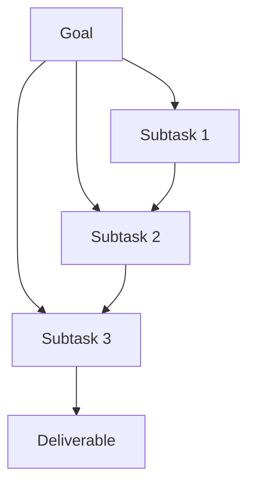

**What is this for?** To show how **task decomposition**—breaking a big goal into smaller steps—makes agents reliable and debuggable.

**Why does it exist?** Agents that skip decomposition try to "do the whole thing" in one blob of reasoning. Then they cannot tell which part failed, retry safely, or show partial progress.

## Intuition

"Create the weekly support summary" is a **goal**, not a step.

- Fetching tickets is a step.
- Clustering themes is a step.
- Each step has inputs, outputs, and a pass/fail check.

When step 3 fails, you retry step 3—not the entire week. Decomposition is how reliability and traceability enter agent design.

| Plain-English idea | What it means |
| --- | --- |
| **Goal** | The deliverable the user wants |
| **Subtask / step** | One named action with a checkable output |
| **Planner** | Breaks the goal into an ordered step list |
| **Executor** | Runs one step and returns the result |

:::key
A step is not done because the model said "done." Prefer programmatic checks: row count > 0, JSON schema valid, tests green.
:::



## How it works

### Why decomposition matters

- **Reliability:** smaller blast radius per failure.
- **Traceability:** logs map to named steps.
- **Retries:** idempotent steps can be safely re-run.
- **Partial progress:** deliver what you have if a late step fails.
- **Parallelism:** independent branches can run together.
- **Human review:** insert HITL on specific steps only.

### Planner output (example)

For a payment outage, a planner might output:

```
1. Check code diff for recent deploys
2. Check auth-service logs (last 1 hour)
3. Check db-primary status
4. Compare findings and synthesize answer
```

The **executor** runs one line at a time—e.g., `github.get_commit_diff(...)`, then `splunk.query_logs(...)`.

### How to decompose well

1. Start from the deliverable and walk backward (what must be true before we publish?).
2. Name steps as verbs with clear outputs (`fetch_tickets` → `TicketList`).
3. Keep steps roughly one tool call or one tight bundle—not mini-projects.
4. Mark dependencies (step 2 needs step 1's artifact).
5. Define a check for each step (row count > 0, schema valid, tests green).
6. Cap depth: if you need more than ~7–10 steps, introduce phases or a sub-agent.

### Example

Goal: "Create weekly support summary."

1. Fetch tickets from CRM for the date range.
2. Cluster by issue type.
3. Summarize top trends with counts.
4. Draft recommendations tied to trends.
5. Format and share the final report.

Each step can fail differently: CRM auth vs empty clusters vs tone policy on recommendations.

### Static vs dynamic plans

| Type | Plain-English idea | Best for |
| --- | --- | --- |
| **Static playbook** | Predefined steps; model fills parameters | Production default |
| **Dynamic planning** | Model invents the step list | Flexible but easier to go off-rails |

Constrain dynamic plans with templates and validators.

## In code

A tiny decomposer with per-step validation and retry.

```python
from dataclasses import dataclass, field

@dataclass
class Step:
    name: str
    run: callable
    check: callable
    retries: int = 2

@dataclass
class RunState:
    artifacts: dict = field(default_factory=dict)
    log: list = field(default_factory=list)

def fetch(state: RunState):
    state.artifacts["tickets"] = [{"id": 1, "type": "billing"}, {"id": 2, "type": "billing"}]

def cluster(state: RunState):
    types = [t["type"] for t in state.artifacts["tickets"]]
    state.artifacts["clusters"] = {t: types.count(t) for t in set(types)}

def summarize(state: RunState):
    c = state.artifacts["clusters"]
    state.artifacts["summary"] = f"Top: {max(c, key=c.get)} ({max(c.values())})"

STEPS = [
    Step("fetch", fetch, lambda s: len(s.artifacts.get("tickets", [])) > 0),
    Step("cluster", cluster, lambda s: bool(s.artifacts.get("clusters"))),
    Step("summarize", summarize, lambda s: "Top:" in s.artifacts.get("summary", "")),
]

def run_plan(steps: list[Step]) -> RunState:
    state = RunState()
    for step in steps:
        for attempt in range(step.retries + 1):
            step.run(state)
            if step.check(state):
                state.log.append(f"{step.name}:ok")
                break
        else:
            state.log.append(f"{step.name}:failed")
            break
    return state

print(run_plan(STEPS).artifacts["summary"])
```

## What goes wrong

- **Fake decomposition.** Five poetic bullets that still map to one giant tool call.
- **No checks.** Steps "succeed" on model assertion alone.
- **Too fine.** Hundreds of micro-steps → coordination hell.
- **Hidden dependencies.** Step 4 assumes a field step 2 never produced.
- **Non-idempotent retries.** Re-running "charge card" doubles the charge—need idempotency keys.
- **Dynamic plans without bounds.** The agent invents endless new steps to look busy.

## Putting it into practice

Take one messy goal from your backlog and force it into a table with columns: step name, input artifact, output artifact, check, retryable?, HITL?. If you cannot fill a row, the step is still a wish.

Keep the first production version under eight steps. For side-effecting steps, write the idempotency story before the prompt.

## Parallel branches

When two steps share no artifacts—fetching CRM tickets and fetching status-page incidents—run them concurrently, then join before summarize. Decomposition makes that parallelism obvious.

## Naming steps for ops

Use stable step IDs in logs (`fetch_tickets`, not "Step 1"). Dashboards and alerts should key off those IDs so a spike in `cluster_themes` failures pages the right owner.

## One-line summary

Decompose goals into named, dependency-aware steps with programmatic checks and retries so agents make reliable partial progress instead of one opaque attempt.

## Key terms

- **Task decomposition:** splitting a goal into executable subtasks.
- **Planner:** part that outputs a step-by-step plan.
- **Executor:** part that runs one planned step safely.
- **Artifact:** structured output of a step consumed by later steps.
- **Playbook:** predefined step skeleton for a workflow.
- **Idempotency:** safe to retry without duplicate side effects.
- **Step check:** programmatic predicate that a step succeeded.
