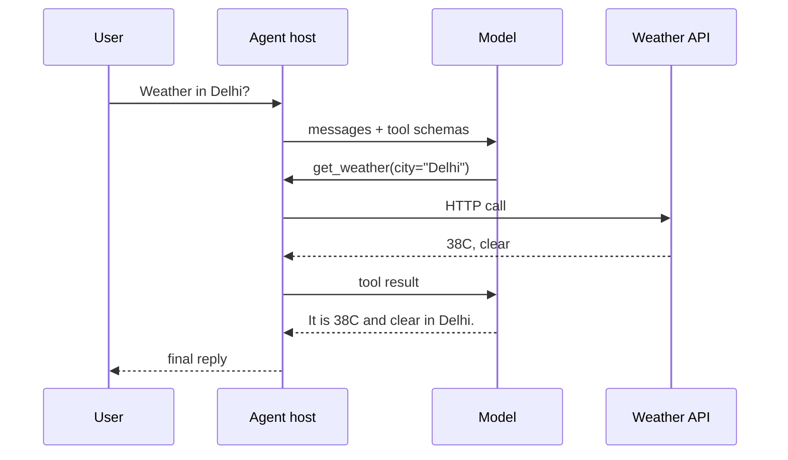

**What is this for?** To explain **tool calling** (also called **function calling**)—how an LLM chooses external actions and your app runs them.

**Why does it exist?** The model does not magically gain network access. Your **host** (application code) grants it. That is exactly why this pattern is powerful and dangerous.

## Intuition

Without tools, the model invents a weather report.

With tools, it emits something like `get_weather(city="Delhi")`; your code calls the API; the model turns the JSON into a user-facing answer.

Structure beats brittle "please output JSON" begging. The app—not the model—owns credentials, allowlists, and audits.

| Plain-English idea | What it means |
| --- | --- |
| **Tool schema** | Name, description, and argument types for each tool |
| **Tool description** | Text the model reads to decide *when* and *how* to call a tool |
| **Observation** | The result returned by a tool after an action |
| **Host / runtime** | Your code that validates and executes tool calls |

:::key
The model chooses tools from their **descriptions**—not just function names. Clear descriptions lower wrong calls and tool hallucination.
:::



## How it works

### Anatomy of one turn

The agent loop inside each tool call:

```
observe  ->  think  ->  act (tool)  ->  observe (result)  ->  think again
```

Example:

```
fetch_server_logs(server_id='db-12', minutes_ago=10)
  -> 'Database connection pool exhausted'
```

A good tool description tells the model:

- **When** to use the tool.
- **What arguments** it needs.
- **How to read** the returned data.

### The contract

1. You register tools with names, descriptions, and JSON schemas for arguments.
2. The model chooses zero or more tools (or a plain answer).
3. The host validates args against the schema and business rules.
4. The host executes allowed tools with real credentials.
5. Results (truncated) return as tool messages; the model continues.

### Design tips for tools

- **Narrow verbs:** `get_order(order_id)` not `run_sql(query)`.
- **Descriptions matter:** write crisp when-to-use / when-not-to-use text.
- **Typed args:** enums over free strings when possible.
- **Small results:** return summaries; page large lists.
- **Errors as data:** structured `{ok: false, error: "..."}` so the model can recover.
- **Idempotency:** pass keys for side-effecting tools.

### Safety checklist

- Allowlist tools per agent role.
- Validate every argument server-side (never trust the model).
- Separate read vs write permissions.
- HITL for destructive actions.
- Rate-limit and budget tool calls per run.
- Never let the model see raw secrets; inject them only in the host HTTP layer.

## In code

OpenAI-style sketch with local validation (provider SDKs differ; the host duties stay the same).

```python
import json
from dataclasses import dataclass

TOOLS = {
    "get_weather": {
        "description": "Current weather for a city. Use when user asks about weather.",
        "properties": {"city": {"type": "str"}},
        "required": ["city"],
    },
    "fetch_server_logs": {
        "description": "Fetch recent logs for a server. Use for outage debugging.",
        "properties": {"server_id": {"type": "str"}, "minutes_ago": {"type": "int"}},
        "required": ["server_id", "minutes_ago"],
    },
}

@dataclass
class ToolCall:
    name: str
    arguments: dict

def validate(call: ToolCall) -> str | None:
    spec = TOOLS.get(call.name)
    if not spec:
        return "unknown tool"
    for req in spec["required"]:
        if req not in call.arguments:
            return f"missing {req}"
    return None

def execute(call: ToolCall) -> dict:
    if call.name == "get_weather":
        return {"city": call.arguments["city"], "temp_c": 38, "cond": "clear"}
    if call.name == "fetch_server_logs":
        return {"log": "Database connection pool exhausted"}
    return {"error": "not implemented"}

def handle_model_tool_payload(payload: str) -> str:
    data = json.loads(payload)
    call = ToolCall(data["name"], data["arguments"])
    if err := validate(call):
        return json.dumps({"ok": False, "error": err})
    result = execute(call)
    return json.dumps({"ok": True, "result": result})

print(handle_model_tool_payload(
    '{"name":"get_weather","arguments":{"city":"Delhi"}}'
))
print(handle_model_tool_payload(
    '{"name":"drop_database","arguments":{}}'
))
```

## What goes wrong

- **Schema too loose.** `command: string` invites injection into shells.
- **Blind execution.** Skipping validation because "the model is usually right."
- **Huge tool dumps.** Entire database rows blow the context window.
- **Tool hallucination.** Model invents a tool name—host must reject, not invent a handler.
- **Bad descriptions.** Vague docs invite wrong tool choice and wrong parameters.
- **No user-visible receipt.** Side effects happen with no explanation in the UI.

## Putting it into practice

Document each tool like an external API: auth, rate limits, error codes, and example successful payloads. Put those examples in the tool description—models imitate what they see.

Add a canary tool in staging that only echoes args; run adversarial prompts that try to call write tools and assert the host blocked them.

Prefer returning `ok/error` envelopes over throwing opaque exceptions into the prompt. Models recover better from structured failure than from truncated stack traces.

## Multi-tool turns

Some model APIs propose several tools in one turn. Execute read-only tools in parallel if safe; serialize writes. After results return, re-validate the model's next proposal—a later write may depend on a forged interpretation of an earlier read.

## Versioning tools

Treat tool schemas like public APIs. Additive optional fields are fine; renaming or removing fields needs a version suffix (`get_order_v2`) and a deprecation window.

## One-line summary

Tool calling is a structured handshake: the model proposes typed actions, your host validates and executes them, and results return as data—never as unchecked power.

## Key terms

- **Function / tool calling:** model emits structured invoke requests.
- **Tool schema:** name, description, and argument types.
- **Tool description:** text the model uses to choose the right tool.
- **Observation:** result returned by a tool after an action.
- **Host / runtime:** application code that validates and executes tools.
- **Allowlist:** permitted tools for a given agent.
- **Tool hallucination:** when the model invents or misuses a tool call.
- **Idempotency key:** token preventing duplicate side effects on retry.
