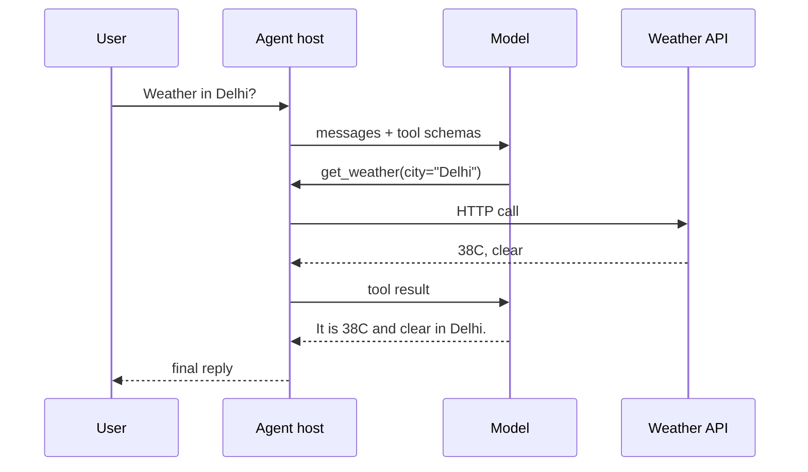

**Function calling** (tool calling) lets the model return structured arguments so your application can invoke a real API. The model does not magically gain network access — your host grants it, which is exactly why this pattern is powerful and dangerous.

## Intuition

Without tools, the model invents a weather report. With tools, it emits something like `get_weather(city="Delhi")`; your code calls the API; the model turns the JSON into a user-facing answer. Structure beats brittle “please output JSON” begging, and the app — not the model — owns credentials, allowlists, and audits.



## How it works

### The contract

1. You register tools with names, descriptions, and JSON schemas for arguments.
2. The model chooses zero or more tools (or a plain answer).
3. The host validates args against the schema and business rules.
4. The host executes allowed tools with real credentials.
5. Results (truncated) return as tool messages; the model continues.

### Why it beats free-form text

- Parsers stop guessing from markdown fences.
- Unknown tools can be rejected before execution.
- Each call is auditable: name, args, latency, status.
- You can require confirmation for risky tools.

### Design tips for tools

- **Narrow verbs:** `get_order(order_id)` not `run_sql(query)`.
- **Descriptions matter:** models pick tools from docs — write crisp when-to-use / when-not.
- **Typed args:** enums over free strings when possible.
- **Small results:** return summaries; page large lists.
- **Errors as data:** structured `{ok: false, error: "..."}` so the model can recover.
- **Idempotency:** pass keys for side-effecting tools.

### Safety checklist

- Allowlist tools per agent role.
- Validate every argument server-side (never trust the model).
- Separate read vs write permissions.
- HITL for destructive actions.
- Rate-limit and budget tool calls per run.
- Never let the model see raw secrets; inject them only in the host HTTP layer.

## In code

OpenAI-style sketch with local validation (provider SDKs differ; the host duties stay the same).

```python
import json
from dataclasses import dataclass

TOOLS = {
    "get_weather": {
        "description": "Current weather for a city",
        "properties": {"city": {"type": "str"}},
        "required": ["city"],
    }
}

@dataclass
class ToolCall:
    name: str
    arguments: dict

def validate(call: ToolCall) -> str | None:
    spec = TOOLS.get(call.name)
    if not spec:
        return "unknown tool"
    for req in spec["required"]:
        if req not in call.arguments:
            return f"missing {req}"
    if not isinstance(call.arguments["city"], str) or not call.arguments["city"].strip():
        return "bad city"
    return None

def execute(call: ToolCall) -> dict:
    # real code would HTTP GET; model never holds API keys
    return {"city": call.arguments["city"], "temp_c": 38, "cond": "clear"}

def handle_model_tool_payload(payload: str) -> str:
    data = json.loads(payload)
    call = ToolCall(data["name"], data["arguments"])
    if err := validate(call):
        return json.dumps({"ok": False, "error": err})
    result = execute(call)
    return json.dumps({"ok": True, "result": result})

print(handle_model_tool_payload(
    '{"name":"get_weather","arguments":{"city":"Delhi"}}'
))
print(handle_model_tool_payload(
    '{"name":"drop_database","arguments":{}}'
))
```

## What goes wrong

- **Schema too loose.** `command: string` invites injection into shells.
- **Blind execution.** Skipping validation because “the model is usually right.”
- **Huge tool dumps.** Entire DB rows blow the context window.
- **Tool hallucination.** Model invents a tool name — host must reject, not invent a handler.
- **Parallel chaos.** Concurrent writes without locking create races.
- **No user-visible receipt.** Side effects happen with no explanation in the UI.

## Putting it into practice

Document each tool like an external API: auth, rate limits, error codes, and example successful payloads. Put those examples in the tool description — models imitate what they see. Add a canary tool in staging that only echoes args; run adversarial prompts that try to call write tools and assert the host blocked them.

Prefer returning `ok/error` envelopes over throwing opaque exceptions into the prompt. Models recover better from structured failure than from truncated stack traces. And keep a kill switch: a config flag that disables write tools globally when an incident is underway.

## Multi-tool turns

Some model APIs propose several tools in one turn. Execute read-only tools in parallel if safe; serialize writes. After results return, do not skip re-validation of the model’s next proposal — a later write may depend on a forged interpretation of an earlier read. Your host remains the authority on ordering for anything that mutates state.

## Versioning tools

Treat tool schemas like public APIs. Additive optional fields are fine; renaming or removing fields needs a version suffix (`get_order_v2`) and a deprecation window. Agents in flight may still emit v1 calls after you deploy. Run compatibility tests: old and new argument shapes against the same host validators before you flip production traffic.

## One-line summary

Tool calling is a structured handshake: the model proposes typed actions, your host validates and executes them, and results return as data — never as unchecked power.

## Key terms

- **Function / tool calling:** model emits structured invoke requests.
- **Tool schema:** name, description, and argument types.
- **Host / runtime:** application code that validates and executes tools.
- **Allowlist:** permitted tools for a given agent.
- **Idempotency key:** token preventing duplicate side effects on retry.
- **Tool message:** channel that carries execution results back to the model.
