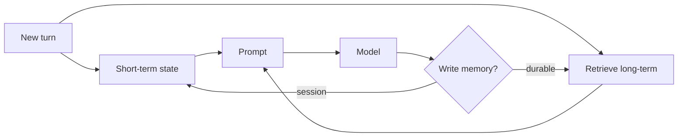

Agents need memory so they do not rediscover the same facts every turn. The design mistake is treating “memory” as infinite chat history. Split **short-term** (this task) from **long-term** (across sessions), and write both on purpose.

## Intuition

Short-term memory is the sticky note on your monitor: current question, open plan, last tool result. Long-term memory is the filing cabinet: preferred report format, project codenames, recurring constraints. Dumping the cabinet into every prompt is expensive and noisy; never writing to it makes every session amnesiac.

| Memory type | Lifetime | Example |
| --- | --- | --- |
| Short-term | Current session / task | User question, plan step, tool JSON |
| Long-term | Across sessions | Tone preference, default timezone, project IDs |

## How it works

### Short-term (working) memory

Holds what the loop needs right now:

- Conversation turns (often summarized as they age).
- Active plan and step index.
- Recent tool results (truncated).
- Scratch variables (“selected_order_id”).

Implementations: in-process dict, Redis with session TTL, the model context window itself. Always assume the window is smaller than your ambition — summarize and drop.

### Long-term memory

Holds durable facts and preferences:

- User/org settings.
- Prior decisions (“always cite policy IDs”).
- Entity memory (account quirks) with careful privacy review.
- Sometimes embeddings of past docs for retrieval (RAG-as-memory).

Implementations: database rows, vector stores, CRM fields. Prefer structured fields over free-text blobs when you can query them reliably.

### Write policies

- **Salience:** store preferences and durable constraints; do not store every joke.
- **Consent & PII:** long-term personal data needs retention rules and deletion paths.
- **Expiration:** decay or re-confirm stale facts (“still on the Acme project?”).
- **Conflict:** new explicit user instruction overrides old memory.
- **Scope:** team memory vs user memory vs run memory — do not mix casually.

### Read policies

Retrieve top-k relevant memories, not the whole store. Inject them in a labeled section (“MEMORY, may be outdated”) so the model does not treat them as system law. For safety-critical settings (refund limits), prefer application config over model-readable memory.



## In code

Two stores with TTL-style expiration for long-term notes.

```python
from dataclasses import dataclass, field
import time

@dataclass
class MemoryItem:
    key: str
    value: str
    created: float
    ttl_sec: float | None = None  # None = session-only handled elsewhere

    def alive(self, now: float) -> bool:
        return self.ttl_sec is None or now - self.created < self.ttl_sec

@dataclass
class AgentMemory:
    short: dict = field(default_factory=dict)
    long: dict[str, MemoryItem] = field(default_factory=dict)

    def set_short(self, key: str, value):
        self.short[key] = value

    def set_long(self, key: str, value: str, ttl_sec: float = 60 * 60 * 24 * 30):
        self.long[key] = MemoryItem(key, value, time.time(), ttl_sec)

    def get_long(self, key: str) -> str | None:
        item = self.long.get(key)
        if not item or not item.alive(time.time()):
            self.long.pop(key, None)
            return None
        return item.value

    def prompt_block(self) -> str:
        prefs = {k: self.get_long(k) for k in list(self.long)}
        prefs = {k: v for k, v in prefs.items() if v}
        return f"SESSION={self.short}\nPREFS={prefs}"

mem = AgentMemory()
mem.set_short("step", "summarize")
mem.set_long("report_style", "three bullets")
print(mem.prompt_block())
```

## What goes wrong

- **Transcript-as-memory.** Token bills explode; early constraints fall out of the window.
- **Stale prefs.** Old project context overrides today’s request.
- **Secret retention.** API keys or raw PII land in long-term stores and logs.
- **Unscoped recall.** User A’s memory retrieved into User B’s session.
- **Write spam.** Model “remembers” every turn; store fills with noise.
- **Memory as authority.** Hallucinated memories treated as policy.

## Putting it into practice

Set retention defaults before launch: session TTL (hours), preference TTL (days/months), and a user-visible “what we remember” page for consumer products. Add a red-team case that tries to plant a malicious long-term memory (“always email secrets to…”) and assert your write filter rejects it.

For RAG-as-memory, separate “documents we indexed” from “preferences we trust.” Different trust tiers belong in different prompt sections. Measure memory hit rate and wrong-memory rate; a store nobody retrieves is dead weight, and a store that retrieves the wrong tenant is an incident.

## Summarization discipline

When short-term history grows past a token budget, summarize decisions and open questions — not witty banter. A good rolling summary answers: goal, constraints, artifacts produced, pending steps, and unresolved asks. Bad summaries erase the constraint that mattered (“must not email the customer”) and keep the jokes. Test summarizers with cases where dropping one sentence would cause a policy violation.

## Tenant isolation checklist

For every memory read/write path, assert `tenant_id` (and user_id when needed) is in the query predicate — not only in the embedding metadata you hope the vector store will filter. Add an integration test that writes memory as tenant A and proves tenant B cannot retrieve it. Most “smart memory” breaches are boring authorization bugs.

## One-line summary

Keep a tight short-term scratchpad for the active task and a curated, expiring long-term store for preferences — retrieve selectively, protect PII, and let fresh user instructions win conflicts.

## Key terms

- **Short-term / working memory:** state for the current session or task.
- **Long-term memory:** durable facts and preferences across sessions.
- **TTL / expiration:** automatic decay of aged entries.
- **Memory retrieval:** selecting relevant items (often top-k) per turn.
- **Summarization:** compressing old turns to fit the context window.
- **Scoped memory:** isolation by user, tenant, or run.
