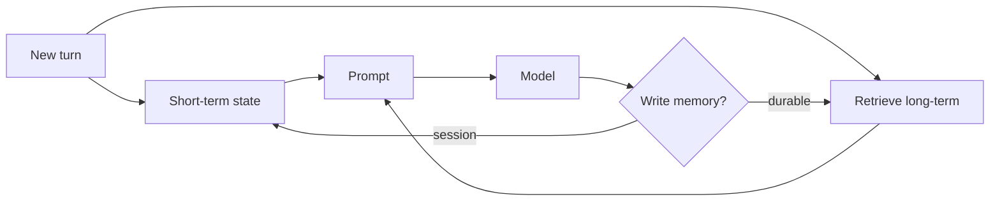

**What is this for?** To explain how agents remember the current conversation vs facts that should persist across sessions.

**Why does it exist?** LLMs are stateless by default. Without memory, the agent forgets what happened as soon as the next API call begins. The design mistake is treating "memory" as infinite chat history.

## Intuition

| Memory type | Plain-English idea | Lifetime | Like... |
| --- | --- | --- | --- |
| **Episodic (short-term)** | Live conversation thread | Current session / task | RAM |
| **Semantic (long-term)** | Lasting facts and solutions | Across sessions | Hard drive / knowledge base |

**Episodic memory** is the sticky note on your monitor: current question, open plan, last tool result.

**Semantic memory** is the filing cabinet: preferred report format, project codenames, lessons from past incidents.

Dumping the cabinet into every prompt is expensive and noisy. Never writing to it makes every session amnesiac.

:::key
More context is not always better context. Too much historical memory can hide the important facts in a haystack of irrelevant history.
:::



## How it works

### Episodic memory (short-term / working)

Holds what the loop needs right now:

- Conversation turns (often summarized as they age).
- Active plan and step index.
- Recent tool results (truncated).
- Scratch variables ("selected_order_id").

Stored in the **thread state**—in-process dict, Redis with session TTL, or the model context window itself. Always assume the window is smaller than your ambition—summarize and drop.

### Semantic memory (long-term)

Holds durable facts and preferences:

- User or org settings.
- Prior decisions ("always cite policy IDs").
- Learned solutions from solved incidents.
- Sometimes embeddings of past docs for retrieval (RAG-as-memory).

Stored in a **vector database (vector DB)** or knowledge base (KB). Prefer structured fields over free-text blobs when you can query them reliably.

### Memory tools (example pattern)

Before planning, search semantic memory:

```
'Have we seen this error before?'
```

After solving, optionally save:

```
Save_To_Knowledge_Base(fact: str)
```

### Write policies

- **Salience:** store preferences and durable constraints; do not store every joke.
- **Consent & PII (personally identifiable information):** long-term personal data needs retention rules and deletion paths.
- **Expiration:** decay or re-confirm stale facts ("still on the Acme project?").
- **Conflict:** new explicit user instruction overrides old memory.
- **Scope:** team memory vs user memory vs run memory—do not mix casually.

### Two cautionary notes

1. **Contradictory memory** can make the agent trust stale facts as if they are still current. Use timestamps and memory updates.
2. **Too much memory** can dilute attention. Good retrieval is **selective** retrieval—not "return everything."

### Read policies

Retrieve top-k relevant memories, not the whole store. Inject them in a labeled section ("MEMORY, may be outdated") so the model does not treat them as system law. For safety-critical settings (refund limits), prefer application config over model-readable memory.

## In code

Two stores with TTL-style expiration for long-term notes.

```python
from dataclasses import dataclass, field
import time

@dataclass
class MemoryItem:
    key: str
    value: str
    created: float
    ttl_sec: float | None = None

    def alive(self, now: float) -> bool:
        return self.ttl_sec is None or now - self.created < self.ttl_sec

@dataclass
class AgentMemory:
    short: dict = field(default_factory=dict)       # episodic
    long: dict[str, MemoryItem] = field(default_factory=dict)  # semantic

    def set_short(self, key: str, value):
        self.short[key] = value

    def set_long(self, key: str, value: str, ttl_sec: float = 60 * 60 * 24 * 30):
        self.long[key] = MemoryItem(key, value, time.time(), ttl_sec)

    def get_long(self, key: str) -> str | None:
        item = self.long.get(key)
        if not item or not item.alive(time.time()):
            self.long.pop(key, None)
            return None
        return item.value

    def prompt_block(self) -> str:
        prefs = {k: self.get_long(k) for k in list(self.long)}
        prefs = {k: v for k, v in prefs.items() if v}
        return f"EPISODIC={self.short}\nSEMANTIC={prefs}"

mem = AgentMemory()
mem.set_short("step", "summarize")
mem.set_long("report_style", "three bullets")
print(mem.prompt_block())
```

## What goes wrong

- **Transcript-as-memory.** Token bills explode; early constraints fall out of the window.
- **Stale prefs.** Old project context overrides today's request.
- **Secret retention.** API keys or raw PII land in long-term stores and logs.
- **Unscoped recall.** User A's memory retrieved into User B's session.
- **Write spam.** Model "remembers" every turn; store fills with noise.
- **Memory contradictions.** Outdated facts treated as current policy.

## Putting it into practice

Set retention defaults before launch: session TTL (hours), preference TTL (days/months), and a user-visible "what we remember" page for consumer products.

Add a red-team case that tries to plant a malicious long-term memory and assert your write filter rejects it.

For RAG-as-memory, separate "documents we indexed" from "preferences we trust." Different trust tiers belong in different prompt sections.

## Summarization discipline

When short-term history grows past a token budget, summarize decisions and open questions—not witty banter. A good rolling summary answers: goal, constraints, artifacts produced, pending steps, and unresolved asks.

## Tenant isolation checklist

For every memory read/write path, assert `tenant_id` (and `user_id` when needed) is in the query predicate. Add an integration test that writes memory as tenant A and proves tenant B cannot retrieve it.

## One-line summary

Keep episodic memory tight for the active task and semantic memory curated and expiring—retrieve selectively, protect PII, and let fresh user instructions win conflicts.

## Key terms

- **Episodic memory:** short-term thread memory for the current interaction.
- **Semantic memory:** long-term stored facts and lessons across sessions.
- **Short-term / working memory:** state for the current session or task.
- **Long-term memory:** durable facts and preferences across sessions.
- **TTL (time to live) / expiration:** automatic decay of aged entries.
- **Summarization:** compressing old turns to fit the context window.
- **State bloat:** when message history gets too large and slows the system.
