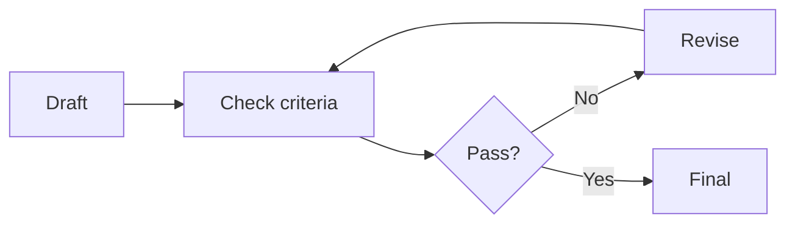

A **reflection loop** has the agent critique its own draft against explicit criteria and revise before the user sees a final answer. Done well, it catches format breaks and shallow errors. Done poorly, it burns tokens arguing with itself.

## Intuition

Humans rarely ship the first draft of a critical email. Agents can do the same: produce -> check -> revise. The check should be a rubric or program, not a vague “make it better.” Without a stop rule, reflection becomes infinite polish.



## How it works

### What to check

- **Factual consistency** with tool results or retrieved docs.
- **Format compliance** (JSON schema, required sections).
- **Policy / safety** constraints and refusal rules.
- **Coverage** of the user’s constraints (dates, audience, language).
- **Tool plan sanity** (no missing dependency, no forbidden tool).

Prefer programmatic checkers when possible. Use an LLM judge for semantic properties, and calibrate it.

### Loop designs

| Design | Mechanism | Notes |
| --- | --- | --- |
| Self-reflect | Same model critiques itself | Cheap; can share blind spots |
| Dual model | Stronger / other model judges | Better diversity; more cost |
| Rules first | Schema & regex before LLM | Fast fail on structure |
| Test-driven | Run unit tests / tools | Best for code agents |

### Budgets

Cap revisions (e.g. 2). Cap extra tokens. Cap wall-clock. If still failing, escalate to a human or return a partial with an explicit uncertainty note — do not silently loop.

### When reflection helps most

- Structured outputs that must parse.
- Grounded answers that must cite.
- Code that must pass tests.
- Tone-sensitive external messages.

Skip heavy reflection for low-stakes chitchat; the latency is pure tax.

### Trade-off

More reflection can raise quality and reduce embarrassing mistakes, but increases latency and cost. Measure lift on a golden set: if pass rate does not move, delete the loop.

## In code

Rule checks plus a single revision pass.

```python
from dataclasses import dataclass

@dataclass
class Critique:
    ok: bool
    issues: list[str]

def draft_answer(question: str) -> str:
    return "Refunds usually work. Contact support sometime."

def check(answer: str) -> Critique:
    issues = []
    if "30 days" not in answer:
        issues.append("missing refund window")
    if "http://" in answer or "https://" in answer:
        issues.append("unexpected link")
    if len(answer) < 40:
        issues.append("too thin")
    return Critique(ok=not issues, issues=issues)

def revise(answer: str, issues: list[str]) -> str:
    # stand-in for a second model call conditioned on issues
    fix = " You can request a refund within 30 days of purchase."
    return answer + fix if "missing refund window" in issues else answer

def reflect_loop(question: str, max_rounds: int = 2) -> str:
    answer = draft_answer(question)
    for _ in range(max_rounds):
        c = check(answer)
        if c.ok:
            return answer
        answer = revise(answer, c.issues)
    c = check(answer)
    if not c.ok:
        return answer + f"\n[needs_human: {', '.join(c.issues)}]"
    return answer

print(reflect_loop("How long do I have to request a refund?"))
```

## What goes wrong

- **Vibes rubric.** “Be better” yields random rewrites.
- **Unbounded loops.** Cost spikes; users wait.
- **Shared delusion.** Self-reflection misses systematic model biases.
- **Over-refusal after critique.** Safety pass becomes unhelpful paranoia.
- **Ignoring failing checks.** Logging issues but shipping the first draft anyway.
- **Reflecting on wrong artifacts.** Polishing prose while the tool data is wrong.

## Putting it into practice

Add reflection only behind a feature flag and measure delta on the golden set for one week. Track extra tokens per successful answer; if cost rises 40% for a 1% pass-rate lift, the loop is vanity. Prefer a cheap rule pass before any LLM critique — schema failures should never consume a judge call.

For code agents, make tests the reflector: draft patch -> run tests -> feed failures back -> revise, with a hard cap of two attempts before human handoff. That pattern outperforms essay-style self-critique on most engineering tasks because the checker is objective.

## Critique prompts that work

A usable critique prompt lists pass/fail bullets and demands JSON like `{ "pass": false, "issues": ["..."] }`. Ban vague advice (“improve clarity”) unless paired with a concrete defect. Feed only the draft plus evidence (tool JSON, citations), not the entire chat history, so the judge cannot be distracted by earlier role-play. Pin the judge model version in CI the same way you pin the actor model.

## Stop conditions beyond round caps

End reflection early on success, on repeated identical issues (the reviser is stuck), or when the judge confidence is low and the task is high risk — escalate instead of polishing. Stuck loops often oscillate between two phrasings; detect duplicate issue sets and bail. Record the reason the loop stopped so you can tune budgets with data, not folklore.

## One-line summary

Add bounded draft–check–revise loops with concrete criteria (and programmatic checks first) so quality rises without open-ended self-debate.

## Key terms

- **Reflection loop:** iterative self-critique and revision before final output.
- **Rubric:** explicit scoring or pass/fail criteria.
- **LLM-as-judge:** model that scores another model’s draft.
- **Revision budget:** max rounds / tokens / time for correction.
- **Escalation:** handoff when checks still fail after the budget.
- **Test-driven agent:** uses executable tests as the checker.
