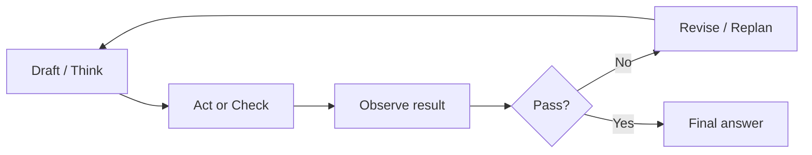

**What is this for?** To explain **reflection loops** and the **ReAct** pattern—how agents think, act, observe, and correct themselves before finishing.

**Why does it exist?** Pure reasoning can drift into wrong assumptions if an early guess is wrong. ReAct adds an **observation** step so the model can verify itself against reality—not imagination.

## Intuition

**ReAct** (Reason + Act) in plain English: **think, take one action, read the result, then think again.**

```
t1 = 'I should check auth-service logs.'
a1 = fetch_server_logs(service='auth-service', timeframe='1h')
o1 = 'ConnectionTimeout: Cannot reach db-primary'
t2 = 'Now I should check db-primary status.'
```

Closed-book reasoning can drift after one wrong assumption. ReAct grounds thought in **tool observations**, so the model can correct itself using reality.

A **reflection loop** is the same idea applied to quality: produce → check → revise before the user sees the final answer.

| Pattern | Plain-English idea |
| --- | --- |
| **ReAct** | Alternate reasoning and action with observations |
| **Reflection** | Draft → check criteria → revise (bounded) |
| **Hierarchical ReAct** | Triage agent plans; specialists act and report back |

:::key
Without a stop rule, reflection becomes infinite polish—and ReAct becomes infinite tool calls. Always cap rounds, tokens, and time.
:::



## How it works

### What to check

- **Factual consistency** with tool results or retrieved docs.
- **Format compliance** (JSON schema, required sections).
- **Policy / safety** constraints and refusal rules.
- **Coverage** of the user's constraints (dates, audience, language).
- **Tool plan sanity** (no missing dependency, no forbidden tool).

Prefer programmatic checkers when possible. Use an LLM-as-judge for semantic properties, and calibrate it.

### Loop designs

| Design | Mechanism | Notes |
| --- | --- | --- |
| Self-reflect | Same model critiques itself | Cheap; can share blind spots |
| Dual model | Stronger / other model judges | Better diversity; more cost |
| Rules first | Schema & regex before LLM | Fast fail on structure |
| Test-driven | Run unit tests / tools | Best for code agents |
| ReAct | Think → act → observe → repeat | Best for multi-step evidence gathering |

### Budgets

Cap revisions (e.g., 2). Cap extra tokens. Cap wall-clock. If still failing, escalate to a human or return a partial with an explicit uncertainty note—do not silently loop.

### When reflection helps most

- Structured outputs that must parse.
- Grounded answers that must cite sources.
- Code that must pass tests.
- Tone-sensitive external messages.

Skip heavy reflection for low-stakes chitchat; the latency is pure tax.

### Hierarchical ReAct at enterprise scale

The **triage agent** becomes a meta-planner. Specialist agents (infrastructure, codebase, policy) become its tools. The triage agent reasons at the strategy level and delegates the details—it does not call every API itself.

## In code

Rule checks plus a single revision pass.

```python
from dataclasses import dataclass

@dataclass
class Critique:
    ok: bool
    issues: list[str]

def draft_answer(question: str) -> str:
    return "Refunds usually work. Contact support sometime."

def check(answer: str) -> Critique:
    issues = []
    if "30 days" not in answer:
        issues.append("missing refund window")
    if len(answer) < 40:
        issues.append("too thin")
    return Critique(ok=not issues, issues=issues)

def revise(answer: str, issues: list[str]) -> str:
    fix = " You can request a refund within 30 days of purchase."
    return answer + fix if "missing refund window" in issues else answer

def reflect_loop(question: str, max_rounds: int = 2) -> str:
    answer = draft_answer(question)
    for _ in range(max_rounds):
        c = check(answer)
        if c.ok:
            return answer
        answer = revise(answer, c.issues)
    c = check(answer)
    if not c.ok:
        return answer + f"\n[needs_human: {', '.join(c.issues)}]"
    return answer

print(reflect_loop("How long do I have to request a refund?"))
```

## What goes wrong

- **Vibes rubric.** "Be better" yields random rewrites.
- **Unbounded loops.** Cost spikes; users wait.
- **Shared delusion.** Self-reflection misses systematic model biases.
- **Reasoning without observation.** ReAct skipped; model guesses instead of checking logs.
- **Ignoring failing checks.** Logging issues but shipping the first draft anyway.
- **Reflecting on wrong artifacts.** Polishing prose while the tool data is wrong.

## Putting it into practice

Add reflection only behind a feature flag and measure delta on the golden set for one week. Prefer a cheap rule pass before any LLM critique—schema failures should never consume a judge call.

For code agents, make tests the reflector: draft patch → run tests → feed failures back → revise, with a hard cap of two attempts before human handoff.

## Critique prompts that work

A usable critique prompt lists pass/fail bullets and demands JSON like `{ "pass": false, "issues": ["..."] }`. Feed only the draft plus evidence (tool JSON, citations), not the entire chat history.

## Stop conditions beyond round caps

End reflection early on success, on repeated identical issues (the reviser is stuck), or when the judge confidence is low and the task is high risk—escalate instead of polishing.

## One-line summary

Use ReAct to ground reasoning in tool observations, and add bounded draft–check–revise loops with concrete criteria so quality rises without open-ended self-debate.

## Key terms

- **ReAct (Reason + Act):** loop that alternates reasoning and action with observations.
- **Observation:** result returned by a tool after an action.
- **Reflection loop:** iterative self-critique and revision before final output.
- **Hierarchical ReAct:** triage agent delegates to specialist agents.
- **LLM-as-judge:** model that scores another model's draft.
- **Revision budget:** max rounds, tokens, or time for correction.
- **Test-driven agent:** uses executable tests as the checker.
