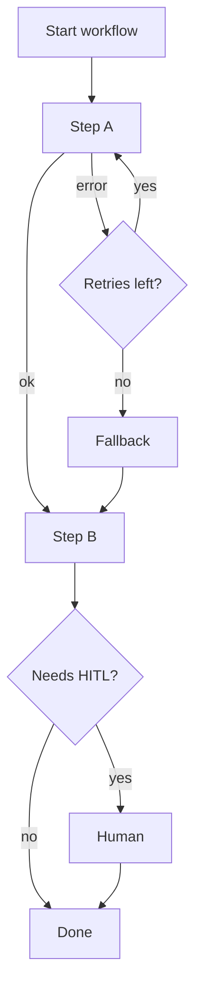

**What is this for?** To explain **orchestration**—the control layer that coordinates agents, tools, loops, and human approval.

**Why does it exist?** Complex workflows need loops, branches, checkpoints, and safe stopping points. Without orchestration, you have a clever model in a room with no fire exits.

## Intuition

Think of an airport ground crew, not a free-jazz solo. Flights (steps) have sequence, gates (dependencies), go-arounds (retries), diversions (fallbacks), and weather holds (approvals).

**State machines** put a reliable outer structure around noisy LLM output. The workflow can still be paused, resumed, routed, and checked—even when the model wobbles.

| Plain-English idea | What it means |
| --- | --- |
| **Orchestration** | Control layer that coordinates many agents and steps |
| **State machine** | System that moves between defined states using rules |
| **Node** | One function or agent step in a graph |
| **Edge** | Route that decides what node runs next |
| **Conditional edge** | Route chosen by inspecting current state (like a router) |

:::key
LLMs are noisy. A state machine forces a fixed pathway over a non-deterministic model—which makes workflows easier to control, pause, and audit.
:::



## How it works

### Core controls

- **Sequencing & dependencies:** step B waits for artifact A.
- **Retry policy:** how many times, with exponential backoff, on which errors.
- **Timeouts:** per step and per whole run.
- **Circuit breaking:** stop calling a sick dependency; fail fast.
- **Fallback:** backup model, backup index, degraded answer.
- **Human approval checkpoints (HITL):** pause before risky transitions.
- **Recursion limit:** hard cap that stops infinite agent loops.
- **Summarize node:** compress old messages when state bloats.
- **Idempotency:** retries must not double-charge or double-email.
- **Budgets:** max steps, tokens, and dollars.

### Provenance tracking

In multi-agent systems, track **provenance**—which specialist agent produced which observation. That makes auditing and debugging much easier: you can trace a claim back to the exact tool call or agent that produced it.

### Example failure path

Primary search API fails twice → wait with backoff → failover to backup index → continue summarization → if backup also fails, return "degraded: cached summary" instead of hanging.

### Orchestration styles

| Style | Plain-English idea | Pros | Cons |
| --- | --- | --- | --- |
| Fixed DAG / state machine | Explicit flowchart | Debuggable, testable | Less flexible |
| LLM chooses next step | Model picks the route | Flexible | Needs hard caps |
| Mixed | Playbook + LLM fillers | Best default for many teams | More design up front |

Prefer fixed skeletons for money and compliance paths; allow freer planning only inside sandboxes.

### LangGraph-style graph (ASCII sketch)

```
graph = StateGraph(AgentState)
graph.add_node('triage_agent', triage_node)
graph.add_node('infra_agent', infra_node)
graph.add_conditional_edges('triage_agent', router_function)
graph.add_edge('infra_agent', 'triage_agent')
app = graph.compile()   # turns definition into a runnable, checkpointable app
```

The **`compile()`** step turns the declarative graph into a runnable application with persistence, streaming, and state management.

## In code

A minimal orchestrator with retries, timeout budget, and fallback.

```python
import time
from dataclasses import dataclass

@dataclass
class StepResult:
    ok: bool
    value: str
    error: str | None = None

def flaky_search(attempt: int) -> StepResult:
    if attempt < 2:
        return StepResult(False, "", "503")
    return StepResult(True, "docs://primary")

def backup_search() -> StepResult:
    return StepResult(True, "docs://backup")

def with_retries(fn, retries=2, backoff=0.01) -> StepResult:
    last = StepResult(False, "", "not_started")
    for i in range(retries + 1):
        last = fn(i)
        if last.ok:
            return last
        time.sleep(backoff * (2 ** i))
    return last

def run_workflow(deadline: float, max_steps: int = 20) -> str:
    steps = 0
    if time.time() > deadline:
        return "aborted:timeout"
    search = with_retries(flaky_search)
    steps += 1
    if steps > max_steps:
        return "aborted:recursion_limit"
    if not search.ok:
        search = backup_search()
    if not search.ok:
        return "degraded:no_index"
    return f"ok:{search.value}"

print(run_workflow(deadline=time.time() + 5))
```

Real systems use durable workflows (queues, step functions) so a process crash mid-run can resume safely—**checkpointing** saves state so a graph can pause and resume later.

## What goes wrong

- **Happy-path only.** No retries or timeouts; first 503 kills the UX.
- **Retrying non-idempotent writes.** Duplicate side effects.
- **Unbounded agent loops.** "Just one more tool call" forever.
- **State bloat.** Message history grows until latency and cost explode.
- **Silent fallbacks.** Users think they got fresh primary data.
- **Missing provenance.** Cannot tell which agent or tool produced a bad claim.

## Putting it into practice

Write an error budget for the workflow: max retries, max fallback rate, max HITL rate, max dollars per run. Alert when any budget burns faster than expected.

Chaos-test one dependency a week in staging (force 503s) and confirm users see a controlled degraded answer, not a hang.

Prefer durable state machines for anything that touches money or accounts. Export a timeline view: step, attempt, latency, outcome—the same view on-call will need during an incident.

## Observability hooks

Emit one structured event per state transition: `{run_id, step, attempt, outcome, latency_ms, cost_usd}`. Orchestration without observability is superstition.

## Compensating actions

When a mid-pipeline write succeeds and a later step fails, you may need a compensating action (cancel reservation, delete draft ticket) rather than a naive retry from zero.

## One-line summary

Orchestrate agent workflows with explicit sequences, state machines, budgets, retries, fallbacks, and approval hooks so failures become controlled degradations instead of runaway chaos.

## Key terms

- **Orchestration:** control of order, failure handling, and stop conditions.
- **State machine:** system that moves between defined states using rules.
- **Node:** one function or agent step in a graph.
- **Conditional edge:** route chosen by inspecting current state.
- **Checkpointing:** saving state so a graph can pause and resume later.
- **Recursion limit:** hard cap that stops infinite loops.
- **Provenance:** origin of a claim or observation (which agent/tool produced it).
- **Degraded mode:** reduced functionality that still returns a safe result.
