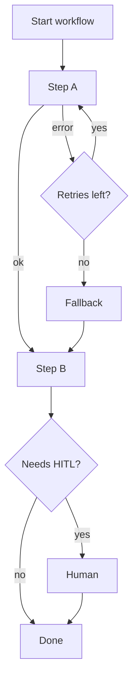

**Orchestration** is the control plane for agent work: what runs in what order, what happens on failure, when to stop, and when a human must intervene. Without it, you have a clever model in a room with no fire exits.

## Intuition

Think of an airport ground crew, not a free-jazz solo. Flights (steps) have sequence, gates (dependencies), go-arounds (retries), diversions (fallbacks), and weather holds (approvals). Production agents need the same discipline — especially when tools flake and models waffle.

## How it works

### Core controls

- **Sequencing & dependencies:** step B waits for artifact A.
- **Retry policy:** how many times, with exponential backoff, on which errors.
- **Timeouts:** per step and per whole run.
- **Circuit breaking:** stop calling a sick dependency; fail fast.
- **Fallback:** backup model, backup index, degraded answer.
- **Human approval checkpoints:** HITL on risky transitions.
- **Idempotency:** retries must not double-charge or double-email.
- **Budgets:** max steps, tokens, and dollars.

### Example

Primary search API fails twice -> wait with backoff -> failover to backup index -> continue summarization -> if backup also fails, return “degraded: cached summary” instead of hanging.



### Why it matters in production

- Predictable behavior under partial outages.
- Prevents infinite tool loops and runaway spend.
- Improves observability: every transition is a named state.
- Supports governance: approvals and audit hooks have a place to live.

### Orchestration styles

| Style | Pros | Cons |
| --- | --- | --- |
| Fixed DAG / state machine | Debuggable, testable | Less flexible |
| LLM chooses next step | Flexible | Needs hard caps & validators |
| Mixed | Playbook + LLM fillers | Best default for many teams |

Prefer fixed skeletons for money and compliance paths; allow freer planning only inside sandboxes.

## In code

A minimal orchestrator with retries, timeout budget, and fallback.

```python
import time
from dataclasses import dataclass

@dataclass
class StepResult:
    ok: bool
    value: str
    error: str | None = None

def flaky_search(attempt: int) -> StepResult:
    if attempt < 2:
        return StepResult(False, "", "503")
    return StepResult(True, "docs://primary")

def backup_search() -> StepResult:
    return StepResult(True, "docs://backup")

def with_retries(fn, retries=2, backoff=0.01) -> StepResult:
    last = StepResult(False, "", "not_started")
    for i in range(retries + 1):
        last = fn(i)
        if last.ok:
            return last
        time.sleep(backoff * (2 ** i))
    return last

def run_workflow(deadline: float) -> str:
    if time.time() > deadline:
        return "aborted:timeout"
    search = with_retries(flaky_search)
    if not search.ok:
        search = backup_search()
    if not search.ok:
        return "degraded:no_index"
    # summarize would go here
    return f"ok:{search.value}"

print(run_workflow(deadline=time.time() + 5))
```

Real systems use durable workflows (queues, step functions) so a process crash mid-run can resume safely.

## What goes wrong

- **Happy-path only.** No retries/timeouts; first 503 kills the UX.
- **Retrying non-idempotent writes.** Duplicate side effects.
- **Unbounded agent loops.** “Just one more tool call” forever.
- **Silent fallbacks.** Users think they got fresh primary data.
- **God orchestrator.** One prompt secretly encodes all control flow — untestable.
- **Missing metrics.** No counts of retries, fallbacks, HITL rate, or aborted runs.

## Putting it into practice

Write an error budget for the workflow: max retries, max fallback rate, max HITL rate, max dollars per run. Alert when any budget burns faster than expected. Chaos-test one dependency a week in staging (force 503s) and confirm users see a controlled degraded answer, not a hang.

Prefer durable state machines for anything that touches money or accounts. In-memory loops die with the process and leave half-applied side effects. Export a timeline view in your admin tool: step, attempt, latency, outcome — the same view on-call will need during an incident.

## Observability hooks

Emit one structured event per state transition: `{run_id, step, attempt, outcome, latency_ms, cost_usd}`. From those events you can build retry heatmaps and find steps that always fall back. Orchestration without observability is superstition — you will tweak prompts for outages that were really timeout misconfigs. Give on-call a single run-id search that reconstructs the whole path.

## Compensating actions

When a mid-pipeline write succeeds and a later step fails, you may need a compensating action (cancel reservation, delete draft ticket) rather than a naive retry from zero. Encode compensations next to the step definition. Orchestration that only knows “retry” will leave orphaned side effects that support teams clean up by hand — expensive and error-prone.

## SLOs for agent runs

Pick service-level objectives the way you would for an API: success rate, p95 run duration, fallback rate, and dollars per successful run. Page on burn rate, not on single failures. Orchestration tuning then becomes ordinary reliability work — increase timeout here, cut a redundant step there — instead of prompt folklore. Publish the SLOs next to the workflow diagram so product and on-call share one definition of “healthy.”

## One-line summary

Orchestrate agent workflows with explicit sequences, budgets, retries, fallbacks, and approval hooks so failures become controlled degradations instead of runaway chaos.

## Key terms

- **Orchestration:** control of order, failure handling, and stop conditions.
- **Backoff:** increasing delay between retries.
- **Circuit breaker:** temporary halt of calls to a failing dependency.
- **Fallback:** alternate path when the primary fails.
- **Durable workflow:** execution state persisted across crashes.
- **Degraded mode:** reduced functionality that still returns a safe result.
