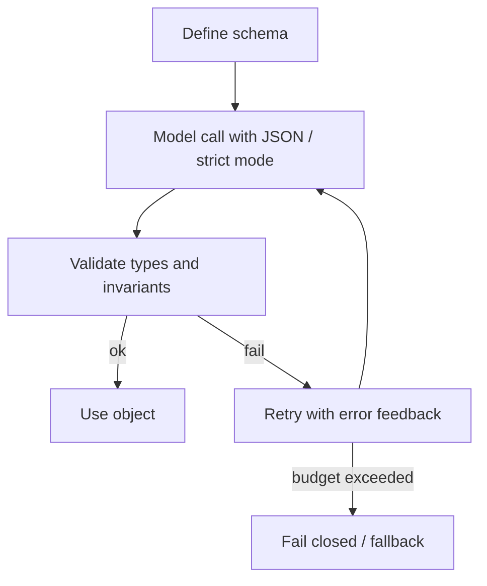

Free-form prose is for humans. Downstream code wants **objects**: enums, IDs, date ranges, confidence scores. Structured outputs turn the model from a storyteller into a component you can wire into queues, UI forms, and agents — but only if you validate every response like it came from an untrusted client.

## Intuition

Ask for “JSON” in a prompt and you will get JSON... until you do not. Trailing commas, markdown fences, renamed keys, and partially truncated objects appear under load. Reliability is a stack:

1. Tell the model the schema.
2. Prefer API features that constrain decoding to valid JSON / schema when available.
3. Validate in your process with a typed model.
4. Repair or fail closed — never “best-effort parse” into a money path.

:::key
Schema in the prompt is documentation. Schema in the validator is enforcement. You need both.
:::

## How it works

### The reliability stack



### Model-side options

- **Prompt-only JSON** — cheapest to try; weakest guarantee.
- **JSON mode / response_format** — forces JSON syntax; may not enforce your fields.
- **Strict structured outputs / grammar constraints** — when offered, binds generation to a schema — strongest.

Always assume vendor features differ. Your app-side validator is the portable guarantee.

### App-side validation

Libraries in the Pydantic family (or dataclasses + hand checks) give you:

- Required fields and types
- Enums and ranges
- Nested objects and lists
- Clear error messages you can feed back on retry

Example conceptual schema:

```
SearchQuery
  rewritten_query: string
  published_daterange: { start: date, end: date }
  domains_allow_list: list[string]
```

### Retry with feedback

On validation failure, do not only “try again colder.” Send the error:

`Your previous output failed validation: published_daterange.end is before start. Reply with corrected JSON only.`

Cap retries (e.g. 2). Log failure rates per prompt version — a spike means schema or model drift.

### Partial success and fallbacks

For UX, you may accept a partial object with defaults for optional fields. For actions (refunds, deletes, emails), fail closed: no valid object -> no side effect.

### Designing schemas models can hit

Schemas fail in production when they are written for lawyers instead of generators:

- Prefer flat or shallow nesting; deep trees invite missing braces under token limits.
- Use enums for closed sets (`"Positive" | "Neutral" | "Negative"`) instead of free strings.
- Make rarely needed fields optional; required fields should be ones you always have evidence for.
- Avoid dual meanings (“status” as both HTTP code and business state).
- Include a first-class abstain path: `status: "ok" | "unknown"` beats forcing a fake value.

When the model must emit dates, demand ISO-8601 in the schema description and reject everything else in the validator. When it must emit IDs, prefer copying from provided context over inventing new ones — and check membership against your database.

### Where structured output sits in an agent

Agents often chain: plan JSON -> tool calls -> final answer JSON. Validate **each** stage. A pretty final paragraph that skipped a failed plan object is how silent wrong workflows ship. Persist the validated objects, not only the chat text, so support can replay what the system believed.

## In code

Stdlib validation without external deps:

```python
from dataclasses import dataclass
from datetime import date
import json


@dataclass
class DateRange:
    start: date
    end: date

    def __post_init__(self):
        if self.end < self.start:
            raise ValueError("end before start")


@dataclass
class SearchQuery:
    rewritten_query: str
    published_daterange: DateRange
    domains_allow_list: list[str]


def parse_search_query(raw: str) -> SearchQuery:
    data = json.loads(raw)
    dr = data["published_daterange"]
    return SearchQuery(
        rewritten_query=str(data["rewritten_query"]).strip(),
        published_daterange=DateRange(
            start=date.fromisoformat(dr["start"]),
            end=date.fromisoformat(dr["end"]),
        ),
        domains_allow_list=[str(d) for d in data.get("domains_allow_list", [])],
    )


good = '''
{"rewritten_query": "llm evaluation",
 "published_daterange": {"start": "2024-01-01", "end": "2024-12-31"},
 "domains_allow_list": ["arxiv.org"]}
'''
print(parse_search_query(good))
```

Strip accidental markdown fences before parse:

```python
def strip_fences(text: str) -> str:
    t = text.strip()
    if t.startswith("```"):
        lines = t.splitlines()
        # drop first and last fence lines
        if lines and lines[0].startswith("```"):
            lines = lines[1:]
        if lines and lines[-1].startswith("```"):
            lines = lines[:-1]
        t = "\n".join(lines).strip()
        if t.lower().startswith("json"):
            t = t[4:].lstrip()
    return t
```

Retry loop sketch:

```python
def complete_structured(call_model, schema_errors_max=2):
    feedback = None
    for _ in range(schema_errors_max + 1):
        raw = call_model(feedback)
        try:
            return parse_search_query(strip_fences(raw))
        except (json.JSONDecodeError, KeyError, ValueError) as e:
            feedback = f"Validation error: {e}. Return corrected JSON only."
    raise RuntimeError("structured_output_failed")
```

Illustrative API flag (vendor-specific):

```python
payload = {
    "model": "chat-mid",
    "messages": [...],
    "response_format": {"type": "json_object"},  # syntax, not full schema
    "temperature": 0.1,
}
```

## What goes wrong

- **Parsing with regex hope** — works in demos; breaks on nested quotes.
- **Trusting JSON mode alone** — missing keys still pass a `json.loads`.
- **Silent defaults** — wrong type coerced to empty string; bug ships.
- **Retry storms** — no budget; one bad schema burns the rate limit.
- **Schema too clever** — deep nesting and optional everything; model flails; simplify.
- **Valid JSON, invalid business rule** — types pass but `user_id` belongs to another tenant — validators must include authz invariants.

:::tip
Version your schemas (`SearchQueryV2`) and keep golden fixtures in CI. Prompt edits that break fixtures should fail the build before they fail production.
:::

## One-line summary

Structured GenAI outputs need a schema, constrained generation when available, strict validation, and bounded repair — never trust free text as a typed API.

## Key terms

- **Structured output** — Model response constrained to a machine-readable shape (often JSON).
- **JSON mode** — API setting that requests/requires JSON syntax.
- **Schema** — Formal field/type contract for an object.
- **Validation** — Checking a payload against types and business rules.
- **Repair / retry loop** — Re-prompting with validator errors to fix output.
- **Fail closed** — Refuse the action when validation fails.
- **Grammar / constrained decoding** — Generation restricted to strings that match a schema or grammar.
