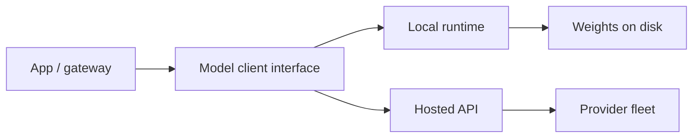

Serving is how a trained (or frozen) model becomes a **callable dependency**. For product work you will bounce between **local** runtimes (laptop GPU, on-prem box, self-hosted container) and **hosted** APIs (vendor endpoints). The model weights may be identical; the operational contract is not. This lesson is about choosing and wiring that contract without painting yourself into a corner.

## Intuition

Local serving means you own the process that loads weights and runs forward passes. Hosted serving means you own an HTTP client and a bill. Local wins on data gravity, air-gapped demos, and per-token cost at steady high volume — if you can staff GPUs and paging. Hosted wins on time-to-first-feature, elastic bursts, and not learning CUDA at 2 a.m.

Design your application against a **narrow interface**: messages in, text (or tokens, or JSON) out, with timeouts, retries, and model ids. Swap local <-> hosted behind that interface. Do not sprinkle vendor SDKs through business logic.

:::key
Pin a model id and a serving mode in config. “Whatever the playground default is today” is not a deployment strategy.
:::

## How it works

### Local stack (conceptual)

1. **Runtime** loads weights (llama.cpp, vLLM, Ollama, Transformers+accelerate, etc.).
2. **Scheduler** batches concurrent requests when the runtime supports continuous batching.
3. **API shim** exposes OpenAI-compatible or custom HTTP/gRPC so apps stay portable.
4. **Resources** — VRAM caps context length and concurrency; quantization (GGUF Q4, AWQ, etc.) trades quality for fit.

Local checklist: max context, tokens/sec at your concurrency, cold-start time, and how you ship weight updates.

### Hosted stack (conceptual)

1. Client sends authenticated requests with `model`, messages, decoding params.
2. Provider handles autoscaling, multi-tenant isolation, and often safety filters.
3. You receive usage meters (input/output tokens), rate limits, and regional endpoints.

Hosted checklist: data retention / training-use policy, SLA, rate-limit headroom, structured-output support, and whether embeddings live on the same bill.

### Decision drivers

| Factor | Lean local | Lean hosted |
|--------|------------|-------------|
| Sensitive prompts/docs | Air-gapped / VPC self-host | Enterprise private endpoints |
| Spiky traffic | Painful capacity planning | Elastic |
| Latency to first token | Good on warm local GPU | Network + queue variance |
| Experimentation speed | Weight management overhead | Switch model string |
| Unit economics at huge steady QPS | Often cheaper | Watch margins |

Hybrid is common: hosted for peak and large models; local small models for classification, routing, and rewrite.

### Reliability patterns (both)

- Timeouts shorter than user patience; retry only on idempotent GETs / safe completions with jitter.
- Circuit breaker when error rate spikes; degrade to cached FAQ or “try again.”
- Load tests with realistic prompt lengths — tiny “Hello” benches lie.
- Log model id, latency, token counts; never log secrets or full PII prompts in cleartext.



## In code

One client protocol, two backends — local OpenAI-compatible server vs hosted. Swap with an env flag.

```python
import os
import json
import urllib.request

def chat_completion(base_url: str, api_key: str | None, model: str, messages: list[dict],
                    temperature: float = 0.2, timeout_s: float = 30.0) -> str:
    url = base_url.rstrip("/") + "/v1/chat/completions"
    body = {
        "model": model,
        "messages": messages,
        "temperature": temperature,
    }
    data = json.dumps(body).encode("utf-8")
    headers = {"Content-Type": "application/json"}
    if api_key:
        headers["Authorization"] = f"Bearer {api_key}"
    req = urllib.request.Request(url, data=data, headers=headers, method="POST")
    with urllib.request.urlopen(req, timeout=timeout_s) as resp:
        payload = json.loads(resp.read().decode("utf-8"))
    return payload["choices"][0]["message"]["content"]

def get_backend():
    mode = os.environ.get("LLM_MODE", "hosted")
    if mode == "local":
        return {
            "base_url": os.environ.get("LOCAL_LLM_URL", "http://127.0.0.1:11434"),
            "api_key": None,
            "model": os.environ.get("LOCAL_MODEL", "llama3.1:8b"),
        }
    return {
        "base_url": os.environ["HOSTED_LLM_URL"],
        "api_key": os.environ["HOSTED_API_KEY"],
        "model": os.environ.get("HOSTED_MODEL", "vendor-small-instruct"),
    }

def ask(user_text: str) -> str:
    cfg = get_backend()
    return chat_completion(
        cfg["base_url"],
        cfg["api_key"],
        cfg["model"],
        messages=[
            {"role": "system", "content": "Answer briefly and factually."},
            {"role": "user", "content": user_text},
        ],
    )

# Smoke: python -c "print(ask('Name two HTTP methods.'))"
```

Point `LOCAL_LLM_URL` at Ollama, vLLM, or any OpenAI-compatible shim. Keep prompts and validators identical across modes so eval suites stay comparable.

## What goes wrong

- **SDK lock-in.** Business code imports one vendor deeply; migration becomes a rewrite. Wrap early.
- **Unbounded context locally.** A 128k model flag does not mean your GPU can hold 128k x batch. OOMs look like “random” crashes.
- **Silent model drift on hosted.** Provider updates a dated alias. Pin versions; re-run golden evals on change.
- **No budget for tokens.** Local feels “free” until electricity and GPU lease show up; hosted feels fine until one recursive agent loop.
- **Different safety stacks.** Hosted filters refuse a prompt local accepts (or the reverse). Document behavior per backend.
- **Clock-skewed timeouts.** Gateway timeout 5s, model p95 8s — cascading retries amplify load.

Roll out hosted + pinned id first; mirror prompts on a local 7–8B for privacy paths and offline eval; route classify locally and generate hosted when metrics justify it. Do not assume quantized local equals frontier hosted.

## One-line summary

Serve models behind a pinned, timeout-aware client interface so you can run the same prompts on local weights or hosted APIs as privacy, cost, and latency demand.

## Key terms

- **Model serving:** process of loading weights and answering inference requests.
- **Local runtime:** self-hosted engine (vLLM, llama.cpp, Ollama, ...).
- **Hosted API:** vendor-managed inference endpoint.
- **Continuous batching:** packing many in-flight generations onto a GPU efficiently.
- **Quantization:** lower-precision weights/activations to reduce memory and cost.
- **Pinned model id:** immutable reference so prod does not float to a new checkpoint silently.
