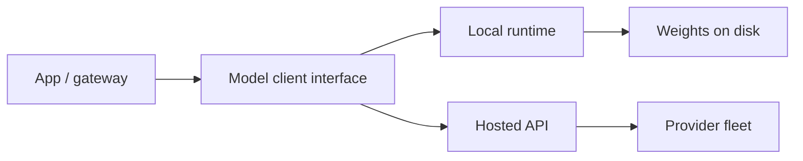

**Model serving** is how a trained model becomes a **callable dependency**. For product work you will bounce between **local** runtimes (laptop GPU, on-prem box, self-hosted container) and **hosted** APIs (vendor endpoints). The model weights may be identical; the operational contract is not.

## Intuition

**What is local serving?** You own the process that loads weights and runs forward passes on your machine.

**What is hosted serving?** You own an HTTP client and a bill; the provider runs the model on their servers.

| Factor | Lean local | Lean hosted |
| --- | --- | --- |
| Sensitive prompts/docs | Air-gapped / private network | Enterprise private endpoints |
| Spiky traffic | Painful capacity planning | Elastic scaling |
| Latency to first token | Good on warm local GPU | Network + queue variance |
| Experimentation speed | Weight management overhead | Switch model string |
| Unit economics at huge steady volume | Often cheaper | Watch margins |

Design your application against a **narrow interface**: messages in, text (or tokens, or JSON) out, with timeouts, retries, and model IDs. Swap local ↔ hosted behind that interface.

:::key
Pin a model ID and a serving mode in config. "Whatever the playground default is today" is not a deployment strategy.
:::

## How it works

### Three practical ways to run open-source models

The lecture covers three deployment paths. The right one depends on privacy, latency, setup effort, and whether you have local hardware.

| Approach | Plain-English idea | Trade-off |
| --- | --- | --- |
| **Transformers locally** | Load model + tokenizer in Python with PyTorch | Needs GPU/MPS for a good experience; maximum control |
| **Hugging Face hosted inference** | Send HTTP requests to provider servers | Network latency and rate limits; fast prototyping |
| **Ollama locally** | Simple local server with minimal setup | Model choice is narrower than the whole HF ecosystem |

### Local Transformers flow

For local inference, the basic flow is always the same: load a tokenizer, load the model, move both to the same device, tokenize the prompt, generate, and decode.

- **`mps`** (Metal Performance Shaders) on Apple Silicon uses the GPU and is much faster than CPU-only.
- **`return_tensors='pt'`** returns PyTorch tensors so the model can process the input directly.
- **`generate()`** performs autoregressive token-by-token generation.

### Hosted stack (conceptual)

1. Client sends authenticated requests with `model`, messages, decoding params.
2. Provider handles autoscaling, multi-tenant isolation, and often safety filters.
3. You receive usage meters (input/output tokens), rate limits, and regional endpoints.

Key mental model: the model is not running on your machine; your code is just making an HTTP call.

### Ollama

Ollama is the quick local route when you want to keep the model on your machine and avoid deep PyTorch setup. The lecture frames it as the simplest private option.

### Reliability patterns (both)

- Timeouts shorter than user patience; retry only on idempotent GETs / safe completions with jitter.
- Circuit breaker when error rate spikes; degrade to cached FAQ or "try again."
- Load tests with realistic prompt lengths — tiny "Hello" benches lie.
- Log model ID, latency, token counts; never log secrets or full PII prompts in cleartext.



## In code

Local Transformers inference:

```python
import torch
from transformers import AutoTokenizer, AutoModelForCausalLM

model_id = "HuggingFaceTB/SmolLM2-360M-Instruct"
tokenizer = AutoTokenizer.from_pretrained(model_id)
model = AutoModelForCausalLM.from_pretrained(model_id)
device = "mps" if torch.backends.mps.is_available() else "cpu"
model = model.to(device)
inputs = tokenizer("What is quantum computing?", return_tensors="pt").to(device)
outputs = model.generate(**inputs, max_new_tokens=100)
print(tokenizer.decode(outputs[0], skip_special_tokens=True))
```

Hugging Face hosted inference:

```python
import requests

API_URL = "https://router.huggingface.co/v1/chat/completions"
headers = {"Authorization": "Bearer YOUR_HF_TOKEN"}
response = requests.post(
    API_URL,
    headers=headers,
    json={
        "messages": [{"role": "user", "content": "What is quantum computing?"}],
        "model": "Qwen/Qwen3-32B:nscale",
    },
)
print(response.json())
```

Ollama local call:

```python
import requests

response = requests.post(
    "http://localhost:11434/api/generate",
    json={
        "model": "llama3",
        "prompt": "What is quantum computing?",
        "stream": False,
    },
)
print(response.json()["response"])
```

One client protocol, two backends — swap with an env flag:

```python
import os
import json
import urllib.request


def chat_completion(base_url: str, api_key: str | None, model: str, messages: list[dict],
                    temperature: float = 0.2, timeout_s: float = 30.0) -> str:
    url = base_url.rstrip("/") + "/v1/chat/completions"
    body = {"model": model, "messages": messages, "temperature": temperature}
    data = json.dumps(body).encode("utf-8")
    headers = {"Content-Type": "application/json"}
    if api_key:
        headers["Authorization"] = f"Bearer {api_key}"
    req = urllib.request.Request(url, data=data, headers=headers, method="POST")
    with urllib.request.urlopen(req, timeout=timeout_s) as resp:
        payload = json.loads(resp.read().decode("utf-8"))
    return payload["choices"][0]["message"]["content"]


def get_backend():
    mode = os.environ.get("LLM_MODE", "hosted")
    if mode == "local":
        return {
            "base_url": os.environ.get("LOCAL_LLM_URL", "http://127.0.0.1:11434"),
            "api_key": None,
            "model": os.environ.get("LOCAL_MODEL", "llama3.1:8b"),
        }
    return {
        "base_url": os.environ["HOSTED_LLM_URL"],
        "api_key": os.environ["HOSTED_API_KEY"],
        "model": os.environ.get("HOSTED_MODEL", "vendor-small-instruct"),
    }
```

Point `LOCAL_LLM_URL` at Ollama, vLLM, or any OpenAI-compatible shim. Keep prompts and validators identical across modes so eval suites stay comparable.

## What goes wrong

- **SDK lock-in** — Business code imports one vendor deeply; migration becomes a rewrite. Wrap early.
- **Unbounded context locally** — A 128k model flag does not mean your GPU can hold 128k × batch. Out-of-memory errors look like "random" crashes.
- **Silent model drift on hosted** — Provider updates a dated alias. Pin versions; re-run golden evals on change.
- **No budget for tokens** — Local feels "free" until electricity and GPU lease show up; hosted feels fine until one recursive agent loop.
- **Different safety stacks** — Hosted filters refuse a prompt local accepts (or the reverse). Document behavior per backend.

Roll out hosted + pinned ID first; mirror prompts on a local 7–8B for privacy paths and offline eval. Do not assume quantized local equals frontier hosted.

## One-line summary

Serve models behind a pinned, timeout-aware client interface so you can run the same prompts on local weights or hosted APIs as privacy, cost, and latency demand.

## Key terms

- **Model serving** — Process of loading weights and answering inference requests.
- **Local runtime** — Self-hosted engine (vLLM, llama.cpp, Ollama, Transformers).
- **Hosted API** — Vendor-managed inference endpoint.
- **Continuous batching** — Packing many in-flight generations onto a GPU efficiently.
- **Quantization** — Lower-precision weights/activations to reduce memory and cost.
- **Pinned model ID** — Immutable reference so production does not float to a new checkpoint silently.
- **MPS (Metal Performance Shaders)** — Apple Silicon GPU acceleration for PyTorch.
