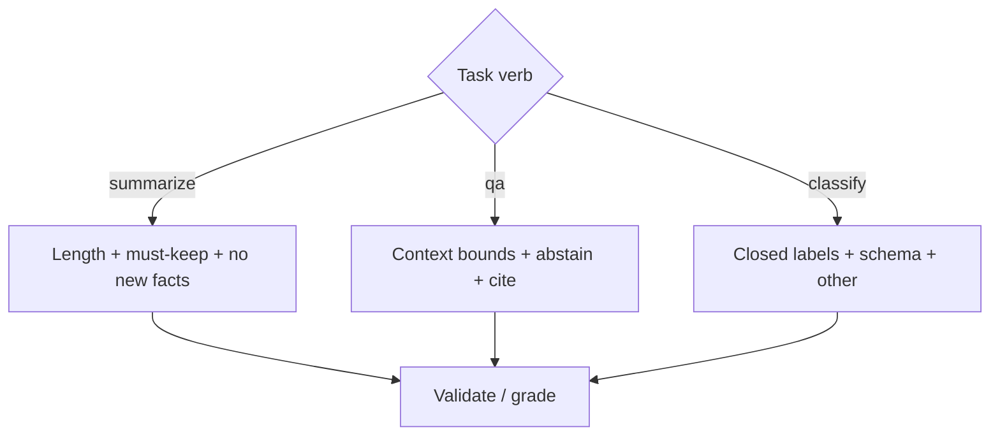

Most business LLM traffic is not open-ended creativity. It is **summarize this**, **answer from that**, or **label as one of these**. **Task prompting** means picking the right shape of instructions, context, and output contract for each job so models stay useful and your validators stay boring.

## Intuition

**Why think in verbs, not vibes?**

| Task | Plain-English idea | Main risk |
| --- | --- | --- |
| **Summarize** | Compress while keeping key facts | Invention and lost nuance |
| **QA (question answering)** | Select and state from evidence | Answering beyond the evidence |
| **Classify** | Choose from a closed set of labels | Fluent free-text labels you cannot count on |

Each verb wants a different system prompt, a different temperature (usually low), and a different success test. Reusing one "helpful assistant" blob for all three is how summaries grow citations that were never in the source and classifiers emit poetry.

:::key
Write the grader before the prompt. If you cannot say what "done" means, the model will invent a meaning.
:::

## How it works

### Summarization

**Goal.** Shorter artifact that preserves decisions, numbers, and owners the reader needs.

**What the prompt should specify beyond the source text:**

- The **audience** (executive, engineer, retail investor)
- The **length limit** (one sentence, 5 bullets, 200 words)
- What information to **keep** (revenue growth, risks) and **omit** (boilerplate)

**Prompt pattern.**

1. Role: "summarizer for busy operators."
2. Constraints: length budget, must-keep fields (dates, amounts, action items).
3. Ban: new facts not in the source; hedging filler.
4. Structure: bullets or sections the UI already knows how to render.

**Eval signals.** Compression ratio band; presence of required entities from a checklist; hallucination spot-check (claim → span in source).

### Question answering

**Goal.** Correct answer grounded in provided context (closed-book only when you truly want parametric knowledge).

**Prompt pattern.**

1. Separate **CONTEXT** from **QUESTION** with clear delimiters.
2. Instruct abstention: if context is insufficient, say so and list what is missing.
3. Ask for short answers plus optional citation markers (`[doc_id]`) when RAG-fed.
4. Temperature near 0 for factual QA.

**Why "answer only from context" is safer:** it grounds the model in supplied evidence and reduces hallucination outside the context. Uncertainty is the correct behavior when the answer is not in the provided text.

**Eval signals.** Exact match / token F1 against gold for short answers; faithfulness rubrics for long ones; refusal correctness on unanswerable items.

### Classification

**Goal.** Map input → label from a fixed taxonomy (plus optional confidence / secondary tags).

**Prompt pattern.**

1. List labels with one-line definitions and boundary examples.
2. Demand machine-readable output: JSON `{"label": "...", "confidence": 0.0}` or a single enum token.
3. Provide 3–8 few-shot edge cases that used to confuse humans.
4. Include an `other` / `needs_review` bucket so the model is not forced to lie.

**Eval signals.** Accuracy / macro-F1 on a labeled set; calibration of confidence; rate of invalid labels (should be ~0 with validation + repair).

### Reasoning and code (brief)

Reasoning tasks benefit from explicit intermediate steps. Code tasks benefit from precise language, input/output examples, and a request for clean, runnable code. For production systems, pair the generation with tests, not just a nice-looking answer.



### Evaluation mindset

| Evaluation style | Good for | Caution |
| --- | --- | --- |
| Statistical metrics (exact match, F1, ROUGE, BLEU) | Quick automated checks | May miss semantic correctness |
| Semantic metrics (BERTScore, similarity) | Paraphrase-friendly grading | Can reward answers that sound right but are wrong |
| Human evaluation | Subjective quality and utility | Slow and expensive |
| LLM-as-a-judge | Fast screening and comparisons | Can be biased and prompt-sensitive |
| Schema validation | Structured outputs | Either conforms or it does not |

For summarization, use ROUGE plus human review when the stakes are real. For QA, exact match or F1 can help, but context-bound correctness matters more than string overlap. For structured outputs, schema validation is often the first real metric.

### Shared discipline

- One task per call when latency allows; chained pipelines beat mega-prompts.
- Pin examples that encode policy boundaries.
- Version prompts (`sum_v3`, `cls_billing_v2`) and run golden suites on change.

## In code

Three tiny prompt builders and a classifier validator:

```python
from dataclasses import dataclass
import json
import re

LABELS = {"billing", "shipping", "product", "other"}


def prompt_summarize(source: str, max_bullets: int = 5) -> list[dict]:
    return [
        {"role": "system", "content": (
            "Summarize for an on-call engineer. Use at most "
            f"{max_bullets} bullets. Keep every dollar amount and deadline "
            "exactly as written. Do not add facts absent from the source."
        )},
        {"role": "user", "content": f"SOURCE:\n{source}\n\nWrite the summary."},
    ]


def prompt_qa(context: str, question: str) -> list[dict]:
    return [
        {"role": "system", "content": (
            "Answer only using CONTEXT. If CONTEXT is insufficient, reply "
            'exactly: INSUFFICIENT_CONTEXT. Otherwise answer in <= 3 sentences '
            "and cite chunk ids like [c1] when used."
        )},
        {"role": "user", "content": f"CONTEXT:\n{context}\n\nQUESTION:\n{question}"},
    ]


def prompt_classify(text: str) -> list[dict]:
    defs = (
        "billing: invoices, refunds, charges\n"
        "shipping: delivery, tracking, address\n"
        "product: features, bugs, how-to\n"
        "other: none of the above or unclear"
    )
    return [
        {"role": "system", "content": (
            "Classify the ticket. Labels:\n"
            f"{defs}\n"
            'Return JSON only: {"label": "<one label>", "confidence": 0-1}'
        )},
        {"role": "user", "content": text},
    ]


@dataclass
class ClassResult:
    label: str
    confidence: float


def parse_classify(raw: str) -> ClassResult:
    cleaned = re.sub(r"^```(?:json)?|```$", "", raw.strip(), flags=re.I | re.M).strip()
    obj = json.loads(cleaned)
    label = str(obj["label"]).lower().strip()
    conf = float(obj["confidence"])
    if label not in LABELS:
        raise ValueError(f"invalid label {label}")
    if not 0.0 <= conf <= 1.0:
        raise ValueError("confidence out of range")
    return ClassResult(label, conf)


print(parse_classify('{"label": "billing", "confidence": 0.88}'))
```

Wire `prompt_*` into your serving client; on `parse_classify` failure, retry once with the validator error text, then fall back to `other` / human review.

## What goes wrong

- **Summaries that "helpfully" complete the story** — Missing root cause in the source becomes a guessed root cause in the bullet list.
- **QA without abstain** — Models prefer a wrong answer to silence. Unanswerable cases must be in the golden set.
- **Open-ended classify** — "Label the sentiment" without an enum → `kinda negative-ish`. Schema + validator.
- **One temperature for all** — Creative 0.9 on classification invites drift; 0.0 on marketing rewrite sounds dead.
- **Context stuffing** — Pasting entire PDFs for a yes/no question wastes tokens and buries the answer — chunk and retrieve first.
- **Metric theater** — ROUGE-high summaries that omit the only action item. Task metrics must match user harm.

Prefer bullets for summarize, shortest correct span for QA, and label-only (rationale offline) for classify.

## One-line summary

Task prompting means matching summarize / QA / classify to explicit contracts — compression with no new facts, grounded answers with abstention, and closed labels with validation — not one generic chat prompt.

## Key terms

- **Task prompting** — Instructions and contracts specialized to a verb (summarize, QA, classify).
- **Abstention** — Refusing to answer when evidence is missing.
- **Closed taxonomy** — Fixed label set for classification.
- **Faithfulness** — Claims in the output supported by provided source/context.
- **Output contract** — Schema or format the caller validates.
- **Golden set** — Fixed examples with expected properties used to regress prompts.
- **ROUGE** — Recall-oriented metric often used for summarization evaluation.
