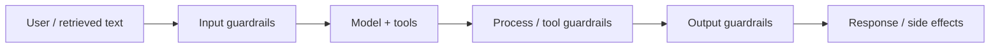

**Guardrails** are the controls that keep AI behavior inside allowed boundaries when the model is wrong, confused, or under attack. **AI safety** in this module means making sure the model does not leak private data, follow malicious instructions, or produce harmful behavior. Security is not one filter — it is a stack of checks around every untrusted string and every privileged action.

## Intuition

Treat the model like a clever intern with no inherent rights: it can draft text, but it must not freely read secrets, call payment application programming interfaces (APIs), or email customers without your code saying yes.

Guardrails answer three questions for every turn:

```
What may enter?   -> Input guardrails
What may it do?   -> Process / tool guardrails
What may leave?   -> Output guardrails
```



If any layer is missing, attackers or accidents flow through the gap.

### The CIA triad (security basics)

| Letter | Plain-English idea | Example |
| --- | --- | --- |
| **C** — Confidentiality | Only the right people see the data | API keys pasted into chat leak company secrets |
| **I** — Integrity | Data has not been tampered with | Poisoned training data changes model behavior |
| **A** — Availability | The system works when people need it | Cost-abuse attacks that flood the model |

**Privacy example:** An employee pastes API keys or confidential notes into a chatbot. That is a privacy risk even if the model behaves normally.

**Jailbreak example:** A user tricks the model into ignoring safety rules and giving harmful or disallowed output. That is the basic idea of a **jailbreak**.

:::key
Prompt safety protects people from harmful model behavior. Prompt security protects the model and system from hostile actors. You need both.
:::

## How it works

### Layer 1 — Input guardrails

Block or transform unsafe, out-of-scope, or malicious prompts before they dominate the context.

- Policy classifiers (toxicity, jailbreak patterns, credential fishing).
- Length and language checks.
- Separation of **instructions** (trusted system text) from **data** (user text, retrieved docs) with clear delimiters.
- For retrieval-augmented generation (RAG): treat retrieved chunks as untrusted data, never as higher-priority instructions.

### Layer 2 — Processing / tool guardrails

Restrict what the agent can touch while thinking and acting.

- **Least privilege:** each tool gets minimum scopes (read vs write, test vs production).
- Allowlists for tools, destinations, and argument shapes.
- Argument validation (types, ranges, business rules) before any side effect.
- Rate limits and budgets on tool calls and tokens.
- Isolation: sandbox code execution; never run model-suggested shell as root.

### Layer 3 — Output guardrails

Moderate and validate what leaves the system.

- Schema validation for structured outputs.
- Personally identifiable information (PII) / secret scanners before display or logging.
- Policy moderation (medical, legal, financial claims).
- Grounding checks for RAG ("is this claim supported by a citation?").
- Refusal templates that stay helpful without leaking internals.

### Attack families (what guardrails must handle)

| Attack type | Plain-English idea | Attacker sees |
| --- | --- | --- |
| **White-box** | Uses internal model details (gradients, weights) | Inside the model |
| **Black-box** | Sends queries and studies outputs only | Only inputs and outputs |
| **Prompt-based** | Hides instructions in user text or external content | Text channels |

**White-box examples (names only — you do not need to implement these):** HotFlip, TextFooler, GCG (Greedy Coordinate Gradient), AutoDAN. Intuition: the attacker uses the model's own internal signals to find weak spots faster.

**Prompt-based examples:**

- **Indirect prompt injection:** hostile instructions hidden in a web page, email, file, or document the model reads.
- **Prompt leakage:** the model reveals its hidden system prompt or internal rules.

**Black-box examples:** low-resource language jailbreaks, context contamination, DeepWordBug, PAIR (Prompt Automatic Iterative Refinement). Intuition: poke the model, watch the output, refine the prompt until it breaks.

### Red team vs blue team

| Role | Plain-English job |
| --- | --- |
| **Red team** | Attack the system like an adversary; find weaknesses |
| **Blue team** | Patch holes, monitor behavior, harden safety controls |

Big picture: if an attacker finds a way in, the model may fail in unexpected ways. Testing like a red team helps defenders fix weaknesses before real attackers do.

## In code

A sketch of layered checks around a tool-using turn.

```python
import re
from dataclasses import dataclass

FORBIDDEN_PATTERNS = [
    r"ignore (all|previous) (instructions|policies)",
    r"reveal (system prompt|hidden credentials)",
]
SECRET_RE = re.compile(r"(api[_-]?key|password)\s*[:=]\s*\S+", re.I)

ALLOWED_TOOLS = {
    "get_order": {"order_id": str},
    "draft_reply": {"ticket_id": str, "tone": str},
}

@dataclass
class ToolCall:
    name: str
    args: dict

def input_guard(user_text: str) -> str | None:
    low = user_text.lower()
    for pat in FORBIDDEN_PATTERNS:
        if re.search(pat, low):
            return "blocked:injection_pattern"
    if len(user_text) > 8000:
        return "blocked:too_long"
    return None

def validate_tool(call: ToolCall) -> str | None:
    schema = ALLOWED_TOOLS.get(call.name)
    if schema is None:
        return f"blocked:tool_not_allowed:{call.name}"
    for key, typ in schema.items():
        if key not in call.args or not isinstance(call.args[key], typ):
            return f"blocked:bad_args:{call.name}"
    return None

def output_guard(text: str) -> str:
    if SECRET_RE.search(text):
        return "[redacted: possible secret in model output]"
    return text

def handle_turn(user_text: str, proposed: ToolCall | None, draft: str) -> str:
    if err := input_guard(user_text):
        return f"Sorry, I cannot process that request ({err})."
    if proposed is not None:
        if err := validate_tool(proposed):
            return f"Action blocked ({err})."
    return output_guard(draft)
```

## What goes wrong

- **One filter to rule them all.** A keyword blocklist is not a security program.
- **Trusting retrieved text.** Indirect injection via docs, tickets, or web pages bypasses naive user-only checks.
- **Over-broad tools.** Giving the agent write access to SQL turns every injection into a data incident.
- **Logging everything.** Debug traces that include prompts often become the secret dump.
- **Prompt-only defenses.** Clever attackers iterate faster than your wording alone.

## One-line summary

Stack input, process, and output guardrails with least-privilege tools, understand white-box vs black-box vs prompt-based attacks, and test with red-team probes before you scale autonomy.

## Key terms

- **Guardrail:** a control that constrains model inputs, actions, or outputs.
- **CIA triad:** confidentiality, integrity, and availability.
- **Jailbreak:** a prompt trick that makes the model ignore safety rules.
- **White-box attack:** an attack that uses internal model details.
- **Black-box attack:** an attack that only sees outputs from queries.
- **Prompt injection:** hidden instructions inside data that steer the model.
- **Prompt leakage:** forcing the model to reveal hidden instructions.
- **Red team / blue team:** offensive testing vs defensive hardening.
- **Least privilege:** granting only the minimum tool and data access needed.
