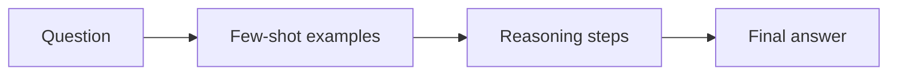

Two of the highest-leverage prompting patterns are **few-shot** examples (show, don’t only tell) and **chain-of-thought** (ask the model to reason before answering). Neither changes model weights. Both change what the model attends to in the context window — and that is often enough to jump from “demo quality” to “usable.”

## Intuition

**Few-shot** is apprenticeship by example. If you want tickets classified into `billing`, `bug`, or `feature`, listing the labels helps; showing three labeled tickets teaches the decision boundary and the output shape. Humans learn styles the same way: one annotated sample beats a paragraph of abstract rules.

**Chain-of-thought (CoT)** is scratch paper. For arithmetic, planning, or multi-constraint questions, forcing an immediate final answer invites shortcuts and confident mistakes. Asking for intermediate steps gives the model room to check itself — and gives you a trace to debug when it fails.



Zero-shot says “do the task.” Few-shot says “do it like these.” CoT says “think first.” Combined carefully, they are stronger than either alone — but more tokens and sometimes more leakage of private examples.

## How it works

**Shot counts.**

- **Zero-shot:** instruction only. Fast, cheap, fine for simple formats.
- **One-shot:** one example. Good for format transfer.
- **Few-shot:** 2–8 examples spanning the label space and edge cases. Diminishing returns after that; bad examples hurt more than missing ones.

Pick examples that are **diverse** (cover classes and corner cases), **correct**, and **format-identical** to what you want at inference. Put the hardest edge case near the end so it stays recent in the context.

**Chain-of-thought variants.**

- Explicit: “Think step by step, then give the answer after `FINAL:`.”
- Structured: numbered checklist the model must fill before concluding.
- Self-consistency: sample several reasoning paths (higher temperature) and majority-vote the final answer — costly but strong on math-like tasks.

**When CoT helps.** Multi-hop facts, counting, comparisons, policy application (“does this refund qualify?”). When CoT hurts: pure extraction, tight latency budgets, or when you must not expose reasoning to end users (use a hidden scratchpad channel if your API supports it).

**Few-shot + CoT.** Show one or two examples that include short reasoning, then ask for the same pattern. Keep reasoning short in examples or the model will ramble.

## In code

Below is a tiny few-shot classifier and a toy CoT checker that scores whether a “reasoning” string mentions required intermediate quantities — the kind of lightweight guard you can run before trusting an answer.

```python
import re

FEW_SHOT = [
    ("Card declined twice today", "billing"),
    ("App crashes on login screen", "bug"),
    ("Please add dark mode", "feature"),
]

def few_shot_prompt(ticket: str) -> str:
    lines = ["Classify each ticket as billing, bug, or feature.\n"]
    for text, label in FEW_SHOT:
        lines.append(f"Ticket: {text}\nLabel: {label}\n")
    lines.append(f"Ticket: {ticket}\nLabel:")
    return "\n".join(lines)

# Simulated model output for a CoT-style math check
reasoning = """
Step 1: cart subtotal = 40
Step 2: tax at 10% = 4
Step 3: total = 44
FINAL: 44
"""

def extract_final(text: str) -> str | None:
    m = re.search(r"FINAL:\s*(\S+)", text)
    return m.group(1) if m else None

def cot_mentions(text: str, required: list[str]) -> bool:
    lower = text.lower()
    return all(tok in lower for tok in required)

print(few_shot_prompt("Refund for duplicate charge")[:120], "...")
print("final =", extract_final(reasoning))
print("has tax step =", cot_mentions(reasoning, ["tax", "total"]))
```

In production you would call the LLM with `few_shot_prompt(...)` or a CoT system message, then parse `FINAL:` (or JSON) rather than trusting free-form prose.

## What goes wrong

- **Biased example sets.** Three “billing” examples and one “bug” teach the wrong prior; the model over-predicts billing.
- **Format drift.** Examples use `Label: bug` but you parse JSON — the model copies the examples.
- **Leaking PII in shots.** Few-shot corpora become part of every request; scrub or synthesize examples.
- **Verbose CoT.** Unbounded “think step by step” can burn the context window and still conclude wrong. Cap steps or use a structured scaffold.
- **Wrong tool for the job.** Retrieval or a calculator beats CoT for facts and arithmetic you can verify externally.
- **Self-consistency cost.** Voting over many samples multiplies latency and spend; reserve it for high-stakes answers.

## Choosing examples like a dataset

Few-shot examples are a **tiny training set inside the prompt**. Apply the same hygiene you would for fine-tuning data: balance classes, include hard negatives, and retire examples that no longer match product policy. If your taxonomy gains a fourth label, every shot list must gain at least one illustration or the model will shove edge cases into the nearest old bucket.

**Ordering effects** are real. Models often imitate the most recent example’s style. Put a clean, canonical example last. For CoT, keep example reasoning shorter than you want at inference or the model will pad.

**When to stop adding shots.** Past roughly six strong examples, gains flatten and token cost rises on every request. Prefer better examples over more examples. If you need dozens of illustrations, you likely want fine-tuning or a classifier head, not an ever-growing prompt.

**CoT and user-visible answers.** Many products should hide scratchpads. Generate reasoning in a tool channel or a first internal call, then emit a short user-facing summary. That preserves the accuracy benefit without exposing messy intermediate guesses or sensitive chain details.

## One-line summary

Few-shot teaching by example and chain-of-thought scratch work steer models toward the right format and multi-step answers without changing weights.

## Key terms

- **Zero / one / few-shot:** instruction-only vs one vs several in-context examples.
- **In-context learning:** adapting behavior from prompt examples at inference time.
- **Chain-of-thought (CoT):** eliciting intermediate reasoning before the final answer.
- **Self-consistency:** sampling multiple reasoning paths and aggregating answers.
- **Scratchpad:** private or delimited space for intermediate computation.
- **Example diversity:** covering classes and edge cases so few-shot does not skew the prior.
