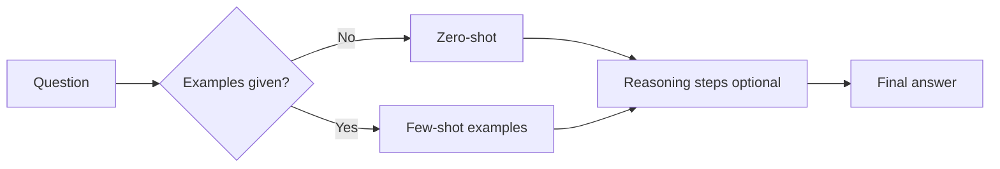

Two of the highest-leverage prompting patterns are **few-shot** examples (show, do not only tell) and **chain-of-thought** (ask the model to reason before answering). Neither changes model weights. Both change what the model pays attention to in the context window — and that is often enough to jump from demo quality to usable.

## Intuition

**Zero-shot prompting** means asking the model to do a task without giving any examples. You just tell the AI what to do and let it try. Modern LLMs often generalize from a direct instruction alone.

**Few-shot prompting** gives the model a small number of examples before the real task. You show a few worked examples first — like showing a student two solved problems before the test question.

**Chain-of-thought (CoT) prompting** asks the model to break a problem into steps before giving the final answer. The model explains its thinking step by step — like writing your working in a math notebook instead of jumping to the final answer.



| Pattern | Plain-English idea | One example prompt |
| --- | --- | --- |
| **Zero-shot** | Ask directly, with no examples | "Classify this review as Positive, Negative, or Neutral." |
| **Few-shot** | Show a few input→output pairs first | "Review: 'This is amazing' → Positive. Now classify: 'The food was decent.'" |
| **Chain-of-thought** | Ask for step-by-step reasoning | "Solve this word problem step by step: Sara has 12 apples..." |
| **Zero-shot CoT** | Add a small reasoning cue, no examples | "Let's think step by step. Sara has 12 apples and gives away 5..." |

## How it works

### Shot counts

| Type | Plain-English idea | Best when |
| --- | --- | --- |
| **Zero-shot** | Instruction only | Simple formats, fast and cheap |
| **One-shot** | One example | Format transfer |
| **Few-shot** | 2–8 diverse examples | Teaching decision boundaries and output shape |

Pick examples that are **diverse** (cover classes and corner cases), **correct**, and **format-identical** to what you want at inference. Bad examples hurt more than missing ones.

### Chain-of-thought variants

| Variant | Plain-English idea |
| --- | --- |
| **Explicit CoT** | "Think step by step, then give the answer after `FINAL:`." |
| **Zero-shot CoT** | Add "Let's think step by step" without worked examples |
| **Few-shot CoT** | Examples include both thinking steps and final answers |
| **Automatic CoT** | System generates reasoning examples instead of hand-writing them all |
| **Self-consistency** | Sample several reasoning paths and trust the answer that appears most often |

**When CoT helps:** multi-hop facts, counting, comparisons, policy application ("does this refund qualify?").

**When CoT hurts:** pure extraction, tight latency budgets, or when you must not expose reasoning to end users.

**Self-consistency intuition:** ask the model many times (with some randomness), then majority-vote the final answer. Costly but strong on math-like tasks. If the model keeps giving the same bland answer (**mode collapse**), self-consistency helps less because every path looks alike.

### Few-shot + CoT together

Show one or two examples that include short reasoning, then ask for the same pattern. Keep reasoning short in examples or the model will ramble.

## In code

A tiny few-shot classifier and a chain-of-thought checker.

```python
import re

FEW_SHOT = [
    ("Card declined twice today", "billing"),
    ("App crashes on login screen", "bug"),
    ("Please add dark mode", "feature"),
]

def few_shot_prompt(ticket: str) -> str:
    lines = ["Classify each ticket as billing, bug, or feature.\n"]
    for text, label in FEW_SHOT:
        lines.append(f"Ticket: {text}\nLabel: {label}\n")
    lines.append(f"Ticket: {ticket}\nLabel:")
    return "\n".join(lines)

reasoning = """
Step 1: cart subtotal = 40
Step 2: tax at 10% = 4
Step 3: total = 44
FINAL: 44
"""

def extract_final(text: str) -> str | None:
    m = re.search(r"FINAL:\s*(\S+)", text)
    return m.group(1) if m else None

print(few_shot_prompt("Refund for duplicate charge")[:120], "...")
print("final =", extract_final(reasoning))
```

In production, call the LLM with `few_shot_prompt(...)` or a CoT system message, then parse `FINAL:` rather than trusting free-form prose.

## What goes wrong

- **Biased example sets.** Three "billing" examples and one "bug" teach the wrong prior.
- **Format drift.** Examples use `Label: bug` but you parse JSON — the model copies the examples.
- **Leaking PII in shots.** Few-shot corpora become part of every request; scrub or synthesize examples.
- **Verbose CoT.** Unbounded "think step by step" burns the context window and still concludes wrong.
- **Self-consistency cost.** Voting over many samples multiplies latency and spend; reserve for high-stakes answers.

## One-line summary

Zero-shot asks directly; few-shot teaches by example; chain-of-thought adds scratch-paper reasoning — combine them carefully for format, logic, and multi-step tasks without changing model weights.

## Key terms

- **Zero-shot:** instruction only, no examples.
- **Few-shot:** several in-context examples before the real task.
- **In-context learning:** adapting behavior from prompt examples at inference time.
- **Chain-of-thought (CoT):** eliciting intermediate reasoning before the final answer.
- **Zero-shot CoT:** triggering step-by-step reasoning with a short cue like "Let's think step by step."
- **Automatic CoT:** generating reasoning examples automatically instead of hand-writing them.
- **Self-consistency:** sampling multiple reasoning paths and aggregating answers.
- **Mode collapse:** the model keeps producing overly similar outputs despite many good options.
