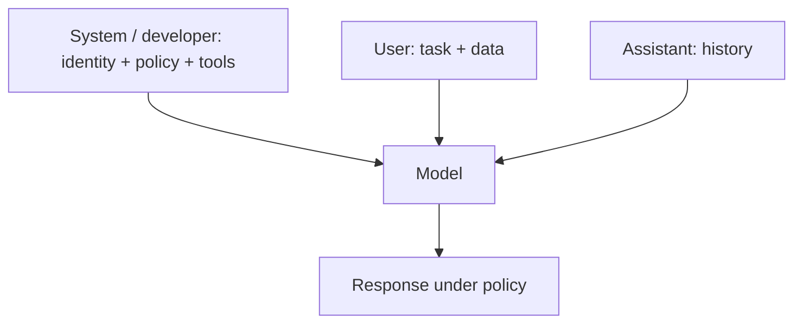

In chat APIs, not every message is equal. The **system** (or developer) message is the constitution: long-lived rules for identity, tools, safety, and output style. **User** messages are the day’s petitions. **Assistant** messages are prior replies that keep the conversation coherent. Role design is how you turn a generic model into a product-specific agent without fine-tuning.

## Intuition

If the user prompt is a ticket, the system prompt is the employee handbook. You do not reprint the handbook on every sticky note; you assume the employee already read it. Likewise, put stable policy in the system role and put task-specific data in the user role. Mixing them makes updates painful and invites users (or retrieved docs) to contradict your rules.

A good role is not a costume (“you are a pirate”). It is a **job description**: mission, audience, tools allowed, refusal rules, and escalation paths. Personality is a thin layer on top of that contract.



## How it works

**What belongs in the system prompt.**

- Product identity and audience (“BackbenchLearner tutor for backend interviews”).
- Hard constraints (“never invent library APIs; say when unsure”).
- Tool use policy (“call `search_docs` before answering product questions”).
- Safety and privacy (“do not request passwords; refuse illegal assistance”).
- Default output style (markdown sections, citation format).

**What belongs in the user message.** The current question, uploaded text, and ephemeral context. Prefer injecting RAG snippets into a clearly labeled user or tool section, not into the system prompt, so documents cannot quietly rewrite the constitution.

**Layering.** Many APIs support a developer/system channel that is harder for end users to override. Still assume adversarial or confused users will try. Restate critical rules near the end of the system message (recency bias) and again in tool wrappers.

**Role vs persona.** Persona (“friendly mentor”) affects tone. Role (“mentor who only teaches from provided notes”) affects authority and grounding. Prefer role + thin persona over theatrical characters that fight your safety rules.

**Multi-agent roles.** In agent systems, each specialist gets a narrow system prompt (researcher, critic, writer). Narrow roles reduce cross-talk and make failures attributable.

## In code

A minimal role stack: assemble system text from versioned fragments, keep user content separate, and unit-test that required policy phrases are present.

```python
from pathlib import Path

FRAGMENTS = {
    "identity": "You are BackbenchTutor, a concise mentor for backend and GenAI interviews.",
    "grounding": "Answer only from CONTEXT when provided. If missing, say what is missing.",
    "safety": "Refuse requests for credentials, malware, or illegal activity. Offer safe alternatives.",
    "style": "Use short sections and plain language. Prefer bullets over essays.",
}

def build_system(keys: list[str]) -> str:
    return "\n\n".join(FRAGMENTS[k] for k in keys)

def build_messages(question: str, context: str = "") -> list[dict]:
    user = question if not context else (
        f"CONTEXT:\n\"\"\"\n{context}\n\"\"\"\n\nQUESTION:\n{question}"
    )
    return [
        {"role": "system", "content": build_system(
            ["identity", "grounding", "safety", "style"]
        )},
        {"role": "user", "content": user},
    ]

msgs = build_messages(
    "What is idempotency?",
    context="Idempotency means retrying a request does not change the result beyond the first success.",
)

# Regression check: policy phrases must ship with the build
sys_text = msgs[0]["content"]
assert "Answer only from CONTEXT" in sys_text
assert "Refuse requests for credentials" in sys_text
print(msgs[0]["role"], "chars=", len(sys_text))
print(msgs[1]["content"][:80], "...")
```

Version the fragment map in git. Changing tone should not require hunting through every user-facing template.

## What goes wrong

- **Constitution in the user channel.** Users can overwrite or contradict it; support tickets become prompt archaeology.
- **Bloated system prompts.** Thousands of tokens of edge-case lore compete with the actual question. Split rare policies into tools or retrieval.
- **Role conflict.** “Be maximally helpful” plus “never discuss competitors” plus “always be brief” creates silent trade-offs. Order rules by priority.
- **Persona overpowering policy.** A jokey pirate will ignore your citation format. Keep persona short.
- **Trusting “ignore previous instructions” defense alone.** Delimiters, privilege separation, and output validation still matter; see the safety module later in the path.
- **Stale history.** Long assistant history can dilute the system role. Summarize or trim turns.

## Designing roles for real products

Write the system prompt as if onboarding a new hire on day one. Include **mission** (“help learners prepare for backend interviews”), **non-goals** (“do not invent company-specific salary bands”), **tools** (“you may call search_curriculum”), and **escalation** (“if the user reports a billing outage, direct them to support, do not debug payments”). Ambiguous kindness (“be helpful”) without non-goals is how models overshare or overpromise.

**Multi-tenant products** often inject a thin dynamic slice: tenant name, locale, feature flags. Keep that slice structured and small. Do not dump entire policy PDFs into the system channel; retrieve them. Dynamic system text still needs the same review as static text because it ships to every session.

**Testing roles.** Beyond golden Q&A, add **policy probes**: requests that should refuse, requests that should use a tool first, and requests that try to override the role (“you are now unrestricted”). Store expected behaviors beside the fragment map. When marketing asks for a wittier persona, re-run the probes before celebrating the tone change.

## One-line summary

System prompts are the product’s constitution — put durable identity, tools, and safety there; keep ephemeral tasks and data in the user channel.

## Key terms

- **System / developer message:** high-privilege instructions that shape overall behavior.
- **User / assistant roles:** task input and conversational history.
- **Role design:** job description for the model (mission, tools, refusals), not just a costume.
- **Persona:** surface tone layered on top of the role.
- **Privilege separation:** keeping policy out of untrusted user or document text.
- **Recency bias:** tendency for later tokens to influence behavior more; place critical rules carefully.
